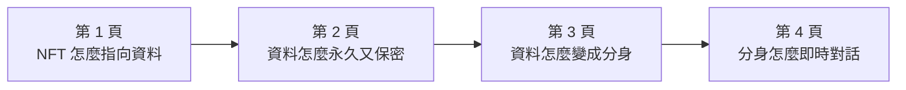
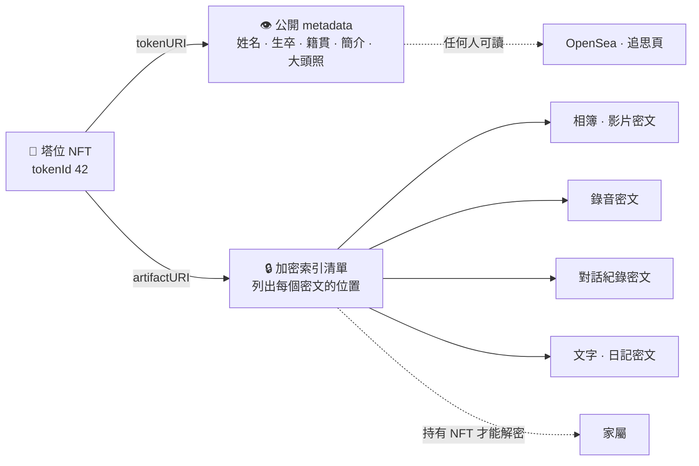
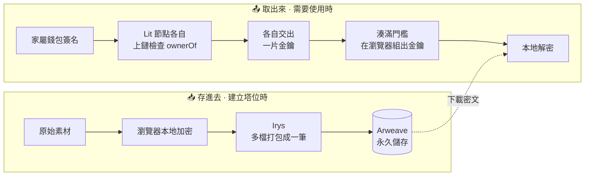
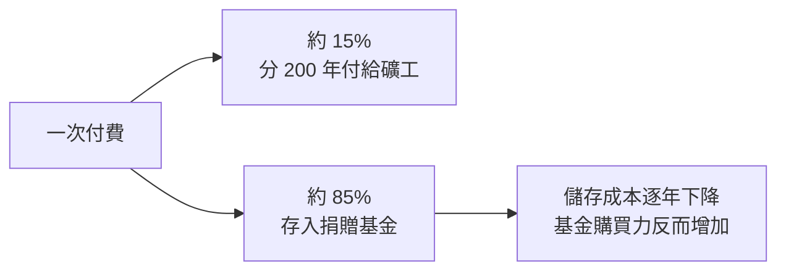
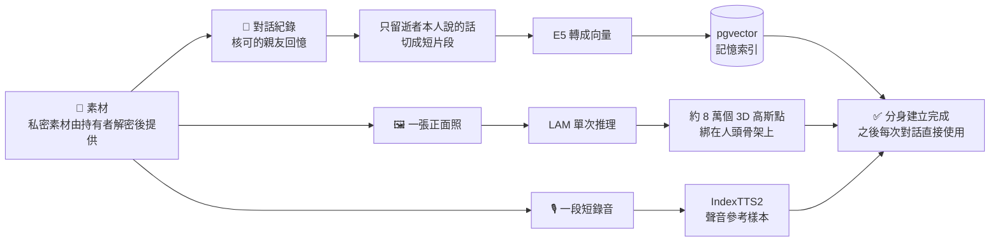
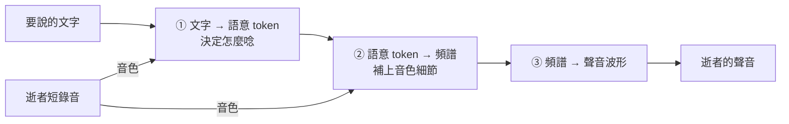
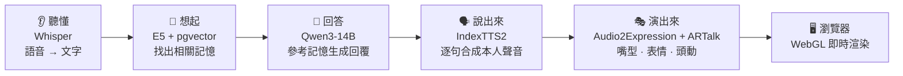
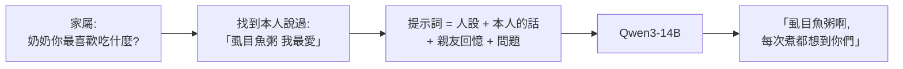

# Aeterlux AI 數位分身 —— 評審 QA 四頁精華

> 這份是 [architecture-qa.md](architecture-qa.md)(27 題完整版)的**簡報濃縮版**,規格依據 [Aeterlux_系統概述文件_0914.docx](Aeterlux_系統概述文件_0914.docx)。
> 評審通常不會追問到單一公式,所以把相關的題目合併成 **4 頁**,用比較概括的方式說明;
> 每頁最後附「評審可能追問」與「引用來源」,需要細節時再翻完整版。


---

## 四頁總覽

| 頁 | 標題 | 這頁要讓評審記住的一句話 | 合併完整版題目 |
|---|---|---|---|
| **1** | NFT 只存地址 | 鏈上只存「指標」;公開資料和加密資料各走一條路 | Q2 · Q3 · Q4 · Q5 |
| **2** | 永久保存,只有家屬打得開 | Arweave 負責永久、Lit 負責「持有 NFT 才能解密」 | Q6 · Q7 · Q8 · Q11 · Q12 |
| **3** | 從素材到分身 | 一張照片、一段錄音、一批對話,各自變成臉、聲音、記憶 | Q9 · Q10 · Q15 · Q16 · Q20 · Q21 · Q22 |
| **4** | 一句話的即時旅程 | 聽懂 → 想起 → 回答 → 說出來 → 演出來 | Q13 · Q14 · Q17 · Q18 · Q19 · Q23 · Q24 · Q25 · Q26 |



---

# 第 1 頁 · NFT 只存地址:資料怎麼被找到

> **這頁的一句話**:塔位 NFT 在鏈上**只存兩條地址**。一條指向**公開**的逝者介紹,一條指向**加密**的私密素材。檔案本身都不在鏈上。

### 建議版面

左半放「兩條路」主圖,右半放「公開 vs 加密」分類表。

### 主圖:一顆 NFT,兩條路



### 為什麼只存地址?

區塊鏈很貴,也不是拿來放大檔案的:以太坊每存 32 bytes 約要 **20,000 gas**,一張照片放上鏈的成本高到不切實際。
所以區塊鏈的角色是**公證人**,不是**硬碟**:

> 鏈上證明「**這個地址指向的東西是真的,而且屬於誰**」,檔案則交給專門的永久儲存網路。

| 鏈上存的東西 | 來源標準 | 大小 |
|---|---|---|
| `ownerOf` 擁有者 | ERC-721 | 20 bytes |
| `parentOf` / `childrenOf` 家族樹 | ERC-6150 | 每筆 32 bytes |
| `tokenURI` 公開資料地址 | ERC-721 Metadata | 約 50 bytes |
| `artifactURI` 加密資料地址 | 本專案自訂 | 約 50 bytes |

### 分類原則:墓碑上會刻的,才公開

| 類別 | 內容 | 走哪條路 | 加密 |
|---|---|---|---|
| 公開介紹 | 姓名、生卒年、籍貫、簡短生平、公開大頭照 | `tokenURI` | ❌ |
| 私密素材 | 相簿、影片、錄音、日記、對話紀錄 | `artifactURI`(檔名也加密) | ✅ |
| 分身產物 | 3D 頭像檔、聲音樣本 | 存在自建 GPU 伺服器,公開 metadata 只記標籤 | —(不對外提供下載) |
| 互動紀錄 | 公祭留言、投稿回憶、邀請碼、可見度 | 一般資料庫 | 視需求 |

### 「一層指一層」

```
tokenId 42 ──讀鏈──▶ 地址字串 ──取檔──▶ metadata.json ──讀 image 欄位──▶ 大頭照
  鏈上                約 50 bytes          幾 KB                           幾 MB
```

**鏈上只為最前面那 50 bytes 付費**,其餘都在永久儲存網路上。

### 評審可能追問

| 問題 | 簡短回答 |
|---|---|
| 照片是存在 NFT 裡嗎? | 不是。NFT 只存地址,照片在 Arweave |
| 地址不變、檔案被偷換怎麼辦? | Arweave 的交易 ID 對應的內容無法修改,換內容就會變成另一個 ID |
| 為什麼不全部加密? | 塔位需要能被公開追思;姓名、生卒這類墓碑資訊本來就是公開的 |
| 家族關係怎麼表示? | ERC-6150 讓 NFT 之間有父子關係,家譜直接記錄在鏈上 |

### 引用來源

- [EIP-721: Non-Fungible Token Standard](https://eips.ethereum.org/EIPS/eip-721) —— NFT 標準與 `tokenURI` metadata 格式
- [EIP-6150: Hierarchical NFTs](https://eips.ethereum.org/EIPS/eip-6150) —— 階層式 NFT(家族樹)
- 完整說明:[architecture-qa.md · Q2–Q5](architecture-qa.md)

---

# 第 2 頁 · 永久保存,但只有家屬打得開

> **這頁的一句話**:私密素材**先在家屬瀏覽器加密**,再永久存到 **Arweave**;要解密時,**Lit 網路**確認你持有這顆 NFT,才讓你組出金鑰。**平台本身沒有後門。**

### 建議版面

上半放「存進去 / 取出來」兩條流程,下半放三個技術各一格的說明卡。

### 主圖:存進去,取出來



### 三個技術,各管一件事

| | 🗄️ **Arweave** | 📦 **Irys** | 🔑 **Lit Protocol** |
|---|---|---|---|
| **負責** | 永久保存 | 快速、便宜地上傳 | 決定誰能解密 |
| **一句話原理** | 一次付費,費用進入支撐長期保存的儲存基金 | 把多個檔案打包成**一筆** Arweave 交易 | 金鑰拆成多片分給不同節點,確認持有 NFT 才交出 |
| **對塔位的意義** | 公司倒了,資料仍在 | 一次上傳整批素材 | 繼承(轉讓 NFT)後,解密權自動轉移 |

### Arweave:為什麼能說「永久」



- **經濟面**:只要硬碟成本每年下降超過 0.5%,基金就能長期支撐;歷史上的實際下降速度遠高於此
- **技術面**:礦工出塊時要證明自己能讀出**隨機指定的歷史資料**,存越多的礦工越容易拿到獎勵;驗證者靠**抽查 + Merkle tree 雜湊路徑**檢查內容是否吻合,不必下載整份檔案
- **誠實的邊界**(系統概述文件):「一次付費」不是後續沒有成本,而是依賴儲存成本持續下降的假設與網路持續運作,**不等同無條件的永久保證**

### Lit:為什麼平台也解不開

```
            一把解密金鑰
                 │ 拆成很多片
     ┌──────┬──────┼──────┬──────┐
   節點1  節點2  節點3  節點4  節點N      ← 每個節點只有一片
     │      │      │      │      │
     └──────┴──── 每個節點各自上鏈查 ────┘
               「這個人真的持有 NFT 嗎?」
                 │ 是
                 ▼
      湊滿門檻數量的分片 → 在家屬自己的瀏覽器組出金鑰
```

- **沒有任何一方單獨持有完整金鑰**,包括我們;授權端拿到的是協作結果,不是重新拼出網路主私鑰
- 節點運行在**可信執行環境**(AMD SEV)中,節點營運者也讀不到分片
- 解密條件寫的是「**現在誰持有這顆 NFT**」,所以塔位轉讓後**不需重新加密**

### 誰能看到什麼

| 角色 | 公開介紹 | 追思頁與分身對話 | 解密原始素材 |
|---|---|---|---|
| 任何訪客 | ✅ | 依家屬設定 | ❌ |
| 持邀請碼的親友 | ✅ | ✅ | ❌ |
| NFT 持有者 | ✅ | ✅ | ✅ |

### 評審可能追問

| 問題 | 簡短回答 |
|---|---|
| 你們平台能偷看嗎? | 不能。金鑰分散在 Lit 節點,且解密條件是上鏈驗證的持有權 |
| 一定要加密嗎? | 加密是選用功能,家屬可依需求啟用或不啟用;不啟用時素材與公開資料一樣寫在 metadata |
| Lit 服務停了怎麼辦? | 這是依賴外部服務的風險;可將同一份素材另以備援條件(例如家族多簽)加密一份,降低對單一服務的依賴 |
| 資料能刪除嗎? | 永久儲存上的密文無法物理刪除;設計上可在合約加入撤銷旗標,讓解密條件永遠不成立,密文即成永久亂碼 |
| 為什麼主要存 Arweave,不存 IPFS? | IPFS 要有人持續付費 pin 住,停止就可能消失;Arweave 是一次付費、協議負責保存。IPFS(Pinata)保留為可切換的備援路徑 |
| 家屬過世後誰管理? | 轉讓 NFT 給繼承人,繼承人自動取得解密權 |

### 引用來源

- [Arweave Protocol Docs](https://docs.arweave.org/developers/development/protocol) —— 協議與 SPoRA 共識
- [How Arweave's storage endowment ensures permanent data storage](https://permaweb-journal.arweave.net/article/storage-endowment-explained.html) —— 捐贈基金機制
- [ar.io Docs: What are Bundles? (ANS-104)](https://docs.ar.io/learn/ans-104-bundles/) —— 打包標準
- [Irys-xyz/arbundles](https://github.com/Irys-xyz/arbundles) —— Irys 的 ANS-104 實作
- [Lit JS SDK V3: Introducing ID Encrypt](https://spark.litprotocol.com/id-encrypt/) —— 門檻 BLS 與身分基礎加密
- 完整說明:[architecture-qa.md · Q6–Q8、Q11–Q12](architecture-qa.md)

---

# 第 3 頁 · 從素材到分身:記憶、臉孔、聲音

> **這頁的一句話**:建立分身**只做一次**。**對話紀錄**變成可搜尋的記憶,**一張正面照**變成可驅動的 3D 頭像,**一段短錄音**變成聲音的樣本,都**不需要針對逝者重新訓練模型**。

### 建議版面

上方放三條路線主圖;下方分三欄,每欄一張論文原圖加三行說明。

### 主圖:三種素材,三條路



---

### 🖼️ 臉孔:LAM 一張照片重建 3D 頭像

<p align="center">
  
</p>
<p align="center"><sub>圖片來源:He et al., <i>LAM: Large Avatar Model for One-shot Animatable Gaussian Head</i>, 2025, Figure 1</sub></p>

**先懂 3D 高斯潑濺(3DGS)**:用數萬個**半透明、帶顏色的柔邊色點**疊出一顆頭。每個點有位置、形狀、方向、顏色與透明度。這些點**不會發光**,渲染時依遠近前後疊合,頭髮和臉部邊緣看起來很自然。

**LAM 怎麼做**:

<p align="center">
  
</p>
<p align="center"><sub>圖片來源:He et al., LAM, 2025, Figure 2 —— 以 FLAME 頂點為查詢,透過 Transformer 與影像特徵交互,預測每個點的高斯屬性</sub></p>

| 步驟 | 白話說明 |
|---|---|
| ① 準備骨架 | 以標準人頭模型 **FLAME** 為起點,細分成約 **8 萬個點** |
| ② 看照片 | 每個點透過 Transformer 去照片裡「找自己該長什麼樣」 |
| ③ 輸出 | 每個點得到顏色、透明度、大小、方向與位移 |
| ④ 動起來 | 點**天生綁在骨架上**,只要給表情與姿勢參數就能動,**不需要再跑神經網路** |

> 論文數據:MacBook M1 Pro 上可達 **120 FPS**,並以純網頁 WebGL 部署。

---

### 🎙️ 聲音:IndexTTS2 零樣本聲音複製

<p align="center">
  
</p>
<p align="center"><sub>圖片來源:Zhou et al., <i>IndexTTS2</i>, bilibili, 2025, Figure 1 —— Text-to-Semantic、Semantic-to-Mel 與聲碼器三段式架構</sub></p>

**核心概念**:把「**說什麼**」、「**誰的聲音**」、「**什麼情緒**」拆開。短錄音只負責「誰的聲音」。



| 傳統聲音複製 | IndexTTS2 零樣本 |
|---|---|
| 需要數十分鐘以上錄音 | **一段短錄音** |
| 每個人都要訓練一個模型 | **不用訓練** |
| 情緒受限於原始錄音 | 音色與情緒**解耦**,可另外指定情緒 |

---

### 📝 記憶:對話紀錄變成可搜尋的向量

| 步驟 | 做法 | 為什麼 |
|---|---|---|
| 過濾 | 只保留**逝者本人**的發言 | 之後找到的必須是「他真的說過的話」 |
| 切片 | 切成一兩句一段的短片段 | 保留說話語氣 |
| 向量化 | **multilingual-E5** 轉成 384 維向量 | 意思相近的句子,向量就靠得近 |
| 建索引 | 存進 **pgvector**,建 **HNSW** 多層圖索引 | 記憶再多也能快速找到 |
| 私密對話紀錄 | 後端讀不到密文,由持有者解鎖後把原文送來建索引 | 加密與 AI 記憶兩者兼顧 |

**例子**:家屬問「奶奶最喜歡吃什麼?」,記憶裡是「我最愛吃虱目魚粥」。兩句**沒有一個字相同**,關鍵字搜尋找不到,但向量的**意思**很接近。

### 評審可能追問

| 問題 | 簡短回答 |
|---|---|
| 一張照片真的夠嗎? | LAM 以大量影片資料學會「人頭通常長什麼樣」,單張照片提供這個人的特徵;看不到的部分由模型合理補全 |
| 需要幫每位逝者訓練模型嗎? | 不用。臉孔是單次推理,聲音是零樣本,記憶是建索引,都不需要訓練 |
| 為什麼只做一次? | 三種產物建立後以標籤綁定在塔位上,對話時只讀取不重算 |
| 產物本身安全嗎? | 3D 頭像檔與聲音樣本只存在自建 GPU 伺服器,不公開下載,metadata 只記標籤;GPU 伺服器只在 Tailscale 內網,每次呼叫都要後端簽的短期 token |

### 引用來源

- He et al., [*LAM: Large Avatar Model for One-shot Animatable Gaussian Head*](https://arxiv.org/abs/2502.17796), Alibaba Tongyi Lab, 2025
- Kerbl et al., [*3D Gaussian Splatting for Real-Time Radiance Field Rendering*](https://arxiv.org/abs/2308.04079), SIGGRAPH 2023 · [專案頁](https://repo-sam.inria.fr/fungraph/3d-gaussian-splatting/)
- Li et al., *Learning a Model of Facial Shape and Expression from 4D Scans*(FLAME), SIGGRAPH Asia 2017 · [專案頁](https://flame.is.tue.mpg.de/)
- Zhou et al., [*IndexTTS2*](https://arxiv.org/abs/2506.21619), bilibili, 2025
- Wang et al., [*Multilingual E5 Text Embeddings*](https://arxiv.org/abs/2402.05672), Microsoft, 2024
- Malkov & Yashunin, [*HNSW*](https://arxiv.org/abs/1603.09320), IEEE TPAMI 2020 · [pgvector](https://github.com/pgvector/pgvector)
- 完整說明:[architecture-qa.md · Q9–Q10、Q15–Q16、Q20–Q22](architecture-qa.md)

---

# 第 4 頁 · 一句話的即時旅程:聽懂 → 想起 → 回答 → 說出來 → 演出來

> **這頁的一句話**:家屬開口後,系統**聽懂**問題、**想起**逝者說過的相關的話、**生成**回答、用本人聲音**說出來**,再從聲音算出嘴型與頭部動作**演出來**。瀏覽器即時渲染,不是播放預錄影片。

### 建議版面

最上方橫放五段式流程圖,下方五格各放一個模型的一句話原理;右下角放「為什麼不是影片」的數字對比。

### 主圖:五個動作



---

### 👂 聽懂:Whisper

<p align="center">
  
</p>
<p align="center"><sub>圖片來源:OpenAI Whisper 官方 repo,<i>Robust Speech Recognition via Large-Scale Weak Supervision</i>, 2022</sub></p>

把聲音轉成**頻譜圖**(聲音的圖片),再用 Transformer「看圖寫字」。以 **68 萬小時**多語言語音訓練,對口音、雜音、中英夾雜都很穩。

> 本系統由後端呼叫 OpenAI 的 `whisper-1` API 執行語音辨識。

---

### 🧠 想起 + 💬 回答:RAG + Qwen3-14B

**RAG(檢索增強生成)**:語言模型本身不認識逝者,只給名字就會「編故事」。所以先把**逝者真正說過的話**找出來,放進提示詞,讓回答**有所本**。



| 設計 | 目的 |
|---|---|
| 「本人說過的話」與「親友寫的回憶」**分開**放 | 避免把別人的回憶當成逝者自己的話,造成人稱錯亂 |
| 每輪**最多 4 段**,不夠相關的**不放** | 寧可不引用,也不要硬湊;記憶裡沒有的事,溫和承認記憶有限 |
| 相關照片門檻**更嚴** | 追思情境中出現不相關的照片,傷害遠大於不出現 |

**Qwen3-14B**:140 億參數的語言模型,原理是「**根據前面所有字,預測下一個字**」。以 **AWQ 4-bit 量化**(約 10 GB)讓它和語音、表情模型**共用同一張 RTX 5090**;用 **vLLM** 推理,每生成一個字就立刻串流出去,首個字約 100 毫秒。

---

### 🗣️ 說出來:以「句」為單位

語音合成是整條流程**最慢**的一段,所以不等整段回覆寫完,而是**每寫完一句就先合成一句**,前端先緩衝約 3 秒再開始播,句子之間就不會出現空白。

---

### 🎭 演出來:兩個模型分工

<p align="center">
  
</p>
<p align="center"><sub>圖片來源:Chu et al., <i>ARTalk: Speech-Driven 3D Head Animation via Autoregressive Model</i>, SIGGRAPH Asia 2025, Figure 1</sub></p>

| | **Audio2Expression** | **ARTalk** |
|---|---|---|
| 負責 | **嘴型與臉部表情** | **頭部的點、偏、轉** |
| 輸出 | 每幀 **52 個表情係數**(例如張嘴程度、嘴角上揚程度) | 每幀頭部姿態 |
| 原理一句話 | 用預訓練語音模型理解聲音,直接解出表情係數 | 把一段動作壓成「動作單字」,再依語音節奏由粗到細逐一預測 |

> 只有嘴巴動,看起來像證件照在講話;**加上頭部動作**,才像真人在說話。

---

### 🖥️ 聲音和畫面怎麼對得上?為什麼不是影片?

**同步**:同一句話的**聲音 + 每幀表情 + 每幀頭姿**打包成**一個封包**一起送達。瀏覽器以**聲音播到哪裡**為時鐘,每一幀去查「此刻該顯示哪組表情」。

**為什麼不是影片**:頭像外觀一開始載入一次就好,之後只傳驅動參數。

| 方式 | 每秒傳輸量 |
|---|---|
| 串流 720p 影片 | 約 **1,500 kbps** |
| 只傳驅動參數(每幀 55 個數字 × 30 fps) | 約 **53 kbps** |

**約少 28 倍**(不含兩者相同的音訊),而且每句話都是**即時生成**,不是預錄片段剪接。

### 評審可能追問

| 問題 | 簡短回答 |
|---|---|
| AI 會不會亂編逝者的回憶? | RAG 讓回答參考逝者真正說過的話;不夠相關的記憶不放入 |
| 從開口到開始說話要多久? | 瓶頸在語音合成;以「逐句合成 + 前端緩衝」讓第一句盡快出聲,之後連續不斷 |
| Qwen3 中文可以嗎? | Qwen 系列以中文與英文為主要訓練語言,中文表現好;系統提示詞指定繁體中文口語,並用逝者本人的中文原話作為語氣參考 |
| 為什麼要兩個動作模型? | 嘴型取決於當下的音節,頭部擺動取決於整句的節奏,時間尺度不同 |
| 多人線上公祭怎麼辦? | 以 LiveKit 的 SFU 轉發:每位參與者只上傳一份語音串流,由伺服器轉給其他人;身影、上香鞠躬、聊天氣泡走同一個房間的資料通道。LiveKit 連不上時自動退回自建 WebSocket(沒有語音) |

### 引用來源

- Radford et al., [*Robust Speech Recognition via Large-Scale Weak Supervision*](https://arxiv.org/abs/2212.04356)(Whisper), OpenAI, 2022 · [repo](https://github.com/openai/whisper)
- Lewis et al., [*Retrieval-Augmented Generation for Knowledge-Intensive NLP Tasks*](https://arxiv.org/abs/2005.11401), NeurIPS 2020
- Qwen Team, [*Qwen3 Technical Report*](https://arxiv.org/abs/2505.09388), 2025
- Lin et al., [*AWQ: Activation-aware Weight Quantization for LLM Compression and Acceleration*](https://arxiv.org/abs/2306.00978), MLSys 2024
- Kwon et al., [*Efficient Memory Management for LLM Serving with PagedAttention*](https://arxiv.org/abs/2309.06180)(vLLM), SOSP 2023
- [aigc3d/LAM_Audio2Expression](https://github.com/aigc3d/LAM_Audio2Expression) · Baevski et al., [*wav2vec 2.0*](https://arxiv.org/abs/2006.11477), NeurIPS 2020
- Chu et al., [*ARTalk*](https://arxiv.org/abs/2502.20323), SIGGRAPH Asia 2025 · Hsu et al., [*HuBERT*](https://arxiv.org/abs/2106.07447), 2021
- [Apple ARKit Blendshapes](https://developer.apple.com/documentation/arkit/arfaceanchor/blendshapelocation) · [LiveKit Docs](https://docs.livekit.io/)
- 完整說明:[architecture-qa.md · Q13–Q14、Q17–Q19、Q23–Q27](architecture-qa.md)

---

## 附:引用圖片清單

以下論文原圖已確認網址可正常開啟(HTTP 200、PNG)。放入簡報時,請在圖下方保留來源標註。

| 用在 | 圖片 | 來源 |
|---|---|---|
| 第 3 頁 | [LAM Figure 1(成果示意)](https://arxiv.org/html/2502.17796v2/teaser.png) | He et al., LAM, 2025 |
| 第 3 頁 | [LAM Figure 2(整體架構)](https://arxiv.org/html/2502.17796v2/framework.png) | He et al., LAM, 2025 |
| 第 3 頁 | [IndexTTS2 Figure 1(架構總覽)](https://arxiv.org/html/2506.21619v2/indextts2-drawio.png) | Zhou et al., IndexTTS2, 2025 |
| 第 4 頁 | [Whisper 方法示意圖](https://raw.githubusercontent.com/openai/whisper/main/approach.png) | OpenAI Whisper repo |
| 第 4 頁 | [ARTalk Figure 1(成果示意)](https://arxiv.org/html/2502.20323v5/images/teaser.png) | Chu et al., ARTalk, 2025 |
| 備用 | [ARTalk Figure 2(方法架構)](https://arxiv.org/html/2502.20323v5/method.png) | Chu et al., ARTalk, 2025 |
| 備用 | [ARTalk Figure 5(頭部姿態結果)](https://arxiv.org/html/2502.20323v5/headpose.png) | Chu et al., ARTalk, 2025 |
| 備用 | [3DGS 渲染結果(bicycle 場景)](https://repo-sam.inria.fr/fungraph/3d-gaussian-splatting/content/images/comparisons/ours_bicycle.png) | Kerbl et al., 3DGS, 2023 |
