# Aeterlux AI 數位分身生成流程 —— 評審 QA 詳解

> 本文件是架構圖「AI 數位分身生成流程」的補充說明。
> 架構圖為了一頁放得下,很多步驟只用一個方塊帶過;
> 這裡針對評審最可能追問的**原理**與**詳細步驟**逐題展開。
>
> 規格依據:[Aeterlux_系統概述文件_0914.docx](Aeterlux_系統概述文件_0914.docx)。


---

## 目錄

**第一部分:上半部 Enrollment(一次性建立)—— 資料怎麼存、怎麼找、怎麼取**

| # | 問題 |
|---|---|
| Q1 | 整張圖在做什麼?為什麼分成上下兩半? |
| Q2 | 逝者的資料為什麼要分成「公開」和「加密」兩種? |
| Q3 | NFT 在鏈上到底存了什麼? |
| Q4 | 公開資料怎麼從 NFT 找到? |
| Q5 | 加密資料怎麼從 NFT 找到? |
| Q6 | Arweave 憑什麼說是「永久」儲存? |
| Q7 | Irys 在圖上做了什麼? |
| Q8 | Lit Protocol 怎麼做到「只有持有 NFT 的人才能解密」? |
| Q9 | 解密出來的資料,怎麼變成人像、聲音和記憶? |
| Q10 | 為什麼只要做一次?產物存在哪? |
| Q11 | 誰能看到什麼?權限怎麼控管? |
| Q12 | 家屬後悔了,資料能刪嗎? |

**第二部分:下半部 Instant Synthesis(即時合成)—— 每個模型的原理**

| # | 問題 | 對應方塊 |
|---|---|---|
| Q13 | 一輪對話從開口到看到畫面,完整經過哪些步驟? | 全部 |
| Q14 | Whisper 怎麼把聲音變成文字? | Speech-To-Text |
| Q15 | E5 怎麼把一句話變成向量? | embedding |
| Q16 | pgvector 怎麼在大量記憶中快速找到相關片段? | Find Memory |
| Q17 | 找到的記憶怎麼交給語言模型?為什麼能減少胡說? | Find Memory → Generate Response |
| Q18 | Qwen3-14B 是怎麼生成回覆的? | Generate Response |
| Q19 | 為什麼回覆能一個字一個字串流出來?(vLLM) | Generate Response |
| Q20 | IndexTTS2 怎麼用短短一段錄音就模仿本人聲音? | IndexTTS2 |
| Q21 | 3D 高斯潑濺(3DGS)到底是什麼? | LAM 3DGS |
| Q22 | LAM 怎麼從一張照片重建出會動的 3D 頭像? | 3DGS Reconstruction |
| Q23 | Audio2Expression 怎麼從聲音算出嘴型和表情? | Visual Reconstruction |
| Q24 | ARTalk 怎麼產生頭部動作?跟 A2E 差在哪? | Visual Reconstruction |
| Q25 | 聲音和畫面怎麼對得上? | Visual → Live Streaming |
| Q26 | 為什麼在瀏覽器即時渲染,而不是播影片? | Live Streaming |
| Q27 | LiveKit 用在哪裡? | Live Streaming |

**附錄**:參考文獻 / 名詞對照

---

# 第一部分:Enrollment —— 資料怎麼存、怎麼找、怎麼取

---

## Q1. 整張圖在做什麼?為什麼分成上下兩半?

> **評審可能這樣問**:「上面藍框和下面紅框差在哪?為什麼要分開?」

**一句話回答**:上半部是**建立分身**(每位逝者只做一次),下半部是**跟分身對話**(每句話都跑一次)。重的計算放上面,讓下面的對話夠快。

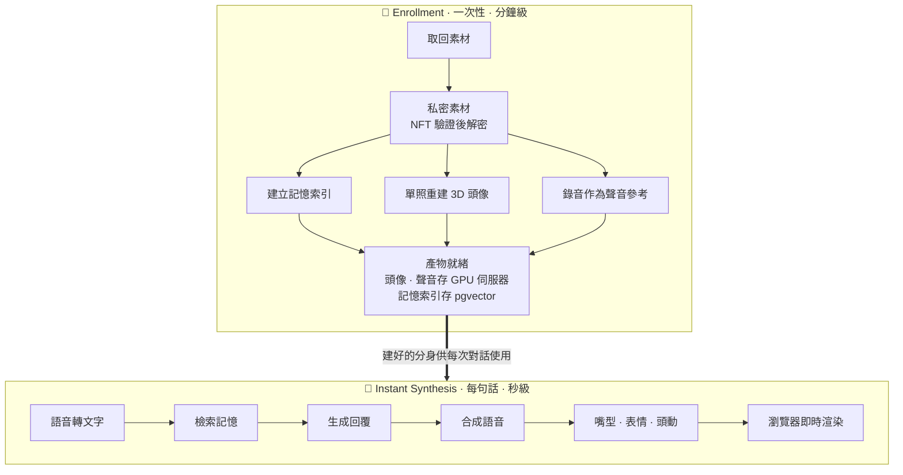

| | 上半部 Enrollment | 下半部 Instant Synthesis |
|---|---|---|
| 頻率 | 每位逝者**一次** | 每句話**一次** |
| 可接受耗時 | 數分鐘 | 需在數秒內開始回應 |
| 主要工作 | 重建 3D 頭像、建立記憶向量索引、準備聲音參考 | 檢索、生成、合成、驅動 |

**為什麼分開**:單照重建 3D 頭像、整批向量化都很花時間;若每句話都重做,對話不可能即時。

> 💡 這跟搜尋引擎的設計相同:**建索引**(慢、離線、一次)和**查詢**(快、線上、很多次)分開。

---

## Q2. 逝者的資料為什麼要分成「公開」和「加密」兩種?

> **評審可能這樣問**:「放上區塊鏈不就全世界都看得到?隱私怎麼辦?」

**一句話回答**:區塊鏈和 Arweave 上的資料**天生全世界可讀、而且刪不掉**,所以我們只把「本來就願意公開、像墓碑上會刻的」資訊放明文,其他全部先加密再上傳。

### 分類原則

**判斷標準:這筆資料如果被陌生人看到,家屬能不能接受?**

| 類別 | 內容 | 存放位置 | 是否加密 | 類比 |
|---|---|---|---|---|
| **公開 metadata** | 姓名、生卒年、籍貫、簡短生平、公開大頭照 | `tokenURI` → Arweave | ❌ 明文 | 墓碑上刻的字 |
| **私密素材** | 相簿、影片、錄音、日記、對話紀錄 | `artifactURI` → Arweave | ✅ 加密(連檔名) | 家裡抽屜的相簿 |
| **分身產物** | 3D 頭像檔、聲音樣本 | 自建 GPU 伺服器(metadata 只記標籤) | 不公開下載 | — |
| **記憶索引** | 逝者發言切片 + 向量 | 後端 PostgreSQL(pgvector) | 伺服器端 | — |
| **互動資料** | 公祭留言、供品、投稿回憶、可見度設定、邀請碼 | 一般資料庫 | 視需求 | 靈堂的簽到簿 |

### 為什麼不能「上傳後再設權限」?

在一般雲端,你可以先上傳、之後再把檔案設成私人。**在永久儲存上不行**:

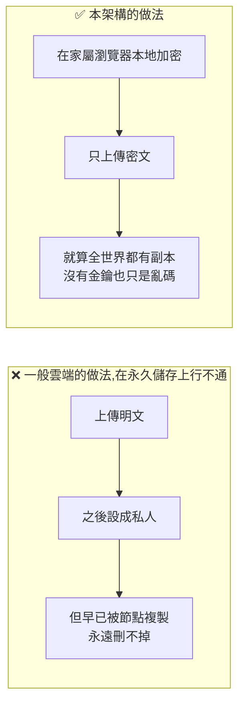

> 🔑 **加密必須發生在上傳之前。** 這是永久儲存的鐵律,也是為什麼圖上「NFT-Gated Encryption via Lit」出現在寫入 Arweave **之前**。

---

## Q3. NFT 在鏈上到底存了什麼?

> **評審可能這樣問**:「照片是存在 NFT 裡面嗎?」

**一句話回答**:**不是。** NFT 在鏈上只存「誰擁有它」、「家族關係」和**兩個指向 Arweave 的地址字串**。照片、影片這些大檔案都不在鏈上。

### 為什麼不直接存在鏈上?

以太坊儲存約**每 32 bytes 消耗 20,000 gas**。一張 3 MB 的照片約需 9 萬多個 32 bytes 的儲存格,換算下來是天價,而且全網每個節點都要各存一份。

所以區塊鏈的角色不是「硬碟」,而是**公證人**:

> 鏈上存「**這個地址指向的東西是真的,而且屬於誰**」,真正的檔案存在專門的儲存網路。

### 合約裡的實際欄位

我們的合約 `DigitalTablet` 同時實作 **ERC-721**(NFT 標準)與 **ERC-6150**(階層式 NFT,用來表達家譜):

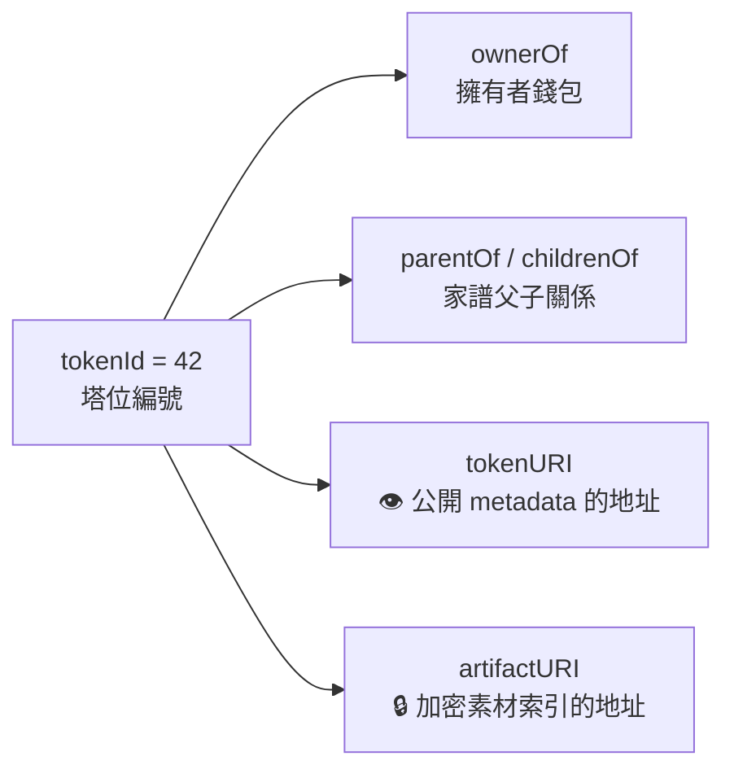

| 欄位 | 來源標準 | 存什麼 | 大小 |
|---|---|---|---|
| `ownerOf(tokenId)` | ERC-721 | 擁有者錢包地址 | 20 bytes |
| `parentOf(tokenId)` | ERC-6150 | 父節點 tokenId(根節點為 0) | 32 bytes |
| `childrenOf(tokenId)` | ERC-6150 | 子節點 tokenId 陣列 | 每個 32 bytes |
| `tokenURI(tokenId)` | ERC-721 Metadata | 公開 metadata 的地址,例如 `ar://<TXID>` | 約 50 bytes |
| `artifactURI(tokenId)` | **本專案自訂** | 加密素材索引的地址 | 約 50 bytes |

> 💡 **`tokenId` 是串起一切的主鍵。** 鏈上每一張表都是「tokenId → 某個值」。有了編號,就能查到擁有者、家族、公開資料和加密資料的位置。

---

## Q4. 公開資料怎麼從 NFT 找到?

> **評審可能這樣問**:「OpenSea 或其他人要怎麼看到逝者的名字和照片?」

**一句話回答**:讀 `tokenURI` 拿到一串 Arweave 地址,再去 Arweave 抓那份 JSON。**全程不需要任何權限,也不花手續費。**

### 完整步驟

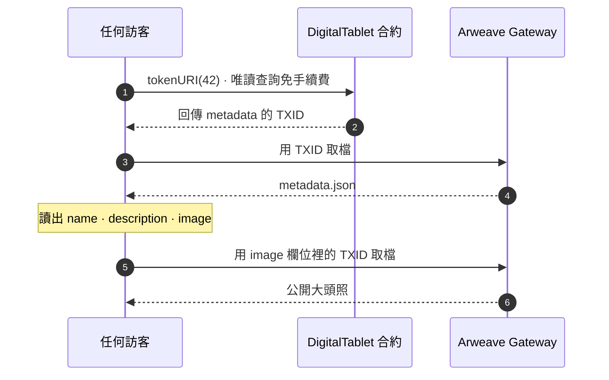

### 那份 metadata.json 長什麼樣

`name` / `description` / `image` / `attributes` 是 ERC-721 標準建議的欄位,OpenSea 等工具都認得;`dsas` 是本專案的擴充欄位。

```json
{
  "name": "王大明",
  "description": "1940 年生於彰化鹿港,2024 年逝於台北。一生教書育人。",
  "image": "ar://<公開大頭照的 TXID>",
  "attributes": [
    { "trait_type": "籍貫", "value": "台灣彰化縣鹿港鎮" },
    { "trait_type": "出生日期", "display_type": "date", "value": -941587200 },
    { "trait_type": "享壽", "value": 84 },
    { "trait_type": "世代", "value": 0 }
  ],
  "dsas": {
    "version": "1.0",
    "deceased": { "name": "王大明", "origin": "台灣彰化縣鹿港鎮" }
  }
}
```

### 關鍵性質:一層指一層

```
tokenId = 42
   │  ① 讀鏈上 tokenURI(約 50 bytes)
   ▼
ar://<metadata TXID>
   │  ② 取回 JSON(幾 KB)
   ▼
metadata.json 裡的 image 欄位
   │  ③ 再取一次
   ▼
公開大頭照(幾 MB)
```

**鏈上只為最上面那 50 bytes 付費**,其餘都在 Arweave。而 Arweave 的 TXID 對應的內容不可修改(見 Q6),所以「鏈上存地址」不會變成「可以偷換內容」的漏洞。

---

## Q5. 加密資料怎麼從 NFT 找到?

> **評審可能這樣問**:「私密資料也放 Arweave,那要怎麼知道哪個密文是誰的?」

**一句話回答**:`artifactURI` 指向一份**索引清單(manifest)**,清單列出每個密文在 Arweave 的位置、密文的資料雜湊,以及「滿足什麼條件才能解密」。清單本身不含任何私密內容,連原始檔名都在密文裡。

### 結構

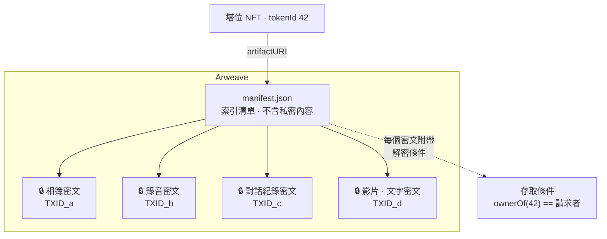

### manifest 範例(結構示意,型別定義見 [shared/types/artifact.ts](../shared/types/artifact.ts))

```json
{
  "type": "aeterlux-encrypted-artifact",
  "version": 2,
  "tokenId": "42",
  "contract": "0x69e556D27B2057c5a32fd40eAe6A6bC986949fd4",
  "chainId": 11155111,
  "access": {
    "network": "naga-dev",
    "chain": "sepolia",
    "accessControlConditions": [
      {
        "contractAddress": "0x69e556D27B2057c5a32fd40eAe6A6bC986949fd4",
        "standardContractType": "ERC721",
        "chain": "sepolia",
        "method": "ownerOf",
        "parameters": ["42"],
        "returnValueTest": { "comparator": "=", "value": ":userAddress" }
      }
    ]
  },
  "items": [
    { "kind": "photo",   "uri": "ar://<TXID_a>", "dataToEncryptHash": "<sha256>", "mime": "image/jpeg", "size": 523211 },
    { "kind": "audio",   "uri": "ar://<TXID_b>", "dataToEncryptHash": "<sha256>", "mime": "audio/mp4",  "size": 2411008 },
    { "kind": "chatlog", "uri": "ar://<TXID_c>", "dataToEncryptHash": "<sha256>", "mime": "text/plain", "size": 88213,
      "chatlog": { "platform": "line", "format": "txt" } }
  ]
}
```

| 欄位 | 用途 |
|---|---|
| `access.accessControlConditions` | **解密條件**。這裡寫的是「呼叫合約 `ownerOf(42)`,回傳值必須等於請求者自己的地址」;同一份清單的密文共用這組條件 |
| `:userAddress` | Lit 的保留字,代表「發出解密請求、並已用錢包簽名證明身分的那個地址」 |
| `items[].uri` | 密文在 Arweave 上的位置 |
| `items[].dataToEncryptHash` | 被加密資料的雜湊,和存取條件一起構成 Lit 的身分參數;解密時用來綁定「是哪一份資料」 |
| `items[].chatlog` | 對話紀錄的平台與格式,解密後建立 AI 記憶時使用 |
| 檔名 | 和內容包在同一份密文裡,清單上不放明文檔名 |
| 補傳 | 新密文附加到 `items[]` 即可,舊版本清單仍在 Arweave 上;不必重新加密既有資料 |

> 💡 **為什麼條件寫的是 `ownerOf` 而不是一串固定地址?**
> 因為塔位可以**繼承**(轉讓 NFT)。條件綁定「現在誰持有這顆 NFT」,轉讓後新持有者自動取得解密權,**不需要重新加密任何檔案**。

---

## Q6. Arweave 憑什麼說是「永久」儲存?

> **評審可能這樣問**:「永久是行銷用語吧?公司倒了怎麼辦?」

**一句話回答**:Arweave 用**一次付費、預存 200 年儲存成本的捐贈基金(endowment)**,加上「礦工必須證明自己真的存著資料才能拿獎勵」的共識機制,讓儲存不依賴任何單一公司存活。

### 跟 IPFS 的差別

| | IPFS | Arweave |
|---|---|---|
| 付費模式 | **租約式**:要有人持續 pin,停止付費資料就可能消失 | **一次付費**:付一次,協議負責長期保存 |
| 定址方式 | 內容雜湊(CID) | 交易 ID(TXID) |
| 誰負責保存 | 你自己或你付錢的 pin 服務 | 全網礦工,由協議經濟誘因約束 |
| 適合 | 快速分發 | **「永久安放」的語意** ← 塔位需要的 |

> 本系統以 Arweave 為主要儲存路徑;IPFS(Pinata)保留為可切換的備援路徑。

### 捐贈基金怎麼運作

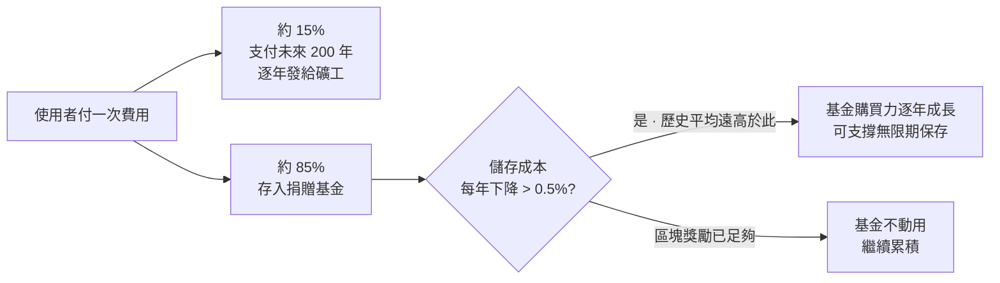

**核心假設**:硬碟的單位儲存成本長期持續下降(Kryder 定律)。Arweave 以「每年只要下降 0.5%」這個非常保守的假設定價,而過去數十年的實際下降速度遠高於此。

> ⚠️ **系統概述文件的誠實說明**:「一次付費」不是後續保存沒有成本,而是預付費用搭配儲存基金與節點獎勵支撐長期保存;實際保存仍依賴成本假設與網路持續運作,**不等同無條件的永久保證**。

### 礦工怎麼證明自己有存?

**SPoRA(Succinct Proofs of Random Access)**:出塊時,網路會隨機指定一段**歷史資料**,礦工必須能快速讀出那段資料才能參與出塊。

> 結果:**存越多歷史資料的礦工,越有機會拿到獎勵。** 保存資料不是義務,而是賺錢的方式。

驗證則結合**資料抽查與 Merkle tree**:節點提供被抽中的資料片段及雜湊路徑,驗證者就能檢查內容是否與紀錄吻合,不必每次下載整份檔案。這是可驗證的保存機制,但單次驗證不代表未來所有資料永遠存在。

---

## Q7. Irys 在圖上做了什麼?

> **評審可能這樣問**:「圖上寫 Irys 把檔案打包,為什麼不直接傳 Arweave?」

**一句話回答**:Irys 是 **Arweave 的打包服務(bundler)**。它把很多個檔案依照 **ANS-104** 標準打包成**一筆** Arweave 交易送出,手續費只付一次、上傳也更快;每個檔案仍有自己的 ID 可以單獨取回。

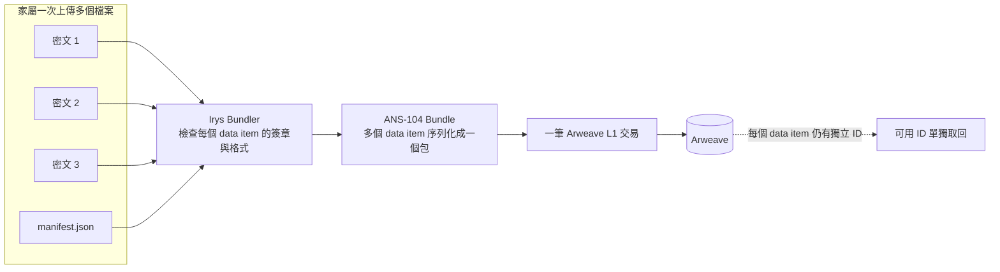

| 不打包 | 用 Irys 打包 |
|---|---|
| N 個檔案 = N 筆 L1 交易 | N 個檔案 = **1 筆** L1 交易 |
| 每筆都付基本交易費 | 基本交易費只付一次 |
| 每個檔案各自等確認 | 上傳後立即取得 ID,背景批次上鏈 |

---

## Q8. Lit Protocol 怎麼做到「只有持有 NFT 的人才能解密」?

> **評審可能這樣問**:「金鑰放在哪?你們平台自己有沒有後門可以解密?」

**一句話回答**:**沒有任何一方單獨持有金鑰**,包括我們。解密金鑰由 Lit 網路多個節點**各自持有一小片**,節點先**上鏈確認你確實持有這顆 NFT**,才各自交出分片;湊滿門檻數量後,金鑰在**使用者自己的瀏覽器裡**組合出來。

### 核心密碼學:門檻 BLS 簽章 + 身分基礎加密

先建立兩個直覺:

**① 門檻密碼學(Threshold Cryptography)**

```
一把完整私鑰 ──拆成──▶ [分片1] [分片2] [分片3] ... [分片N]
                          節點1   節點2   節點3       節點N

要簽章/解密:只要湊齊「超過門檻數量」的分片即可
任何單一節點(或少數串通的節點)都無法還原完整私鑰
```

**② 身分基礎加密(Identity-Based Encryption, IBE)**

一般加密要先拿到收件者的公鑰。IBE 則是**用一個「身分字串」本身當作加密參數**。Lit 把這個身分定義為:

$$\text{identity} = \text{Hash}(\text{存取條件} \,\Vert\, \text{資料雜湊})$$

**加密時不需要跟任何節點互動**:用 Lit 網路的公開金鑰 + 這個身分參數,就能在瀏覽器本地加密。
**解密時**,需要 Lit 網路針對「這個身分」產生的 **BLS 門檻簽章**,這個簽章本身就是解密金鑰。

### 加密流程(Enrollment 寫入時)

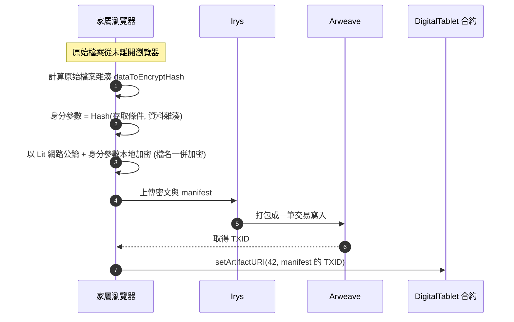

### 解密流程(需要使用素材時)

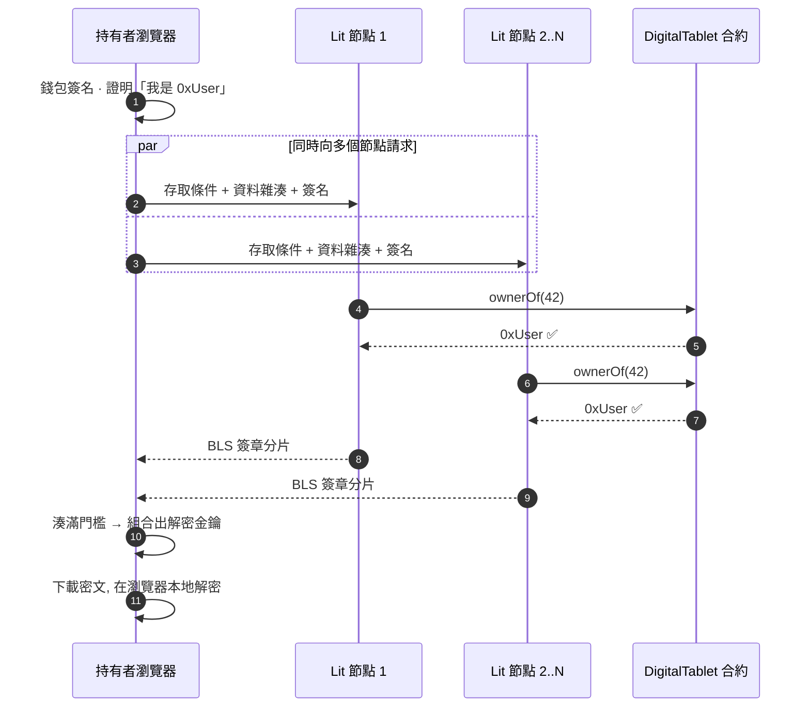

### 評審常追問的點

| 問題 | 回答 |
|---|---|
| **平台能偷偷解密嗎?** | 不能。我們沒有持有任何分片,且解密條件寫死在身分參數裡,改條件等於換一把完全不同的金鑰 |
| **Lit 節點串通呢?** | 需要超過門檻數量的節點同時串通。節點運行在 **AMD SEV** 可信執行環境(TEE)中,節點營運者本身也無法讀取分片 |
| **條件怎麼驗證?** | 每個節點**各自**讀取區塊鏈上的 `ownerOf`,不信任使用者自己宣稱的結果 |
| **NFT 轉讓後?** | 新持有者的 `ownerOf` 驗證通過,自動取得解密權;舊持有者立刻失去解密權。**不需要重新加密** |
| **Lit 服務停了呢?** | 這是依賴外部服務的風險;可將同一份素材另以備援條件(例如家族多簽)加密一份 |
| **一定要加密嗎?** | 加密是選用功能,家屬可依需求啟用或不啟用;不啟用時素材與公開資料一樣寫在 metadata |

---

## Q9. 解密出來的資料,怎麼變成人像、聲音和記憶?

> **評審可能這樣問**:「圖上中間三個方塊,各自在做什麼?」

**一句話回答**:三種素材走三條平行的路 —— **文字**變成可檢索的向量記憶、**照片**變成可驅動的 3D 頭像、**錄音**變成聲音合成的參考樣本。

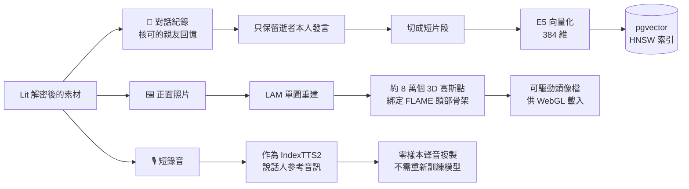

### 路線一:對話紀錄 → 向量記憶(Backend RAG,CPU)

| 步驟 | 做法 | 為什麼 |
|---|---|---|
| ① 過濾 | 對話紀錄**只保留逝者本人**的發言,不索引家屬說的話 | 檢索命中的必須是「他真的說過的話」 |
| ② 切片 | 聊天訊息累積到約 **24 字**傾向斷片,上限 **120 字**,少於 **4 字**(單字、貼圖)丟棄;親友回憶上限 **240 字** | 聊天訊息很短,一兩句一片最能保留語氣 |
| ③ 加前綴 | 每片加上 `passage: ` 前綴 | E5 的訓練方式要求(見 Q15) |
| ④ 向量化 | multilingual-E5-small,輸出 **384 維**,mean pooling + L2 正規化 | 正規化後可直接用 cosine 比相似度 |
| ⑤ 寫入 | 存進 PostgreSQL 的 pgvector 欄位,建 **HNSW** 索引 | 快速近似最近鄰搜尋(見 Q16) |

> 💡 **記憶分兩種來源,並刻意分開存**:
> - `chatlog`:逝者**本人說過的話** → 可以模仿語氣、當作自己的記憶
> - `story`:**親友寫下的回憶** → 是別人對他的記憶,不能當成他說過的原話
>
> 這個區分在 Q17 組 prompt 時非常重要。

### 路線二:照片 → 3D 頭像(3DGS Reconstruction,GPU)

一張正面照送進 **LAM**,輸出一個由約 8 萬個 3D 高斯點組成、綁定在 FLAME 頭部模型上的可驅動頭像。原理見 **Q21、Q22**。

### 路線三:錄音 → 聲音參考(Voice Clone,GPU)

短錄音**不是用來訓練新模型**,而是在每次合成時當作 **IndexTTS2 的說話人參考音訊**,模型從中擷取音色。這叫**零樣本(zero-shot)聲音複製**,原理見 **Q20**。

---

## Q10. 為什麼只要做一次?產物存在哪?

> **評審可能這樣問**:「每次對話都要重新解密、重建嗎?那會很慢。」

**一句話回答**:不用。三條路線的產物在建立時就準備好,以**標籤(label)**綁定在該塔位上,之後每次對話只需要**讀取**,不需要重算。

| 產物 | 建立耗時量級 | 對話時的使用方式 |
|---|---|---|
| 記憶向量索引 | 依素材量,數秒至數分鐘 | 每句話做一次檢索(毫秒級) |
| 3D 頭像檔 | 單次前向推理 + 匯出 | 瀏覽器載入一次,之後只傳驅動參數 |
| 聲音參考 | 上傳並登記一次 | 每句話合成時直接引用 |

### 產物存在哪

| 產物 | 存放位置 | 說明 |
|---|---|---|
| 記憶向量索引 | 後端 PostgreSQL(pgvector) | 可隨時從素材重建;私密對話紀錄的切片只在持有者解鎖後提供時建立 |
| 3D 頭像檔 | 自建 GPU 伺服器 | metadata 只記標籤(`avatarLabel`),不公開下載 |
| 聲音樣本 | 自建 GPU 伺服器 | metadata 只記標籤(`voiceLabel`) |

> 🔑 **分身能不能不被平台綁定?** 原始素材都在 Arweave(公開的在 metadata、私密的是 `artifactURI` 裡的密文),指標在鏈上;GPU 伺服器上的產物是**可重建的快取**。持有者解鎖素材後,在任何一台跑同樣開源模型的機器重跑一次建立流程,就能得到同一個分身。

---

## Q11. 誰能看到什麼?權限怎麼控管?

> **評審可能這樣問**:「親戚想看,但不是 NFT 持有者怎麼辦?」

**一句話回答**:分三層 —— **公開資料**任何人可看;**對話與追思頁**可由持有者透過邀請碼分享;**原始私密素材的解密權**只綁定 NFT 持有者。

| 角色 | 公開 metadata | 追思頁 / 與分身對話 | 解密原始素材 |
|---|---|---|---|
| 任何訪客 | ✅ | 依持有者設定的可見度 | ❌ |
| 持邀請碼的親友 | ✅ | ✅ | ❌ |
| NFT 持有者 | ✅ | ✅ | ✅ |

### 對話時的身分驗證流程

對話不需要把原始素材解密給親友,而是由伺服器驗證身分後,發給一張**短期通行證**:

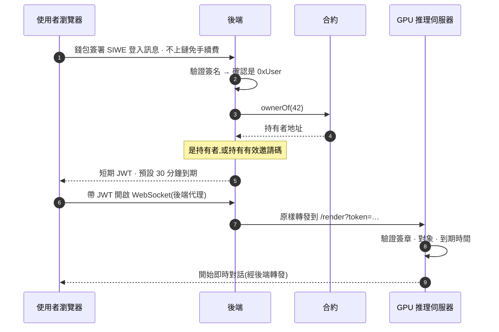

| 機制 | 規格 | 用途 |
|---|---|---|
| **SIWE** | EIP-4361 | 用錢包簽一段文字證明身分。**是簽名不是交易**,不上鏈、不花手續費 |
| **JWT** | HS256,含 `sub`、`aud`、`voice`、`avatar`、`exp` | 後端與 GPU 伺服器共享密鑰;GPU 伺服器不需要自己查鏈 |
| **短效期** | 預設 1800 秒 | 通行證外洩的影響時間有限 |

---

## Q12. 家屬後悔了,資料能刪嗎?

> **評審可能這樣問**:「永久儲存聽起來很好,但個資法要求能刪除,你們怎麼處理?」

**一句話回答**:Arweave 上的**密文**確實刪不掉,這是永久儲存的本質。我們能保證的是**讓它永遠無法被解開** —— 密文沒有金鑰就只是亂碼。

### 誠實說明限制

| 資料 | 能否物理刪除 | 本架構的處理 |
|---|---|---|
| 鏈上的 `tokenURI` / `artifactURI` 字串 | ❌ 歷史紀錄永久存在 | 可更新為空值,但舊值在歷史區塊中仍可查 |
| Arweave 上的**公開** metadata | ❌ | **因此 metadata 只放家屬同意公開的墓碑級資訊**(Q2) |
| Arweave 上的**密文** | ❌ | 使其**無法被解密**(見下) |
| 資料庫的留言、向量索引 | ✅ | 直接刪除 |
| GPU 伺服器上的頭像與聲音快取 | ✅ | 直接刪除 |

### 讓密文永遠無法解開的設計

因為解密條件在加密時就寫死在身分參數裡,**事後無法修改既有密文的條件**。所以要在**加密當下**就把「撤銷開關」放進條件:

```
解密條件 =  ownerOf(tokenId) == 請求者
       AND  isRevoked(tokenId) == false      ← 合約上的撤銷旗標
```

家屬要求撤銷時,在合約上把 `isRevoked` 設為 `true`,之後 Lit 節點驗證條件永遠不會通過,**所有既有密文同時失效**。

> ⚠️ 這個撤銷旗標屬於**設計規劃**,需要在合約加上對應函式,並在加密時把它納入存取條件。

---

# 第二部分:Instant Synthesis —— 每個模型的原理

---

## Q13. 一輪對話從開口到看到畫面,完整經過哪些步驟?

> **評審可能這樣問**:「下面這排方塊的資料是怎麼流動的?」

**一句話回答**:聲音 → 文字 → 檢索記憶 → 生成回覆 → **每一句**合成語音 → 從語音同時算出表情和頭部動作 → 三者打包送到瀏覽器同步播放。

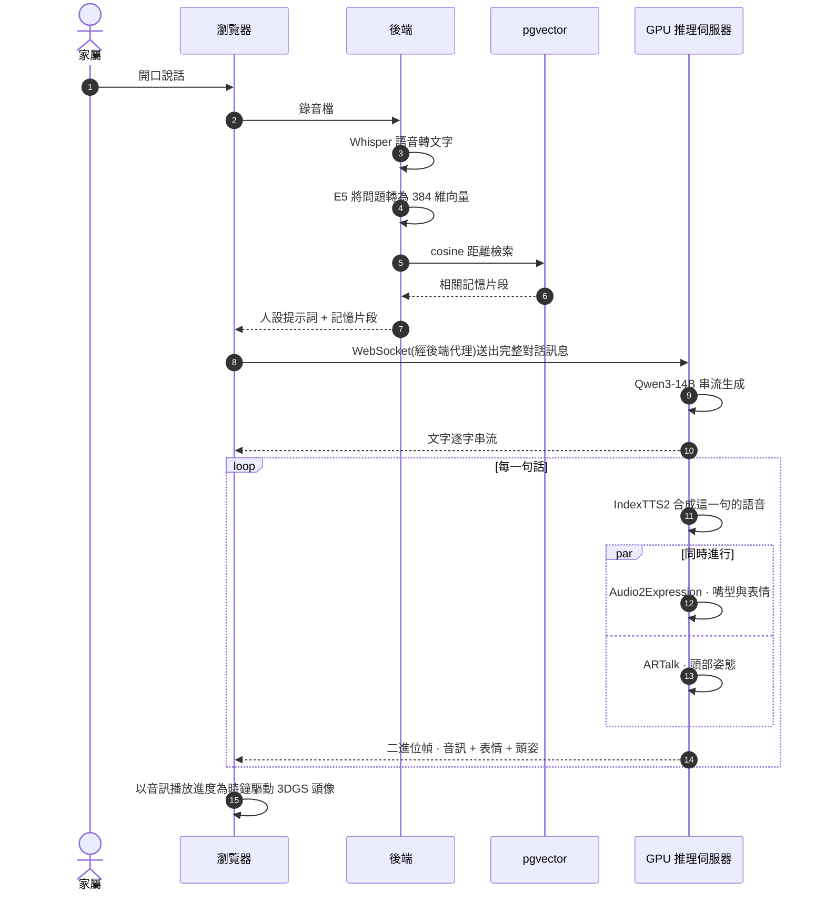

### 為什麼以「句」為單位?

語音合成是整條管線中**最慢**的一段。實測在 RTX 5090 上:

| 階段 | 耗時(每句) |
|---|---|
| IndexTTS2 語音合成 | **RTF 約 2.7**(生成 1 秒語音需約 2.7 秒) |
| Audio2Expression | 約 0.5 秒 |
| ARTalk(與 A2E 並行) | 約 0.5 秒 |

如果等整段回覆全部合成完才播,使用者要等很久。**以句為單位**,第一句合成好就能先送出;前端再**預先緩衝約 3 秒**音訊才開始播,避免句與句之間出現靜音斷層。

> 💡 **RTF(Real-Time Factor)**= 生成耗時 ÷ 音訊長度。RTF < 1 代表比即時快。

---

## Q14. Whisper 怎麼把聲音變成文字?

> **對應方塊**:Speech-To-Text

**一句話回答**:Whisper 先把聲音轉成**頻譜圖**(聲音的「圖片」),再用 **Transformer 編碼器-解碼器**「看圖寫字」。它強在用了 **68 萬小時**網路上的多語言語音訓練,所以對口音、雜音、中英夾雜都很穩。

**論文**:Radford et al., *Robust Speech Recognition via Large-Scale Weak Supervision*, OpenAI, 2022(ICML 2023)

> 本系統由後端呼叫 OpenAI 的 `whisper-1` API 執行語音辨識。

### 架構

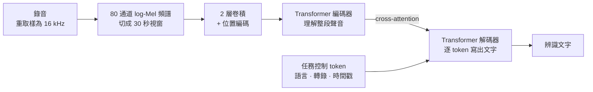

### 逐步說明

**① 聲音 → 頻譜圖**

聲音是一條隨時間變化的波形,直接處理很難。Whisper 先做短時傅立葉轉換,每 10 毫秒取一個 25 毫秒的小窗,算出各頻率的能量,再依人耳的感知方式壓成 **80 個 Mel 頻帶**、取對數。

結果是一張「橫軸時間、縱軸頻率、顏色是能量」的圖。**語音辨識就變成了看圖說話。**

**② 編碼器理解聲音**

頻譜經過兩層卷積降採樣,送進 Transformer 編碼器。自注意力機制讓每個時間點都能「看到」整段 30 秒的其他部分,理解上下文。

**③ 解碼器逐字寫出**

解碼器一次預測一個文字 token,每一步都透過 cross-attention 回頭查看編碼器的輸出。一開始先餵進幾個**特殊 token** 告訴它要做什麼:

```
<|startoftranscript|> <|zh|> <|transcribe|> <|notimestamps|> 奶 奶 你 好 ...
                        ↑        ↑              ↑
                      語言     任務:轉錄     不要時間戳
```

同一個模型換不同的特殊 token,就能做語言偵測、轉錄、翻譯成英文。

### 為什麼選 Whisper

| 特性 | 對本專案的意義 |
|---|---|
| **弱監督大規模訓練**(680,000 小時) | 不需要針對台灣口音另外訓練 |
| **自動語言偵測** | 家屬中英夾雜、台語詞彙混入時仍能處理;我們不鎖定語言 |
| **對雜訊穩健** | 家中環境、情緒哽咽的語音仍有可用結果 |

---

## Q15. E5 怎麼把一句話變成向量?

> **對應方塊**:embedding

**一句話回答**:E5 是一個被訓練成「**意思相近的句子,向量就靠得近**」的編碼器。它把任何一句話壓成 **384 個數字**,之後比較兩句話的意思,只要算這兩組數字的夾角。

**論文**:
- Wang et al., *Text Embeddings by Weakly-Supervised Contrastive Pre-training*, Microsoft, 2022
- Wang et al., *Multilingual E5 Text Embeddings: A Technical Report*, Microsoft, 2024

### 為什麼需要向量?

家屬問「奶奶最喜歡吃什麼?」,記憶裡是「我最愛吃虱目魚粥」。**兩句話沒有任何一個字相同**,關鍵字搜尋找不到。但它們的**意思**很接近 —— 向量檢索就是在比意思。

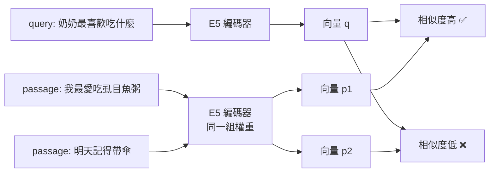

### 訓練原理:對比學習

E5 的訓練目標是讓「配對的句子」向量靠近、「不相關的句子」向量遠離。使用 **InfoNCE 損失函數**:

$$
\mathcal{L} = -\log \frac{\exp\big(\mathrm{sim}(q, p^{+}) / \tau\big)}{\exp\big(\mathrm{sim}(q, p^{+}) / \tau\big) + \sum_{i} \exp\big(\mathrm{sim}(q, p_i^{-}) / \tau\big)}
$$

| 符號 | 意義 |
|---|---|
| $q$ | 查詢句 |
| $p^{+}$ | 正例:真正相關的句子 |
| $p_i^{-}$ | 負例:同一批次裡其他不相關的句子 |
| $\mathrm{sim}$ | cosine 相似度 |
| $\tau$ | 溫度參數,控制分數分布的銳利程度 |

**白話**:把這當成一道選擇題 —— 從一堆句子裡選出真正配對的那一句。選對的機率越高,損失越低。

### 兩階段訓練

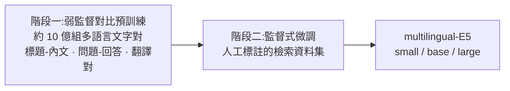

### 使用時的三個關鍵細節

| 細節 | 本專案做法 | 為什麼 |
|---|---|---|
| **前綴** | 記憶片段加 `passage: `,使用者問題加 `query: ` | 模型訓練時就是這樣區分兩種角色;省略會明顯降低檢索品質 |
| **Mean pooling** | 把句子中每個 token 的向量取平均 | 得到代表整句的單一向量 |
| **L2 正規化** | 向量長度縮放為 1 | 正規化後 cosine 相似度 = 內積,計算更快 |

選 **small(384 維)** 的原因:在後端 CPU 上即可執行,不佔用 GPU;對話紀錄多為短句,小模型已足夠。

---

## Q16. pgvector 怎麼在大量記憶中快速找到相關片段?

> **對應方塊**:Find Memory

**一句話回答**:用 **HNSW(階層式可導航小世界圖)** 索引。它像一張**多層地圖** —— 先在最粗略的高速公路層跳到大概位置,再逐層下到細街道找到最近的點,不需要跟每一筆記憶都比對一次。

**論文**:Malkov & Yashunin, *Efficient and Robust Approximate Nearest Neighbor Search Using Hierarchical Navigable Small World Graphs*, IEEE TPAMI, 2020

### 暴力搜尋的問題

如果有 N 段記憶,暴力搜尋要算 N 次相似度。記憶越多越慢。HNSW 讓搜尋步數大約只隨 $\log N$ 成長。

### HNSW 的結構

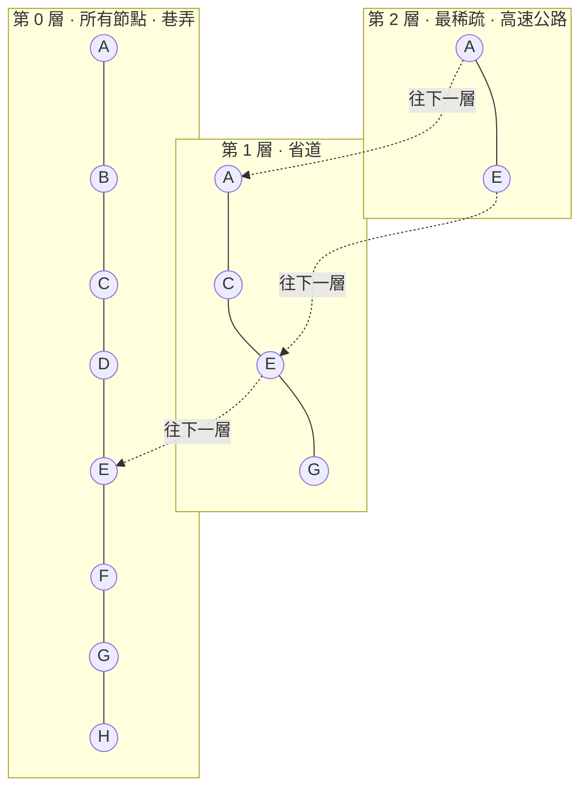

### 搜尋步驟

```
查詢向量 q 進來
  │
  ▼  第 2 層:從入口點出發,貪婪地往「離 q 更近」的鄰居跳
  │         跳不動了 → 記下目前位置,下到第 1 層
  ▼  第 1 層:從剛才的位置繼續貪婪地跳
  │         跳不動了 → 下到第 0 層
  ▼  第 0 層:在最密的圖上做較寬的搜尋,收集最近的 k 個
  │
  ▼  回傳 top-k
```

**為什麼快**:上層節點少、連線跨度大,幾步就能跨越整個空間;下層只需在很小的鄰域內精修。

**「近似」的代價**:HNSW 不保證找到數學上絕對最近的點,但實務上召回率極高,換來數量級的速度提升。

### 本專案的檢索參數

```sql
SELECT text, kind, speaker, "mediaUri",
       embedding <=> $query_vector AS distance
FROM "MemoryChunk"
WHERE "tokenId" = $tokenId
ORDER BY embedding <=> $query_vector
LIMIT 4;
```

| 參數 | 值 | 說明 |
|---|---|---|
| 距離運算子 | `<=>` | pgvector 的 **cosine 距離** = 1 − cosine 相似度。0 代表完全相同 |
| 索引 | HNSW,`vector_cosine_ops` | 對應 cosine 距離的索引類型 |
| 候選數 | **4** | 先取最相近的 4 段(系統概述文件:最多四段) |
| 文字相關門檻 | 距離 **≤ 0.62** | 超過視為不夠相關,不注入 prompt |
| 照片門檻 | 距離 **≤ 0.55**,每輪最多 **2** 張 | 見 Q17 |
| 範圍限制 | `WHERE tokenId = ...` | **只搜尋這位逝者的記憶**,不會混到別人的 |

---

## Q17. 找到的記憶怎麼交給語言模型?為什麼能減少胡說?

> **對應方塊**:Find Memory → Generate Response

**一句話回答**:這叫 **RAG(檢索增強生成)**。語言模型本身不認識這位逝者,如果只給名字,它會「編」出看似合理的回憶。RAG 先把**真實說過的話**檢索出來放進提示詞,讓模型**有所本地回答**。

**論文**:Lewis et al., *Retrieval-Augmented Generation for Knowledge-Intensive NLP Tasks*, NeurIPS 2020

### 沒有 RAG vs 有 RAG

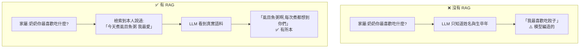

### 提示詞怎麼組

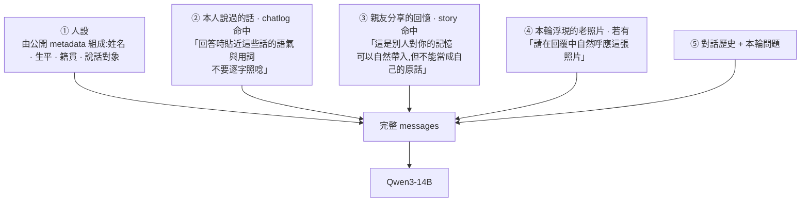

### 兩個刻意的設計

**① 區分「本人的話」與「別人的回憶」**

如果把親友寫的「奶奶以前總是半夜幫我蓋被子」直接當作奶奶的語料,模型可能以奶奶口吻說出「我總是半夜幫我蓋被子」這種人稱錯亂的句子。所以兩種來源分區塊呈現,並給出不同的使用指示。

**② 照片門檻比文字更嚴**

| | 門檻 | 理由 |
|---|---|---|
| 文字 | 距離 ≤ 0.62 | 不夠相關時模型可以選擇不引用,傷害有限 |
| 照片 | 距離 ≤ 0.55,每輪最多 2 張 | **在追思情境中跳出不相關的照片,情感傷害遠大於不放**,寧缺勿錯 |

---

## Q18. Qwen3-14B 是怎麼生成回覆的?

> **對應方塊**:Generate Response

**一句話回答**:Qwen3-14B 是一個 **148 億參數的 decoder-only Transformer**。它做的事情只有一件:**根據前面所有的字,預測下一個字**,重複這個動作直到回覆結束。我們在自建 GPU 伺服器上以 **AWQ 4-bit 量化**執行它。

**論文**:Qwen Team, *Qwen3 Technical Report*, 2025

### 核心原理:自回歸生成

$$
P(x_1, x_2, \dots, x_T) = \prod_{t=1}^{T} P(x_t \mid x_1, \dots, x_{t-1})
$$

**白話**:整句話出現的機率,等於每個字在「已知前面所有字」的條件下出現機率的乘積。生成時就是一次挑一個字、接上去、再預測下一個。

```
輸入:[系統提示詞 + 記憶 + 問題]
  → 預測「虱」
  → [... + 虱] 預測「目」
  → [... + 虱目] 預測「魚」
  → ... 直到預測出結束 token
```

### 模型結構

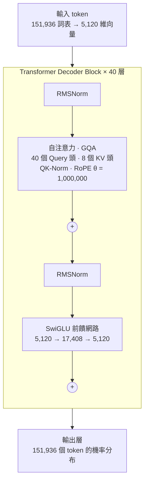

**官方架構參數(技術報告 Table 1 與官方模型設定檔)**:

| 參數 | 值 |
|---|---|
| 參數量 | 148 億(不含嵌入層 132 億) |
| 層數 | 40 |
| 隱藏維度 | 5,120 |
| 前饋網路維度 | 17,408 |
| 注意力頭數 | 40 |
| Key/Value 頭數 | **8**(GQA) |
| 每頭維度 | 128 |
| 詞表大小 | 151,936 |
| 位置編碼 | RoPE,θ = 1,000,000 |
| 注意力穩定化 | QK-Norm(取代 Qwen2 的 QKV bias) |
| 激活函數 | SwiGLU |
| 預訓練資料 | 約 36 兆 token,涵蓋 119 種語言與方言 |
| 上下文長度 | 原生 32,768 token;以 YaRN 可延伸至 131,072 |
| 授權 | Apache 2.0 |

### 三個關鍵技術

**① 自注意力(Self-Attention)** —— 讓每個字決定該「注意」前文的哪些字

$$
\mathrm{Attention}(Q, K, V) = \mathrm{softmax}\!\left(\frac{QK^{\top}}{\sqrt{d_k}} + M\right) V
$$

$M$ 是**因果遮罩**,讓每個位置只能看到自己和前面的字,不能偷看後面。

**② GQA(分組查詢注意力)** —— 省記憶體的關鍵

生成時要把每一層、每個 token 的 Key/Value 存起來(KV cache),避免重算。一般多頭注意力每個頭都有自己的 K/V;**GQA 讓 40 個 Query 頭共用 8 組 K/V**。

以 FP16 精度計算,每個 token 的 KV cache:

$$
2 \times \underbrace{40}_{\text{層}} \times \underbrace{8}_{\text{KV 頭}} \times \underbrace{128}_{\text{每頭維度}} \times \underbrace{2}_{\text{bytes}} = 163{,}840 \text{ bytes} = 160\text{ KiB}
$$

若不用 GQA(40 組 K/V)則為 800 KiB,**GQA 省下 80%**。這讓同一張 GPU 能同時留出空間給語音合成與表情模型。

**③ RoPE + QK-Norm** —— 讓模型知道字的順序,並穩定訓練

RoPE 把位置資訊編碼成向量在高維空間中的**旋轉角度**,兩個字的注意力分數自然只取決於它們的**相對距離**。Qwen3 以 ABF 技術把基底 θ 從 10,000 提高到 1,000,000,以支援更長的上下文。QK-Norm 在計算注意力前先把 Query 與 Key 正規化,避免注意力分數爆掉,讓大模型訓練更穩定。

### AWQ 4-bit 量化:讓 14B 跟語音、表情模型擠同一張 GPU

| | FP16 權重 | AWQ 4-bit 權重 |
|---|---|---|
| 每個參數 | 2 bytes | 約 0.5 bytes |
| 模型權重約需 | 約 30 GB | 約 10 GB |

**原理一句話**:不是所有權重都一樣重要。AWQ 依**啟用值(activation)**找出影響最大的少數權重通道,先把它們放大再量化以保住精度;其餘權重每 128 個一組量化成 4 bits。

**論文**:Lin et al., *AWQ: Activation-aware Weight Quantization for LLM Compression and Acceleration*, MLSys 2024

### 思考模式

Qwen3 同一個模型支援「思考模式」(先輸出 `<think>…</think>` 推理再回答)與「非思考模式」。追思對話要的是自然口語與低延遲,GPU 伺服器會把 `<think>` 段剝掉,只串流回答本身。

### 為什麼選 Qwen3-14B

| 考量 | 說明 |
|---|---|
| **中文** | 預訓練涵蓋 119 種語言與方言(含中文);系統提示詞指定繁體中文口語,並以逝者本人的中文原話引導語氣 |
| **顯存共用** | AWQ 4-bit 約 10 GB,同一張 RTX 5090 還要跑 IndexTTS2、Audio2Expression、ARTalk |
| **延遲** | 首個 token 約 100 毫秒 |
| **開源可自架** | Apache 2.0 授權,可在自有機器上執行,對話內容不交給第三方 AI 平台 |

---

## Q19. 為什麼回覆能一個字一個字串流出來?

> **對應方塊**:Generate Response(推理引擎)

**一句話回答**:GPU 伺服器用 **vLLM** 執行模型。它的 **PagedAttention** 像作業系統管理記憶體一樣管理 KV cache,不浪費顯存;每生成一個 token 就立刻串流回傳。

**論文**:Kwon et al., *Efficient Memory Management for Large Language Model Serving with PagedAttention*, SOSP 2023

### 問題:KV cache 很難預留

生成前不知道回覆會多長。傳統做法是**預留最大長度的連續記憶體**,但大部分回覆用不到那麼多,造成大量浪費。

### 解法:借用作業系統的「分頁」

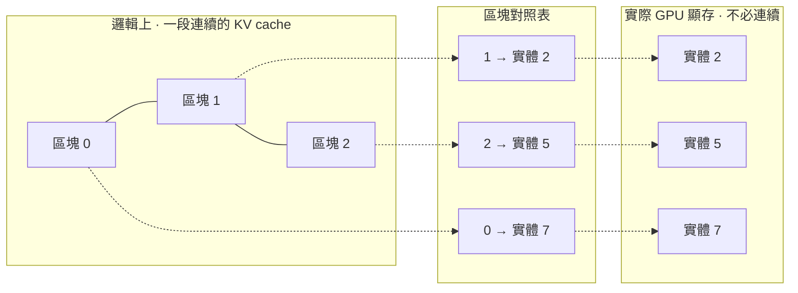

| 傳統做法 | PagedAttention |
|---|---|
| 預留一整塊連續空間 | 固定大小的區塊,**用到才分配** |
| 碎片化嚴重 | 區塊可放在顯存任何位置 |
| 浪費大量預留空間 | 浪費只發生在最後一個未填滿的區塊 |

### 對話體驗的差別

```
不串流:  [===== 等待 3~4 秒 =====] → 整段回覆一次出現

串流:    今 → 天 → 天 → 氣 → 真 → 好 → ...
         ↑ 第一個字很快出現,邊生成邊顯示,邊送去合成語音
```

---

## Q20. IndexTTS2 怎麼用短短一段錄音就模仿本人聲音?

> **對應方塊**:IndexTTS2 / Voice Clone

**一句話回答**:IndexTTS2 把「**說什麼**」、「**誰的聲音**」、「**什麼情緒**」拆成三個獨立的輸入。家屬提供的短錄音只負責「誰的聲音」—— 模型從中擷取**音色特徵**,再用這個音色唸出任何新的文字。**不需要針對逝者重新訓練模型。**

**論文**:Zhou et al., *IndexTTS2: A Breakthrough in Emotionally Expressive and Duration-Controlled Auto-Regressive Zero-Shot Text-to-Speech*, bilibili, 2025

### 三段式架構

```mermaid
flowchart LR
    TXT["要說的文字<br/>Qwen3 生成的一句"] --> T2S
    REF["逝者的短錄音"] --> SPK["說話人條件編碼器<br/>擷取音色"]
    EMO["情緒參考"] --> EE["情緒編碼器<br/>以梯度反轉層與音色解耦"]
    SPK --> T2S
    EE --> T2S
    T2S["① T2S · 自回歸 Transformer<br/>文字 → 語意 token"] --> S2M["② S2M · Flow Matching<br/>語意 token → Mel 頻譜"]
    REF --> S2M
    S2M --> VOC["③ BigVGANv2 聲碼器<br/>Mel 頻譜 → 波形"]
    VOC --> WAV["逝者聲音的語音"]
```

### 逐段說明

**① Text-to-Semantic(T2S):決定「怎麼說」**

一個**自回歸 Transformer**(跟 Qwen3 同類),輸入文字、音色、情緒,一個一個生成**語意 token**。這些 token 描述的是發音內容與韻律(抑揚頓挫),還不是聲音本身。語意 token 的定義來自 **MaskGCT** 的語意編碼器。

**② Semantic-to-Mel(S2M):決定「聲音長什麼樣」**

一個**非自回歸**的 **Flow Matching** 模型,把語意 token 轉成 Mel 頻譜。它會參考逝者錄音的頻譜,把音色細節補上。

> **Flow Matching 的直覺**:從一團隨機雜訊出發,學一個「速度場」,沿著它一步步把雜訊推向目標頻譜。跟擴散模型類似,但路徑更直、步數更少。

**③ Vocoder:變成真正的聲音**

**BigVGANv2** 把 Mel 頻譜還原成可以播放的波形。本系統輸出為 **24 kHz 單聲道**音訊。

### 三個讓它適合本專案的設計

**① 音色與情緒解耦**

如果逝者留下的錄音都是平淡的語氣,傳統方法合成出來也只會平淡。IndexTTS2 用**梯度反轉層(Gradient Reversal Layer)** 訓練情緒編碼器 —— 在訓練時故意讓它「無法從情緒特徵中辨認出說話人」,強迫情緒特徵不含音色資訊。

結果:**音色來自逝者的錄音,情緒可以另外指定**,兩者可以自由組合。

**② GPT latent 增強清晰度**

情緒強烈時語音容易含糊。IndexTTS2 把 T2S 最後一層的隱藏狀態,以向量相加的方式融入語意特徵,提供更豐富的上下文,論文實驗顯示能降低高表現力語音的字錯誤率。

**③ 可控制時長**

自回歸模型通常無法事先決定語音長度。IndexTTS2 加入時長嵌入:

$$
p = W_{\text{num}} \cdot h(T)
$$

$T$ 是目標語意 token 數量。指定 $T$ 就能控制語音長度;不指定時 $p = \mathbf{0}$,模型自由生成。

### 零樣本 vs 微調

| | 傳統聲音複製 | IndexTTS2 零樣本 |
|---|---|---|
| 需要多少錄音 | 數十分鐘到數小時 | **一段短錄音** |
| 需要訓練嗎 | 每個人都要微調一個模型 | **不需要** |
| 新增一位逝者 | 數小時 GPU 訓練 | 上傳錄音即可 |
| 對本專案的意義 | 很多逝者只留下零星的語音訊息 | **符合實際能取得的素材** |

---

## Q21. 3D 高斯潑濺(3DGS)到底是什麼?

> **對應方塊**:LAM 3DGS

**一句話回答**:用**大量半透明、帶顏色的橢球色點**在空間中疊出一個物體。每個點都有位置、形狀、方向、顏色、透明度。渲染時把這些點「潑」到畫面上,按遠近疊合 —— 不需要傳統的三角網格或貼圖。

**論文**:Kerbl et al., *3D Gaussian Splatting for Real-Time Radiance Field Rendering*, SIGGRAPH 2023(ACM TOG)

### 直覺:柔邊色點

```
傳統 3D 模型                    3D 高斯潑濺
┌─────────────────┐            ┌─────────────────┐
│  ▲▲▲▲▲▲▲▲▲▲▲  │            │  ○ ◐ ● ◑ ○ ●   │
│  三角形網格      │            │ ◐ ● ○ ◑ ● ◐ ○  │
│  + 貼圖          │            │  ● ◑ ◐ ○ ● ◑   │
│  硬邊            │            │  數萬個柔邊色點  │
└─────────────────┘            └─────────────────┘
  頭髮、半透明很難表現              頭髮、邊緣自然柔和
```

> ⚠️ **常見誤解**:這些點**不會發光**。它們是帶有顏色的半透明物質,渲染時依照與相機的遠近前後疊加。

### 每個高斯點的屬性

一個 3D 高斯在空間中的形狀由以下公式描述:

$$
G(\mathbf{x}) = \exp\!\left(-\frac{1}{2}(\mathbf{x} - \boldsymbol{\mu})^{\top} \Sigma^{-1} (\mathbf{x} - \boldsymbol{\mu})\right)
$$

| 屬性 | 符號 | 意義 |
|---|---|---|
| 中心位置 | $\boldsymbol{\mu} \in \mathbb{R}^3$ | 點在空間中的哪裡 |
| 共變異數 | $\Sigma$ | 橢球的形狀與方向 |
| 不透明度 | $\alpha$ | 多透明 |
| 顏色 | $\mathbf{c}$ | 什麼顏色(原論文用球諧函數表示隨視角變化的顏色) |

$\Sigma$ 不直接學習,而是拆成**旋轉** $R$ 和**縮放** $S$,保證它永遠是合法的橢球:

$$
\Sigma = R\, S\, S^{\top} R^{\top}
$$

### 渲染:潑濺 + 前後疊合

```mermaid
flowchart LR
    G3["空間中數萬個<br/>3D 高斯"] --> PJ["投影到畫面<br/>變成 2D 橢圓"]
    PJ --> SO["依深度排序<br/>由近到遠"]
    SO --> AB["逐像素 α 混合"]
    AB --> IMG["最終畫面"]
```

每個像素的顏色由覆蓋它的高斯**由近到遠**疊加:

$$
C = \sum_{i=1}^{N} \mathbf{c}_i\, \alpha_i \prod_{j=1}^{i-1} (1 - \alpha_j)
$$

**白話**:第 $i$ 個點能貢獻多少顏色 = 它自己的不透明度 × **前面所有點沒擋住的比例**。越前面的點越優先。

### 為什麼選 3DGS

| 特性 | 對本專案的意義 |
|---|---|
| **即時渲染** | 可在瀏覽器以 WebGL 流暢執行 |
| **柔和邊緣** | 頭髮、臉部輪廓看起來自然,不像傳統 3D 那樣硬邊 |
| **可微分** | 整個渲染過程可以反向傳播,讓 LAM 能用照片訓練(Q22) |

---

## Q22. LAM 怎麼從一張照片重建出會動的 3D 頭像?

> **對應方塊**:3DGS Reconstruction

**一句話回答**:LAM 先準備一個**標準人頭的點雲骨架(FLAME)**,讓每個點去**「看」照片**、決定自己該是什麼顏色和形狀。一次前向推理就輸出一個綁定在骨架上的 3DGS 頭像 —— 骨架怎麼動,頭像就怎麼動。

**論文**:He et al., *LAM: Large Avatar Model for One-shot Animatable Gaussian Head*, Alibaba 通義實驗室, 2025(SIGGRAPH 2025)

### 架構

```mermaid
flowchart LR
    IMG["一張正面照"] --> DINO["DINOv2<br/>多尺度影像特徵"]
    FL["FLAME 標準頭模<br/>5,023 個頂點"] --> SUB["網格細分 2 次<br/>約 81,424 個點"]
    SUB --> QF["每個點附一個<br/>可學習查詢特徵"]
    QF --> TR["Transformer × 10 層<br/>Cross-Attention · 16 頭 · 1,024 維"]
    DINO --> TR
    TR --> ATTR["每點預測高斯屬性<br/>顏色 · 不透明度 · 縮放 · 旋轉 · 位移"]
    ATTR --> CAN["標準姿態下的<br/>3DGS 頭像"]
    CAN --> ANI["FLAME 驅動<br/>骨架蒙皮 + 表情形變"]
    ANI --> WEB["WebGL 即時渲染"]
```

### 逐步說明

**① 準備骨架:FLAME**

**FLAME** 是一個由大量 3D 人臉掃描建立的**參數化人頭模型**,有 5,023 個頂點,並內建:
- **形狀參數** $\boldsymbol\beta$:臉型胖瘦、五官位置
- **姿勢參數** $\boldsymbol\theta$:脖子、下巴、眼球的轉動
- **表情參數** $\boldsymbol\psi$:微笑、皺眉、張嘴

5,023 個點太稀疏,表現不了頭髮與細節。LAM 把網格**細分兩次**(每條邊中點加新頂點),得到約 **81,424** 個點,在品質與渲染速度間取得平衡。

**② 看照片:DINOv2**

用預訓練的 **DINOv2** 視覺模型抽取照片的**多尺度特徵** —— 同時捕捉局部細節(髮絲、皺紋)與整體資訊(臉型、光照)。

**③ 每個點去照片裡找自己的樣子:Cross-Attention**

每個 FLAME 點附帶一個可學習的**查詢向量**。經過 10 層 Transformer,每一層都用 **cross-attention** 讓點的查詢去照片特徵中找「跟我相關的資訊」:

$$
F_{P_i} = \mathrm{CrossAttn}_i\big(F_{P_{i-1}},\; F_I\big)
$$

$F_{P}$ 是點特徵,$F_I$ 是影像特徵。逐層精修後,每個點都有獨特的特徵。

**④ 輸出高斯屬性**

從每個點的特徵預測:

| 屬性 | 維度 | 意義 |
|---|---|---|
| 顏色 | 3 | RGB |
| 不透明度 | 1 | 透明程度 |
| 縮放 | 3 | 橢球三軸長度 |
| 旋轉 | 4(四元數) | 橢球朝向 |
| **位移** | 3 | **相對 FLAME 頂點的偏移** —— 讓頭髮等 FLAME 沒有的形狀長出來 |

### 怎麼動起來:不需要額外的神經網路

這是 LAM 最巧妙的地方。因為每個高斯點**生來就綁在 FLAME 頂點上**,直接沿用 FLAME 既有的變形機制:

**表情與姿勢形變**:

$$
T_G(\boldsymbol\theta, \boldsymbol\psi) = \bar{G} + B_P(\boldsymbol\theta) + B_E(\boldsymbol\psi)
$$

| 符號 | 意義 |
|---|---|
| $\bar G$ | 標準姿態下的高斯位置 |
| $B_P$ | 姿勢造成的修正形變 |
| $B_E$ | 表情造成的形變 |

再經過 **線性混合蒙皮(Linear Blend Skinning, LBS)**,依照關節轉動帶動周圍的點。

> 🔑 **動畫只需要傳送一組表情與姿勢參數**,不需要重新推理神經網路。這就是為什麼能在瀏覽器即時執行。

### 效能(論文數據)

| 平台 | FPS |
|---|---|
| NVIDIA A100 | 280.96 |
| MacBook M1 Pro | 120 |
| iPhone 16 | 35 |
| Xiaomi 14 | 26 |

論文作者將表情形變與蒙皮資訊以**紋理**形式傳入 WebGL 頂點著色器,在 GPU 上完成變形,因此能以**純網頁**形式部署。

### 訓練資料

VFHQ 資料集:15,204 段影片、約 300 萬幀,512×512 解析度。損失函數結合像素 L1、LPIPS 感知損失、輪廓遮罩損失,以及限制位移不要過大的正則項。

---

## Q23. Audio2Expression 怎麼從聲音算出嘴型和表情?

> **對應方塊**:Visual Reconstruction(LAM 3DGS 部分的驅動)

**一句話回答**:用預訓練語音模型 **wav2vec 2.0** 理解聲音,再由解碼器輸出每一幀的 **52 個 ARKit 表情係數** —— 每個係數控制臉上一個部位(例如下巴張開程度、嘴角上揚程度)。

**來源**:阿里通義實驗室 LAM 專案開源模組 `LAM_Audio2Expression`(Apache 2.0),搭配 LAM 論文使用

### 架構

```mermaid
flowchart LR
    AUD["IndexTTS2 合成的一句語音"] --> W2V["wav2vec 2.0 編碼器<br/>預訓練語音表徵"]
    STY["風格特徵"] --> DEC
    W2V --> DEC["解碼器"]
    DEC --> BS["每幀 52 維<br/>ARKit blendshape 係數"]
    BS --> MAP["對應到 FLAME 臉部拓樸"]
    MAP --> DRV["驅動 LAM 頭像"]
```

### 什麼是 ARKit 52 blendshapes?

Apple ARKit 定義的**業界通用臉部動畫標準**。把臉部動作拆成 52 個獨立的「滑桿」,每個值介於 0 到 1:

| 部位 | 部分係數範例 |
|---|---|
| 下巴 | `jawOpen` 張嘴、`jawLeft` 下巴左移 |
| 嘴巴 | `mouthSmileLeft` 左嘴角上揚、`mouthFunnel` 嘟嘴、`mouthPucker` 噘嘴 |
| 眼睛 | `eyeBlinkLeft` 左眼眨眼、`eyeWideRight` 右眼睜大 |
| 眉毛 | `browInnerUp` 眉心上揚、`browDownLeft` 左眉下壓 |
| 臉頰 | `cheekPuff` 鼓臉頰 |

**一幀的臉 = 52 個 0~1 的數字。** 發「啊」時 `jawOpen` 高;發「嗚」時 `mouthFunnel` 高。

LAM 團隊將 ARKit 的 52 個係數**手工對應**到 FLAME 的臉部拓樸,讓這些係數可以直接驅動 LAM 頭像。

### wav2vec 2.0 為什麼適合

**論文**:Baevski et al., *wav2vec 2.0: A Framework for Self-Supervised Learning of Speech Representations*, NeurIPS 2020

wav2vec 2.0 在大量**沒有文字標註**的語音上,用自監督方式學會語音的表徵(遮住一段聲音,讓模型從上下文猜出被遮住的部分)。它學到的特徵天然包含**發音部位與方式**的資訊 —— 這正是決定嘴型的關鍵。

### 資料量

每幀 52 個 float32 = **208 bytes**。本系統以 30 fps 傳送,每秒約 **6.2 KB**。

---

## Q24. ARTalk 怎麼產生頭部動作?跟 A2E 差在哪?

> **對應方塊**:Visual Reconstruction(ARTalk)

**一句話回答**:ARTalk 把「一段時間的頭部動作」**壓縮成離散代碼**(像把動作變成單字),再用**自回歸模型**根據語音一個一個預測這些代碼。它產生的是**自然的頭部擺動與姿態**,補足只有嘴巴在動的僵硬感。

**論文**:Chu et al., *ARTalk: Speech-Driven 3D Head Animation via Autoregressive Model*, 東京大學 & RIKEN AIP, SIGGRAPH Asia 2025

### 為什麼需要兩個模型?

```
只有 Audio2Expression:              加上 ARTalk:
   嘴巴會動                            嘴巴會動
   頭完全不動                          頭會點、會偏、會轉
   → 像證件照在講話                    → 像真人在說話
```

| | Audio2Expression | ARTalk |
|---|---|---|
| **主要負責** | 嘴型、臉部表情 | **頭部姿態** |
| 音訊編碼器 | wav2vec 2.0 | HuBERT |
| 生成方式 | 編碼器-解碼器 | **多尺度自回歸** |
| 本系統使用的輸出 | 每幀 52 維 ARKit 係數 | 每幀 3 維頭部姿態 |

> 💡 說話時頭部的擺動**不是由單一音節決定**,而是跟語句節奏、強調、停頓有關,需要**較長時間尺度**的建模 —— 這正是 ARTalk 多尺度設計的用途。

### 核心設計一:多尺度 VQ 動作編碼

```mermaid
flowchart TB
    MO["一段 4 秒的頭部動作"] --> MENC["動作編碼器"]
    MENC --> SC1["尺度 1 · 1 個代碼<br/>整段的整體趨勢"]
    MENC --> SC5["尺度 2 · 5 個代碼"]
    MENC --> SC25["尺度 3 · 25 個代碼"]
    MENC --> SC50["尺度 4 · 50 個代碼"]
    MENC --> SC100["尺度 5 · 100 個代碼<br/>最細的逐幀細節"]
    SC1 & SC5 & SC25 & SC50 & SC100 --> CB[("共用碼本<br/>256 個代碼 · 每個 64 維")]
```

**VQ(向量量化)的直覺**:把連續的動作對應到一本有 256 個「動作單字」的字典。一段動作就能用一串單字表示。

**多尺度的直覺**:先用 1 個單字描述「這 4 秒大致在點頭」,再用 5 個單字描述「前半點頭、後半偏頭」,越來越細。這是**殘差量化** —— 每一層只補上一層沒描述到的細節。

### 核心設計二:兩層自回歸

```
時間軸 ────────────────────────────────────────────▶
       [視窗 1 · 4 秒]    [視窗 2 · 4 秒]    [視窗 3 · 4 秒]
         │                  │                  │
         ▼                  ▼                  ▼
       尺度 1 → 5 →       尺度 1 → 5 →       尺度 1 → 5 →
       25 → 50 → 100      25 → 50 → 100      25 → 50 → 100
                   ↑                  ↑
            以前一視窗的動作為條件    以前一視窗的動作為條件
```

- **視窗內**:由粗到細,一個尺度一個尺度預測
- **視窗間**:以前一個視窗的動作為條件,確保動作連貫不跳動

每一步都以 **HuBERT** 抽取的語音特徵為條件,讓頭部動作跟著說話節奏。

### 核心設計三:風格編碼器

從一段**參考動作**中擷取個人風格(有人講話愛點頭、有人習慣偏頭),推理時不需重新訓練即可套用。

### 效能(論文數據)

| 平台 | 生成 1 秒動作所需時間 |
|---|---|
| NVIDIA A100 | 約 0.01 秒 |
| Apple M2 Pro | 約 0.057 秒 |

---

## Q25. 聲音和畫面怎麼對得上?

> **對應方塊**:Visual Reconstruction → Live Streaming

**一句話回答**:GPU 伺服器把**同一句話的音訊、每幀表情、每幀頭姿**打包成**一個二進位訊息**一起送出。瀏覽器以**音訊實際播放到哪裡**當作唯一的時鐘,每一幀去查「這個時間點該顯示哪一組表情」。

### 一句話的資料封包格式

```
┌──────────────┬────────────────┬──────────────────┬────────────────────────┬──────────────────────┐
│  4 bytes     │  meta_len      │  audio_len       │  frames_len            │  pose_len            │
│  uint32 LE   │  UTF-8 JSON    │  WAV 音訊        │  float32 × (N × 52)    │  float32 × (N × 3)   │
│  meta 長度   │  中繼資料      │  24 kHz 單聲道   │  每幀 52 維表情        │  每幀 3 維頭姿(可選)│
└──────────────┴────────────────┴──────────────────┴────────────────────────┴──────────────────────┘
```

**為什麼打包在一起**:如果音訊和表情分開傳,網路延遲不同就會對不上。**同一個封包 = 同一句話的所有資料一起到達。**

### 同步機制:「拉」而不是「推」

```mermaid
flowchart LR
    AC["瀏覽器 AudioContext<br/>音訊播放時鐘"] --> TT["目前播放到<br/>第 t 秒"]
    TT --> IDX["換算幀號<br/>frame = t × fps"]
    IDX --> LOOK["查表取出<br/>該幀 52 維表情 + 頭姿"]
    RF["3DGS 渲染器<br/>每幀主動來拉"] --> LOOK
    LOOK --> DRAW["畫出這一幀"]
```

| 設計 | 理由 |
|---|---|
| **以音訊時鐘為準** | 人耳對聲音斷裂比對畫面掉幀敏感得多;音訊必須連續,畫面跟著音訊走 |
| **渲染器主動來拉** | 渲染器有自己的畫面更新節奏;每次更新時問「現在該顯示什麼」,就不會因為資料到達時間不規律而抖動 |
| **預先緩衝約 3 秒** | 語音合成是瓶頸(Q13);累積足夠音訊才開播,避免句與句之間出現靜音 |

---

## Q26. 為什麼在瀏覽器即時渲染,而不是播影片?

> **對應方塊**:Live Streaming · WebGL

**一句話回答**:因為要傳的東西差了幾十倍。影片要傳**每一幀的所有像素**;我們只傳**驅動參數**,頭像的外觀在一開始載入一次就好。

### 資料量比較

| 方式 | 每秒傳輸量 | 計算 |
|---|---|---|
| 串流 720p 影片 | 約 1,500 kbps | 一般視訊通話常見碼率 |
| **傳送驅動參數** | **約 53 kbps** | 每幀 (52 + 3) × 4 bytes = 220 bytes,× 30 fps = 6,600 bytes/秒 |

**約少了 28 倍。**(不含音訊,兩者音訊量相同)

### 其他好處

```mermaid
flowchart TB
    RR["瀏覽器即時渲染"] --> BA["💬 真正的互動<br/>每句話即時生成,不是預錄片段剪接"]
    RR --> BB["📱 伺服器不需要做影片編碼<br/>GPU 資源留給模型推理"]
    RR --> BC["🔄 任何視角<br/>3D 頭像可以轉動,影片只有固定角度"]
    RR --> BDD["🌐 不用安裝 App<br/>WebGL 是瀏覽器內建標準"]
```

---

## Q27. LiveKit 用在哪裡?

> **對應方塊**:Live Streaming · LiveKit

**一句話回答**:用在**多人同時參加的線上公祭**(3D 靈堂)。和數位分身的一對一對話用 WebSocket 就夠了;但當十幾位親友同時在線、要彼此看到身影、聽到彼此說話時,需要 **SFU(選擇性轉發單元)** 架構,LiveKit 是它的開源實作。

### 為什麼不能讓大家直接互連?

WebRTC 原生是**點對點**。如果每個人都直接連每個人(Mesh 架構),每個人要上傳 $N-1$ 份串流:

```mermaid
flowchart LR
    subgraph MESH["❌ Mesh · 每人上傳 N−1 份"]
        m1((A)) <--> m2((B))
        m1 <--> m3((C))
        m1 <--> m4((D))
        m2 <--> m3
        m2 <--> m4
        m3 <--> m4
    end
    subgraph SFUB["✅ SFU · 每人只上傳 1 份"]
        s1((A)) <--> LK["LiveKit<br/>SFU 伺服器"]
        s2((B)) <--> LK
        s3((C)) <--> LK
        s4((D)) <--> LK
    end
```

| 參與人數 | Mesh:每人上傳份數 | SFU:每人上傳份數 |
|---|---|---|
| 4 人 | 3 | 1 |
| 10 人 | 9 | 1 |
| 50 人 | 49 | 1 |

Mesh 在超過 4~5 人時,一般家用網路的上傳頻寬就撐不住。

### 公祭房間怎麼運作

| 項目 | 做法 |
|---|---|
| 房間 | 每座燈塔一個房間 `aeterlux-ceremony-<tokenId>` |
| 入房 | 後端依追悼頁可見度簽發 token:公開放行、不公開需邀請碼、私人不開放;權限只有「收發資料 + 麥克風」 |
| 在線人數 | 房間裡的參與者數 |
| 身影走動 | 每人約 10 Hz 送出自己的位置(走可遺失的快速通道);新人進房時,已在場的人補發自己的位置給他 |
| 點香、鞠躬、聊天氣泡 | 走可靠資料通道;因為訊息點對點轉送,由**接收端**做白名單、長度、範圍與頻率檢查 |
| 留言獻供 | 存進資料庫後,後端用 LiveKit server API 推進房間 |
| 語音 | 麥克風預設關閉;打開後由 SFU 轉給房裡其他人,畫面標示誰正在說話 |
| 備援 | LiveKit 連不上時,瀏覽器自動退回後端自建的 WebSocket(同樣的事件,沒有語音) |

以環境變數 `CEREMONY_TRANSPORT=livekit|ws` 切換,與儲存層、Lit 的開關方式一致。

> 把數位分身作為伺服器端參與者加入房間、讓大家一起聽它說話,是可擴充的方向。

---

# 附錄

## 附錄 A:參考文獻

### 區塊鏈與儲存

| 項目 | 出處 |
|---|---|
| ERC-721 | Entriken et al., *EIP-721: Non-Fungible Token Standard*, 2018 — https://eips.ethereum.org/EIPS/eip-721 |
| ERC-6150 | *EIP-6150: Hierarchical NFTs* — https://eips.ethereum.org/EIPS/eip-6150 |
| SIWE | *EIP-4361: Sign-In with Ethereum* — https://eips.ethereum.org/EIPS/eip-4361 |
| Arweave 協議 | Arweave Docs — https://docs.arweave.org/developers/development/protocol |
| Arweave 捐贈基金 | *How Arweave's storage endowment ensures permanent data storage* — https://permaweb-journal.arweave.net/article/storage-endowment-explained.html |
| ANS-104 打包標準 | ar.io Docs, *What are Bundles?* — https://docs.ar.io/learn/ans-104-bundles/ |
| Irys 打包實作 | Irys-xyz/arbundles — https://github.com/Irys-xyz/arbundles |
| Lit Protocol | *Lit JS SDK V3: Introducing ID Encrypt* — https://spark.litprotocol.com/id-encrypt/ |
| Lit Protocol 文件 | https://developer.litprotocol.com/ |

### 語音與文字

| 項目 | 出處 |
|---|---|
| Whisper | Radford et al., *Robust Speech Recognition via Large-Scale Weak Supervision*, OpenAI, 2022 — https://arxiv.org/abs/2212.04356 |
| E5 | Wang et al., *Text Embeddings by Weakly-Supervised Contrastive Pre-training*, 2022 — https://arxiv.org/abs/2212.03533 |
| Multilingual E5 | Wang et al., *Multilingual E5 Text Embeddings: A Technical Report*, 2024 — https://arxiv.org/abs/2402.05672 |
| HNSW | Malkov & Yashunin, *Efficient and Robust Approximate Nearest Neighbor Search Using HNSW Graphs*, IEEE TPAMI 2020 — https://arxiv.org/abs/1603.09320 |
| pgvector | https://github.com/pgvector/pgvector |
| RAG | Lewis et al., *Retrieval-Augmented Generation for Knowledge-Intensive NLP Tasks*, NeurIPS 2020 — https://arxiv.org/abs/2005.11401 |

### 語言模型

| 項目 | 出處 |
|---|---|
| Transformer | Vaswani et al., *Attention Is All You Need*, NeurIPS 2017 — https://arxiv.org/abs/1706.03762 |
| Qwen3 | Qwen Team, *Qwen3 Technical Report*, 2025 — https://arxiv.org/abs/2505.09388 |
| Qwen3-14B 模型卡 | https://huggingface.co/Qwen/Qwen3-14B |
| AWQ | Lin et al., *AWQ: Activation-aware Weight Quantization for LLM Compression and Acceleration*, MLSys 2024 — https://arxiv.org/abs/2306.00978 |
| YaRN | Peng et al., *YaRN: Efficient Context Window Extension of Large Language Models*, 2023 — https://arxiv.org/abs/2309.00071 |
| GQA | Ainslie et al., *GQA: Training Generalized Multi-Query Transformer Models*, 2023 — https://arxiv.org/abs/2305.13245 |
| RoPE | Su et al., *RoFormer: Enhanced Transformer with Rotary Position Embedding*, 2021 — https://arxiv.org/abs/2104.09864 |
| SwiGLU | Shazeer, *GLU Variants Improve Transformer*, 2020 — https://arxiv.org/abs/2002.05202 |
| vLLM | Kwon et al., *Efficient Memory Management for LLM Serving with PagedAttention*, SOSP 2023 — https://arxiv.org/abs/2309.06180 |

### 語音合成

| 項目 | 出處 |
|---|---|
| IndexTTS2 | Zhou et al., *IndexTTS2: A Breakthrough in Emotionally Expressive and Duration-Controlled Auto-Regressive Zero-Shot TTS*, bilibili, 2025 — https://arxiv.org/abs/2506.21619 |
| IndexTTS | Deng et al., *IndexTTS: An Industrial-Level Controllable and Efficient Zero-Shot TTS System*, 2025 — https://arxiv.org/abs/2502.05512 |
| MaskGCT | Wang et al., *MaskGCT: Zero-Shot Text-to-Speech with Masked Generative Codec Transformer*, 2024 — https://arxiv.org/abs/2409.00750 |
| Flow Matching | Lipman et al., *Flow Matching for Generative Modeling*, ICLR 2023 — https://arxiv.org/abs/2210.02747 |
| BigVGAN | Lee et al., *BigVGAN: A Universal Neural Vocoder with Large-Scale Training*, ICLR 2023 — https://arxiv.org/abs/2206.04658 |

### 3D 人像與動畫

| 項目 | 出處 |
|---|---|
| 3D Gaussian Splatting | Kerbl et al., *3D Gaussian Splatting for Real-Time Radiance Field Rendering*, SIGGRAPH 2023 — https://arxiv.org/abs/2308.04079 |
| LAM | He et al., *LAM: Large Avatar Model for One-shot Animatable Gaussian Head*, Alibaba Tongyi Lab, 2025 — https://arxiv.org/abs/2502.17796 |
| FLAME | Li et al., *Learning a Model of Facial Shape and Expression from 4D Scans*, SIGGRAPH Asia 2017 — https://flame.is.tue.mpg.de/ |
| LAM Audio2Expression | aigc3d/LAM_Audio2Expression — https://github.com/aigc3d/LAM_Audio2Expression |
| wav2vec 2.0 | Baevski et al., *wav2vec 2.0: A Framework for Self-Supervised Learning of Speech Representations*, NeurIPS 2020 — https://arxiv.org/abs/2006.11477 |
| ARTalk | Chu et al., *ARTalk: Speech-Driven 3D Head Animation via Autoregressive Model*, SIGGRAPH Asia 2025 — https://arxiv.org/abs/2502.20323 |
| HuBERT | Hsu et al., *HuBERT: Self-Supervised Speech Representation Learning by Masked Prediction of Hidden Units*, 2021 — https://arxiv.org/abs/2106.07447 |
| ARKit Blendshapes | Apple Developer — https://developer.apple.com/documentation/arkit/arfaceanchor/blendshapelocation |

### 即時通訊

| 項目 | 出處 |
|---|---|
| WebRTC | *RFC 8825: Overview: Real-Time Protocols for Browser-Based Applications* — https://www.rfc-editor.org/rfc/rfc8825 |
| LiveKit | https://docs.livekit.io/ |

---

## 附錄 B:名詞對照

| 名詞 | 一句話解釋 |
|---|---|
| **tokenId** | 塔位 NFT 的編號,鏈上所有資料都用它當主鍵 |
| **tokenURI** | 指向公開 metadata 的地址字串 |
| **artifactURI** | 指向加密素材索引的地址字串(本專案自訂) |
| **TXID** | Arweave 交易 ID,用來取回永久儲存的檔案 |
| **ANS-104** | 把多個檔案打包成一筆 Arweave 交易的標準 |
| **門檻密碼學** | 金鑰拆成多片分散保管,湊滿門檻才能使用 |
| **TEE** | 可信執行環境,連主機管理者都看不到裡面的運算 |
| **IBE** | 身分基礎加密,用身分字串本身當加密參數 |
| **BLS 簽章** | 一種可聚合的數位簽章,適合門檻簽章 |
| **SIWE** | 用錢包簽名登入,不上鏈、不花手續費 |
| **JWT** | 有效期限短的數位通行證 |
| **log-Mel 頻譜** | 依人耳感知壓縮過的聲音頻率能量圖 |
| **Embedding** | 把文字轉成一組代表語意的數字 |
| **InfoNCE** | 對比學習的損失函數,拉近正例、推遠負例 |
| **cosine 距離** | 1 − 兩向量夾角的 cosine,越小越相似 |
| **HNSW** | 多層圖結構的近似最近鄰搜尋索引 |
| **RAG** | 先檢索相關資料再生成回答 |
| **自回歸** | 根據前面生成的內容預測下一個 |
| **KV cache** | 生成時快取的注意力 Key/Value,避免重算 |
| **GQA** | 多個 Query 頭共用較少組 Key/Value,節省記憶體 |
| **QK-Norm** | 計算注意力前先正規化 Query 與 Key,穩定訓練 |
| **AWQ** | 依啟用值保護重要權重的 4-bit 量化方法 |
| **RoPE** | 以旋轉角度編碼位置的方式 |
| **PagedAttention** | 以固定大小區塊管理 KV cache 的技術 |
| **零樣本** | 不需針對特定對象訓練即可使用 |
| **語意 token** | 描述發音內容與韻律的離散代碼 |
| **Flow Matching** | 學習把雜訊推向目標資料的生成方法 |
| **聲碼器** | 把頻譜還原成聲音波形的模型 |
| **3DGS** | 用大量 3D 高斯色點表示場景的技術 |
| **FLAME** | 參數化 3D 人頭模型,可用形狀/姿勢/表情參數控制 |
| **LBS** | 線性混合蒙皮,依關節轉動帶動網格變形 |
| **Blendshape** | 臉部某個動作的形變目標,以 0~1 權重混合 |
| **VQ** | 向量量化,把連續數值對應到有限的代碼本 |
| **SFU** | 選擇性轉發單元,多人視訊的中繼架構 |
| **RTF** | 生成耗時 ÷ 音訊長度,< 1 代表比即時快 |
