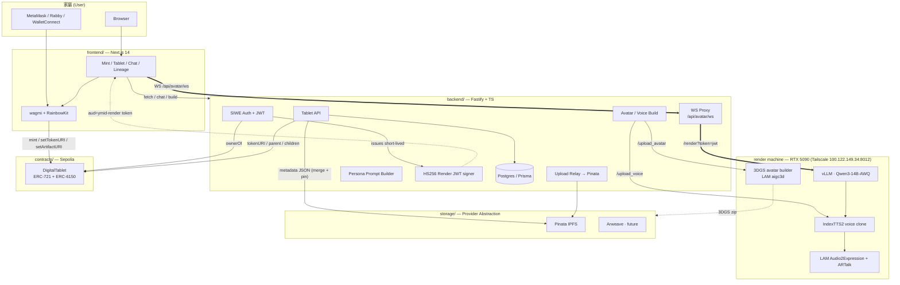

# DSAS Architecture

## Layer Boundaries

| Layer | Owns | Trusts | Notes |
|---|---|---|---|
| Identity (chain) | NFT ownership, family tree, artifact pointers | Nothing | Source of truth for ownership |
| Storage | Bytes addressed by CID | Provider's persistence guarantees | IPFS for prototype; Arweave swap = driver change |
| Render machine | Inference only (LLM / TTS / expression / avatar build) | Backend-signed JWT for every request | Self-hosted on Tailscale; **stateless & persona-agnostic** |
| Backend | Off-chain cache, session, persona prompts, JWT signing | Chain + render + storage | Thin orchestration; sole holder of `RENDER_JWT_SECRET` |
| Frontend | UX | Backend + chain (read) + storage | Wallet is the auth primitive; talks to render only via backend WS proxy |

## Trust & Ownership Invariants

1. **NFT ownership = data sovereignty.** The wallet that owns the NFT is the only authority that can update `tokenURI` / `artifactURI` or mint descendants.
2. **Storage is content-addressed.** A CID change = a new artifact version, not a mutation. Old versions remain pinned until the user unpins.
3. **The render machine is stateless & persona-agnostic.** It holds no per-deceased state; the backend sends the full `messages` array every turn, so persona, RAG, and memory changes touch only the backend. Inference is reproducible from chain + storage.
4. **Artifact updates are owner-signed.** The backend never touches private keys. The owner signs `setTokenURI(tokenId, newUri)` from their wallet on the tablet page when adding or re-uploading assets (生平 / 照片 / 影音 / 子孫 / 對話紀錄), and the backend merges (never replaces) into the existing metadata before re-pinning.
5. **Render auth is backend-mediated.** The browser never talks to the render machine directly (Chrome Private Network Access blocks localhost → private-IP WS). Backend ↔ render uses a shared-secret HS256 JWT (`aud=ymid-render`, TTL ~1800s); the frontend only ever receives a short-lived signed token.
