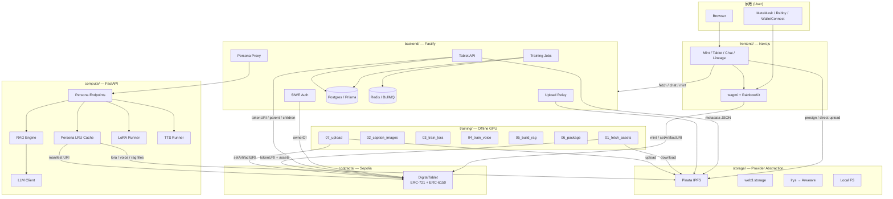

# DSAS Architecture

## Layer Boundaries

| Layer | Owns | Trusts | Notes |
|---|---|---|---|
| Identity (chain) | NFT ownership, family tree, artifact pointers | Nothing | Source of truth for ownership |
| Storage | Bytes addressed by CID | Provider's persistence guarantees | IPFS for prototype; Arweave swap = driver change |
| Compute | Inference only | Chain + storage for inputs | Stateless except LRU cache |
| Backend | Off-chain cache, session, jobs | Chain + compute + storage | Thin orchestration |
| Frontend | UX | Backend + chain (read) + storage (direct upload) | Wallet is the auth primitive |
| Training | Offline artifact production | Chain + storage | Runs on user's GPU, never on the server |

## Trust & Ownership Invariants

1. **NFT ownership = data sovereignty.** The wallet that owns the NFT is the only authority that can update `artifactURI` or mint descendants.
2. **Storage is content-addressed.** A CID change = a new artifact version, not a mutation. Old versions remain pinned until the user unpins.
3. **The compute service caches but never owns.** All artifacts are reproducible from chain + storage; cache loss is recoverable.
4. **Training is user-controlled.** The backend never touches private keys for `setArtifactURI`; the user signs that transaction from their offline training machine using `TRAINER_PRIVATE_KEY`.
