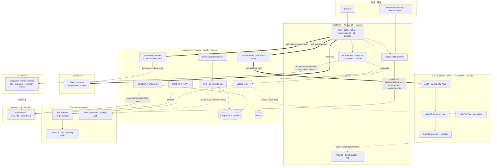

# Aeterlux (DSAS) Architecture

Based on the system overview [Aeterlux_系統概述文件_0914.docx](Aeterlux_系統概述文件_0914.docx) (圖二).

## Layer Boundaries

| Layer | Owns | Trusts | Notes |
|---|---|---|---|
| Identity (chain) | NFT ownership, family tree (ERC-6150 parent/children), `tokenURI` / `artifactURI` pointers | Nothing | Source of truth for ownership. Stores URI strings only, never media |
| Storage | Bytes addressed by Arweave transaction ID (`ar://`) or IPFS CID | Arweave endowment / bundler; Pinata pin for IPFS | Two paths selected by `STORAGE_DRIVER`: Arweave via Irys (primary, Turbo as the fallback bundler) and IPFS via Pinata (backup) |
| Encryption (Lit) | Threshold encryption of private files in the browser | Lit's share-release check: each node verifies that the wallet signature belongs to the current `ownerOf(tokenId)`; no single party, including the platform, can decrypt alone | Optional (`NEXT_PUBLIC_LIT_MODE`). Only ciphertext and a manifest (ciphertext URIs, data hashes, access conditions; file names travel inside the ciphertext) reach storage |
| Realtime (LiveKit) | Rooms for the online memorial: presence, rituals, avatar positions, chat bubbles, voice | Backend-issued join token (visibility / invite check) | `CEREMONY_TRANSPORT=ws` uses the self-hosted WebSocket hub, which is also the automatic fallback when LiveKit is unreachable |
| GPU inference server | Inference only (LLM / TTS / expression / avatar build) | Backend-signed JWT for every request | Self-hosted on Tailscale; **stateless & persona-agnostic** |
| Backend | Off-chain cache, sessions, persona prompts, RAG index, story moderation, JWT signing | Chain + render + storage | Thin orchestration; sole holder of `RENDER_JWT_SECRET` and LiveKit API secret |
| Frontend | UX, in-browser encryption / decryption | Backend + chain (read) + storage + Lit | Wallet is the auth primitive; talks to the render machine only via the backend WS proxy |

## Trust & Ownership Invariants

1. **NFT ownership = data sovereignty.** The wallet that owns the NFT is the only authority that can update `tokenURI` / `artifactURI` (besides `MINTER_ROLE`) or mint descendants under it.
2. **Public vs private.** Public basic data (name, dates, biography, portrait, approved stories) lives in the `tokenURI` metadata. With Lit enabled, photos / video / audio / text / chat logs are encrypted in the browser; only ciphertext and the manifest pointed to by `artifactURI` are stored. Anyone can download the ciphertext; only the current NFT holder can obtain the decryption shares.
3. **Rules cannot be relaxed after the fact.** The access rule (`ownerOf(tokenId)` must equal the requester, on this contract and chain) is bound into each ciphertext's identity parameter. Changing the rule yields a different key, so existing ciphertext cannot be opened under relaxed rules.
4. **Storage is append-only.** A new upload is a new transaction ID. Hiding content or stopping AI use does not remove what was already written to Arweave; the UI says so.
5. **The render machine is stateless & persona-agnostic.** It holds no per-deceased state; the backend sends the full `messages` array every turn, so persona, RAG and memory changes touch only the backend.
6. **Private chat logs reach the AI only through the owner.** The backend cannot read encrypted chat logs. The owner's browser decrypts them and sends the plaintext over TLS to the backend, which keeps the deceased's lines as text chunks plus embeddings (`MemoryChunk.kind = private_chatlog`) for retrieval and prompt injection, never the original file. Ordinary reindexing keeps these chunks.
7. **Artifact updates are owner-signed.** The backend never touches user keys. The owner signs `setTokenURI` / `setArtifactURI` from their wallet; the backend merges (never replaces) metadata before re-uploading.
8. **Render auth is backend-mediated.** The browser never talks to the render machine directly (Chrome Private Network Access blocks public-origin → private-IP WS). Backend ↔ render uses a shared-secret HS256 JWT (`aud=ymid-render`, TTL ~1800s).

## Where each AI step runs

| Step | Model / service | Runs on |
|---|---|---|
| Speech-to-text | Whisper (`whisper-1`) | OpenAI API, called by the backend |
| Memory embedding + retrieval | multilingual-e5-small (384-d) + pgvector, top-4 | Backend process + PostgreSQL |
| Reply generation | Qwen3-14B (AWQ) on vLLM | GPU inference server |
| Voice | IndexTTS2 | GPU inference server |
| Lip-sync / expression / head pose | Audio2Expression + ARTalk | GPU inference server |
| Avatar build | LAM | GPU inference server |
