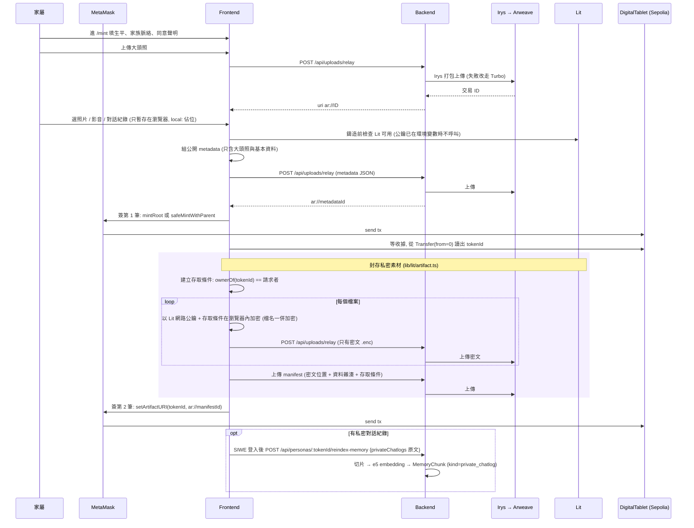
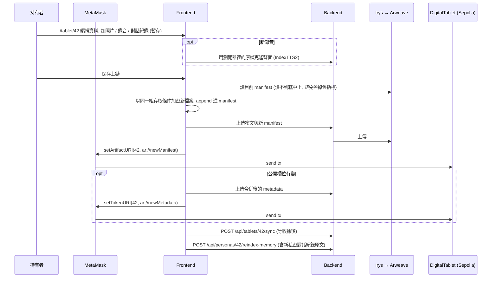
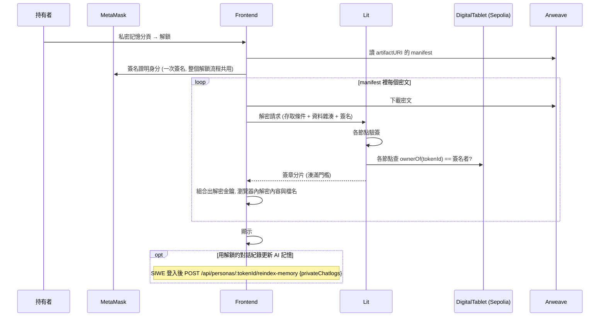
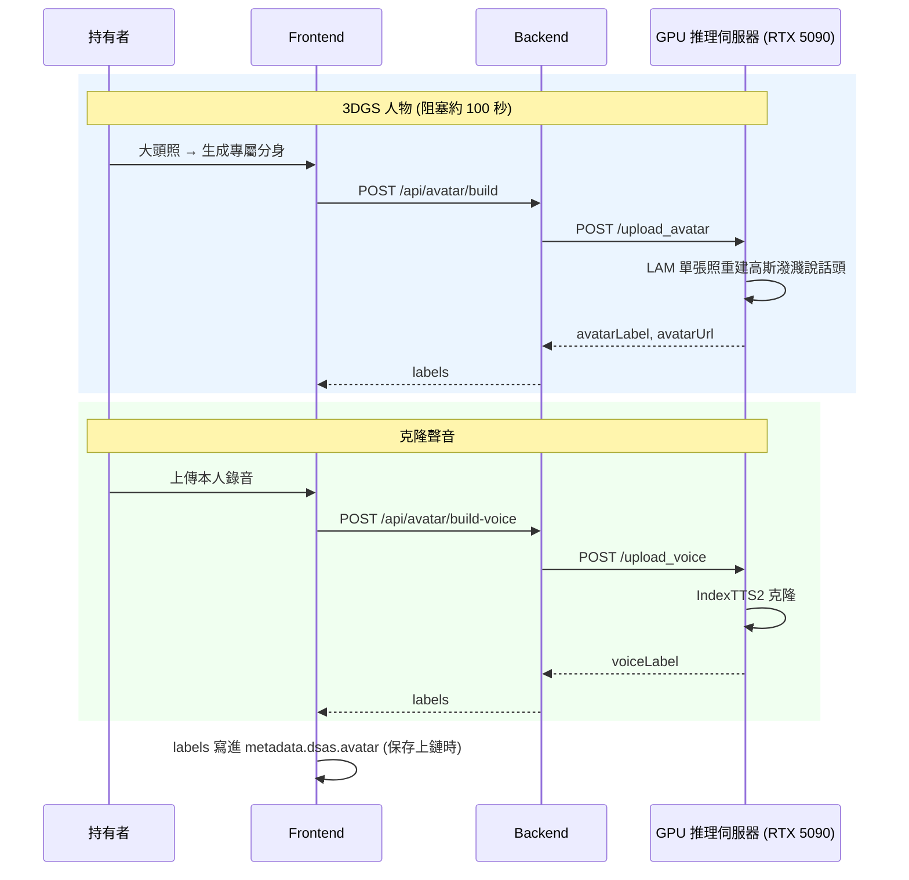
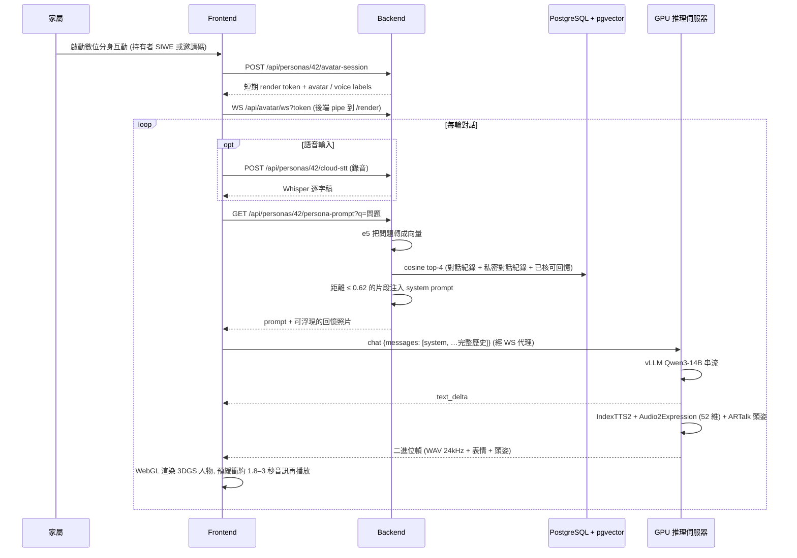
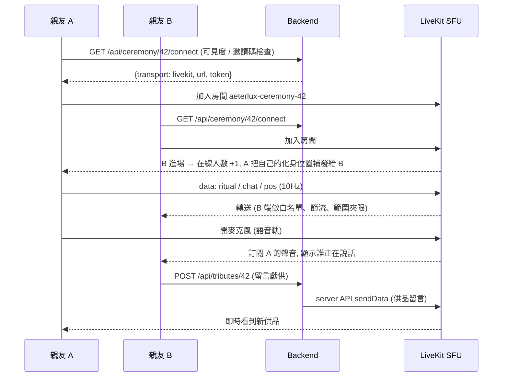

# Data Flow — End to End

規格依據:[Aeterlux_系統概述文件_0914.docx](Aeterlux_系統概述文件_0914.docx)。以下流程以 Arweave 主要儲存路徑、啟用 Lit 加密與 LiveKit 公祭通道的設定說明。Lit 加密為選用功能;未啟用時,Phase 1 / 2 的私密素材會像大頭照一樣直接上傳並寫進公開 metadata。

## Phase 1: 鑄造燈塔(Mint)

大頭照與基本資料是公開的;照片 / 影音 / 文字 / 對話紀錄是私密素材,選檔後只暫存在瀏覽器,拿到 tokenId 後才加密上傳。

- 公開 metadata:`tokenURI` 指向的 JSON(ERC-721 metadata + `dsas` 擴充)。
- 私密素材清單:`artifactURI` 指向的 manifest(`type: "aeterlux-encrypted-artifact"`),任何人都下載得到,但裡面只有密文位置、資料雜湊與存取條件。
- 封存失敗時燈塔已鑄造,暫存檔仍在分頁中,可按「重試加密上傳」,不會重複鑄造。

## Phase 2: 補傳上鏈(Asset Re-upload)

燈塔頁「編輯資料」:公開欄位(生平、墓誌銘、子孫)合併進現有 metadata 後 `setTokenURI`;新加的照片 / 影音 / 對話紀錄走加密封存,**append** 一把新金鑰與新項目進現有 manifest 後 `setArtifactURI`,不必解開舊的。只補私密素材時不會多簽 `setTokenURI`。

## Phase 3: 解鎖私密記憶(Unlock)

簽名者不是這座燈塔目前的持有者、簽名過期,或存取條件與密文對不上,Lit 節點都不會交出分片。

## Phase 4: 預構建數位分身(Avatar / Voice)

每位逝者一次性構建,可在鑄造時或燈塔頁補傳時觸發。

GPU 伺服器是**無狀態、persona 無關**的:只暴露構建 / 推理介面,不存任何家族記憶。

## Phase 5: 即時對話(RAG + 串流)

瀏覽器不直連 GPU 伺服器(Chrome Private Network Access 會攔公開網頁 → 私網 IP 的 WS),而是連後端 `/api/avatar/ws?token=…`,由後端轉發到 `/render?token=…`。token 是後端用 `RENDER_JWT_SECRET` 簽的 HS256(aud=`ymid-render`,TTL 1800 秒)。

效能:LLM 首 token 約 100ms;TTS 是瓶頸(IndexTTS2 RTF≈2.7),所以前端預緩衝音訊。遇到記憶裡沒有的事,persona prompt 要求溫和承認記憶有限、不編造事實。

## Phase 6: 線上公祭(LiveKit)

`CEREMONY_TRANSPORT=ws` 或 LiveKit 連不上時,同樣的事件改走後端 WebSocket hub(`/api/ceremony/:tokenId/ws`,由後端驗證與節流),沒有語音。私人(PRIVATE)燈塔不開放公祭;不公開(UNLISTED)需邀請碼。

## Phase 7: 隱私

- **私密素材**:在瀏覽器加密,Arweave 上只有密文;解密金鑰只交給鏈上持有者。公開 metadata 只有墓碑級資訊。
- **AI 記憶**:後端讀不到加密的對話紀錄;只有持有者解密後主動送來的原文會被切片、向量化,存成 `MemoryChunk`(保存逝者發言的切片文字與向量,供檢索與注入 prompt;不保存原始檔案)。
- **推理**:對話生成、克隆聲音、表情 / 頭姿都在自建 GPU 伺服器,不交給第三方 AI 平台;互動內容仍需經網路傳到自建服務(「本機推理」不代表資料不離開家屬裝置)。語音辨識(Whisper)使用 OpenAI `whisper-1` API。
- **永久性**:Arweave 上的資料無法刪除。隱藏內容或停止 AI 使用,不等於移除已封存的資料。
