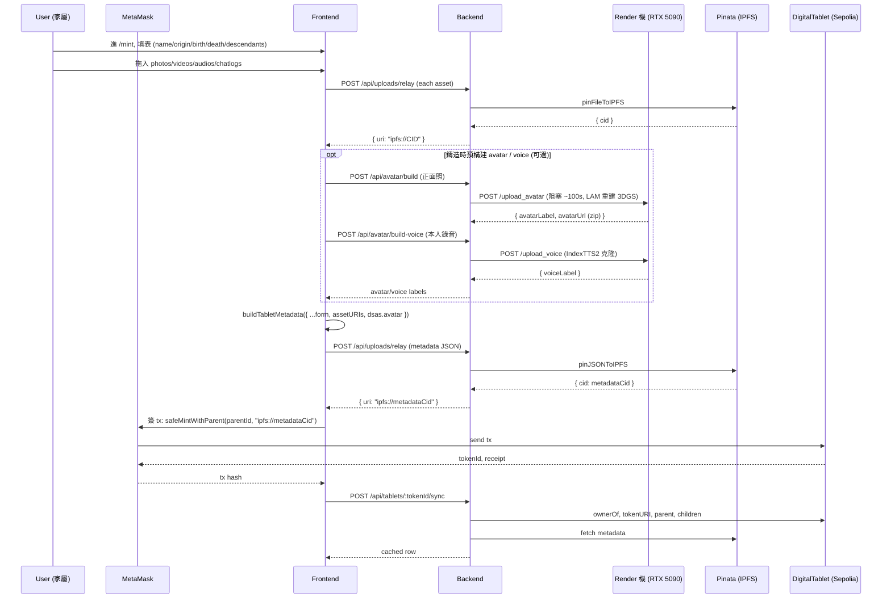
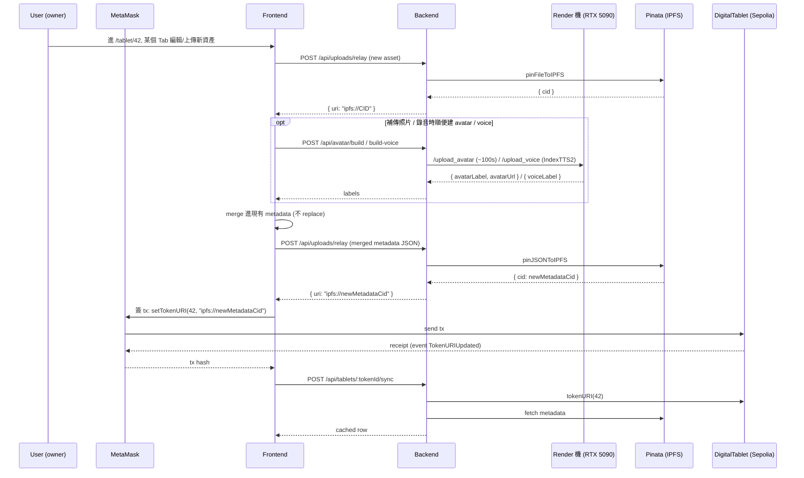
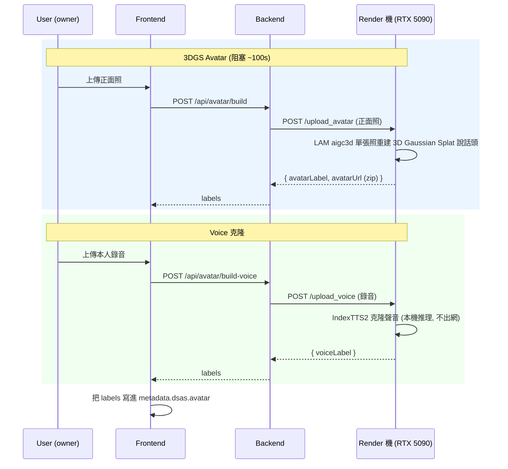
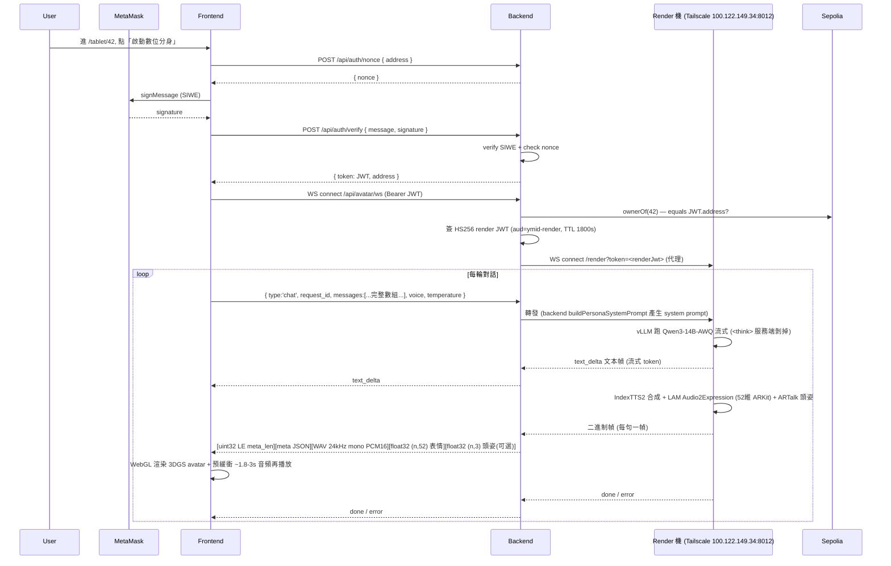

# Data Flow — End to End

## Phase 1: Mint a Tablet

avatar/voice 兩個 label 寫進 NFT `metadata.dsas.avatar { avatarLabel, avatarUrl, voiceLabel, ... }`。
若鑄造時沒傳照片/錄音,可之後到塔位頁補傳(見 Phase 2)。

## Phase 2: 資產補傳上鏈 (Asset Re-upload)

塔位頁 5 個 Tab(生平 / 照片 / 影音 / 子孫 / 對話紀錄)owner 可就地編輯上傳;新資產 **合併**(merge,不 replace)進現有 metadata,重新 pin 後 `setTokenURI` 上鏈。

聲音克隆用的是鑄造/補傳時上傳的音頻(`metadata.dsas.assets.audios`);若當初沒傳,聊天頁會提示用戶來這裡補傳。

## Phase 3: 預構建 Avatar / Voice (Pre-build)

每位逝者一次性構建,可在鑄造時或塔位頁補傳時觸發。

> Render 機是【無狀態、persona 無關】的:它只暴露構建/推理接口,不存任何家族記憶。
> 構建結果(`avatarLabel` / `voiceLabel` / `avatarUrl`)由 backend 落到 NFT metadata。

## Phase 4: Live Interaction (WS 流式)

前端不直連 render 機 —— Chrome Private Network Access 會攔 localhost→私網 IP 的 ws,所以 **WS 走 backend 代理**(`/api/avatar/ws`)轉發到 render 機 `/render?token=<jwt>`。backend 用共享密鑰 **HS256 JWT**(`RENDER_JWT_SECRET`,aud=`ymid-render`,TTL 1800s)簽 token,前端只拿短期 token。

性能:LLM 首 token ~100ms;TTS 是瓶頸(IndexTTS2 RTF≈2.7),所以前端需預緩衝約 1.8-3s 音頻再播放,否則句間有空白。persona system prompt 要求「像家人朋友般口語閒聊、回覆短(通常 1-2 句)」。

## Phase 5: Privacy (隱私)

對話經過自建 render 機(自己的機器,Tailscale 內網),不再經過第三方雲 API(Simli / OpenAI / fal.ai / ElevenLabs 都已不用),敏感家族對話隱私更好。LLM、語音克隆、表情/頭姿全部本機推理,不出網。

原始資產(照片 / 影片 / 音頻 / 對話紀錄)永久留在 IPFS(直到家屬取消 pin),生產應切 Arweave。render 機本身【無狀態】,不留任何對話或記憶。

這呼應 idea.md §六:
> 互動結束 → 不在第三方雲端留存,原始資料永遠留存於 IPFS / Arweave.
