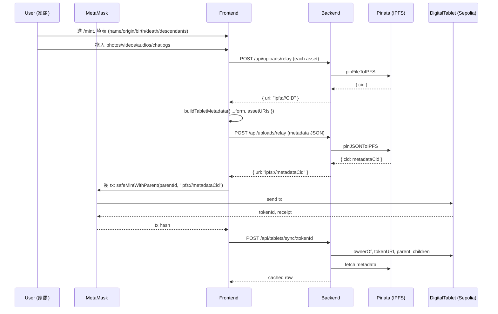
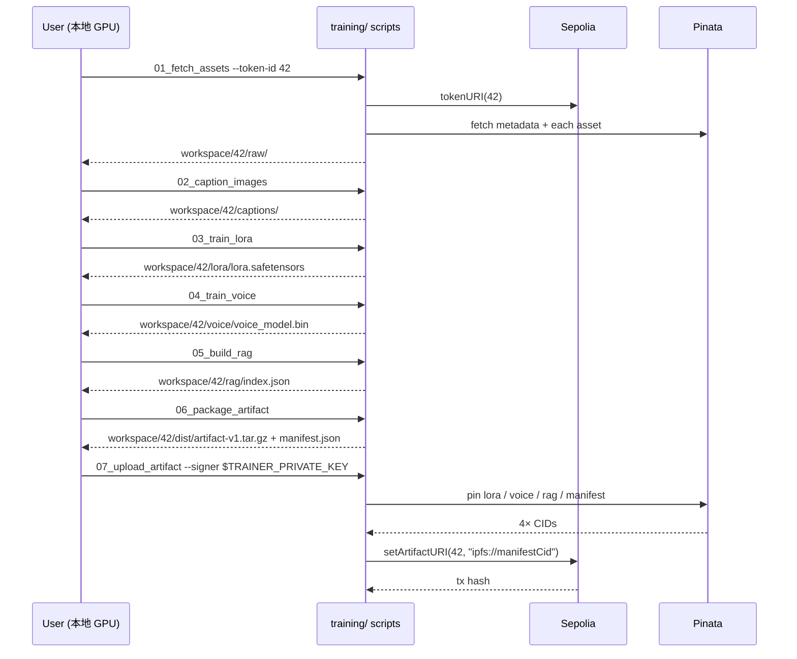
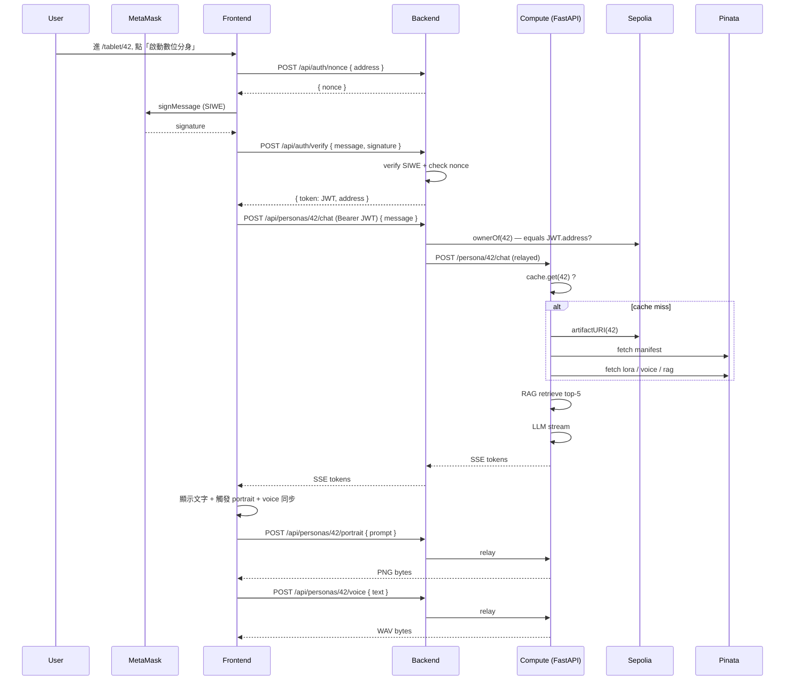

# Data Flow — End to End

## Phase 1: Mint a Tablet

## Phase 2: Offline Training

## Phase 3: Live Interaction

## Phase 4: Cache Eviction (Privacy)

After SSE connection closes, the compute cache marks the persona's last-access timestamp. After `CACHE_TTL_SECONDS` (default 300s) of inactivity, the in-memory artifacts are GC'd. The on-disk download cache may remain until `MAX_DISK_CACHE_GB` is exceeded. The original assets stay pinned on IPFS forever (or until the family unpins).

This realizes idea.md §六:
> 互動結束 → 快取資料刪除,原始資料永遠留存於 Arweave.
