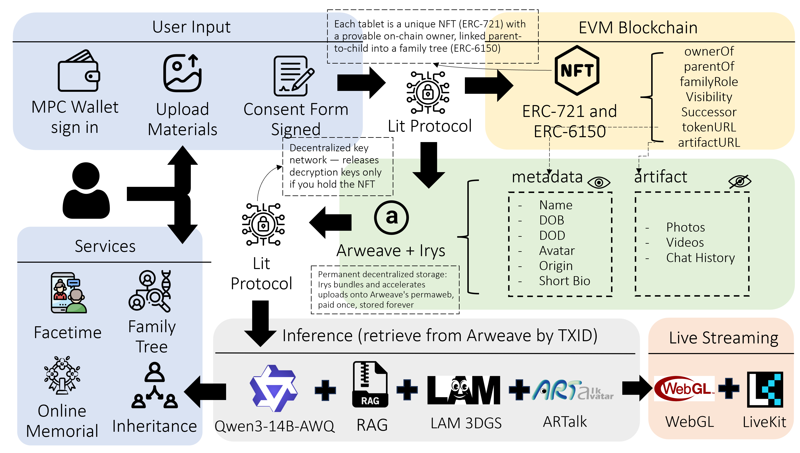
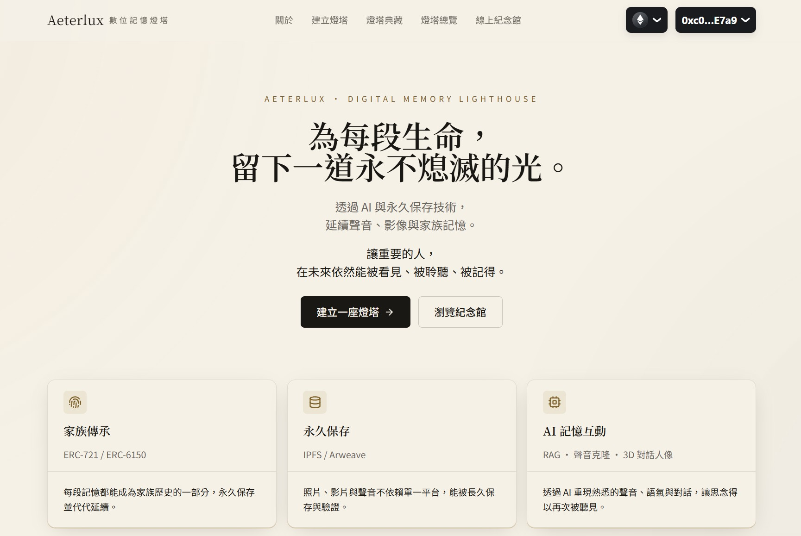
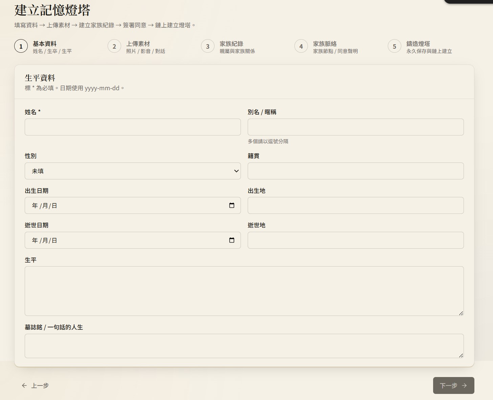
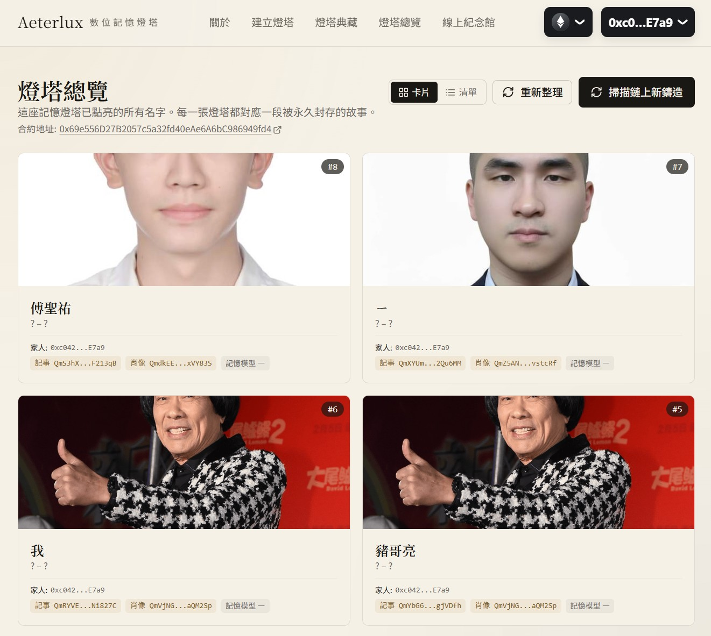
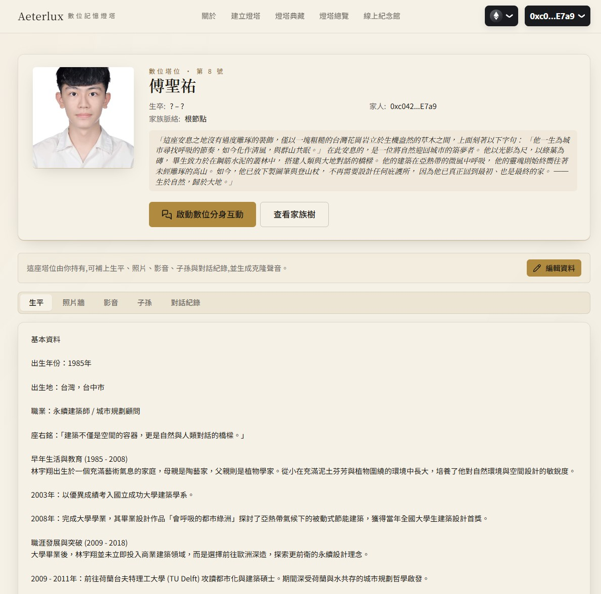
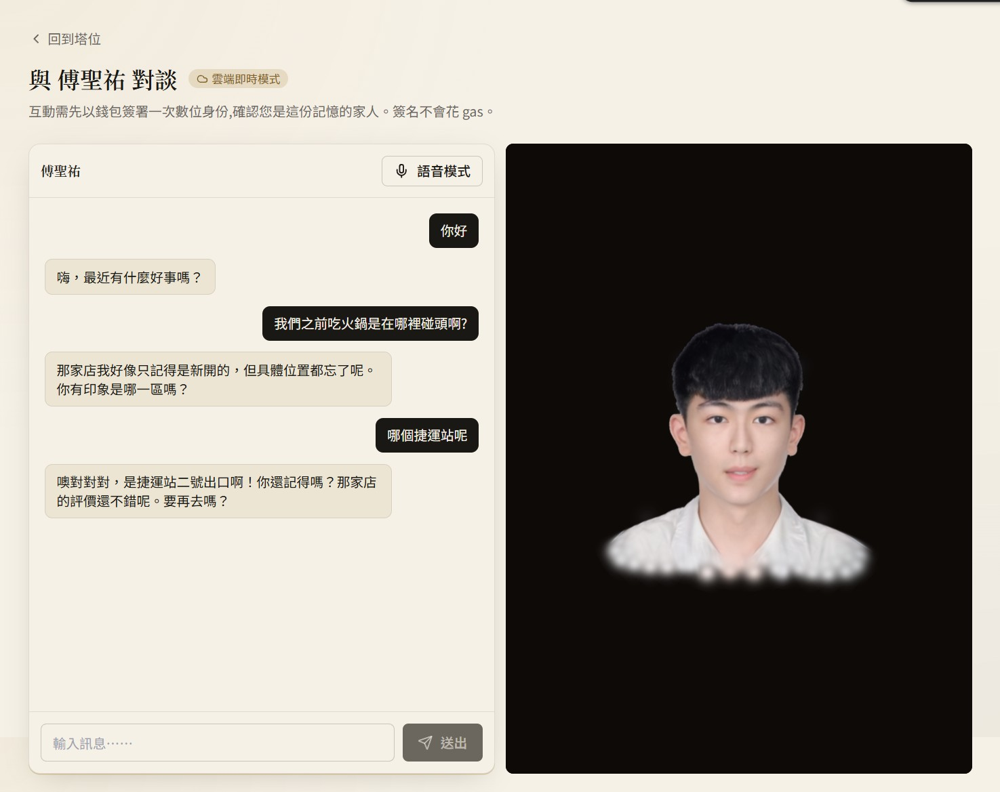
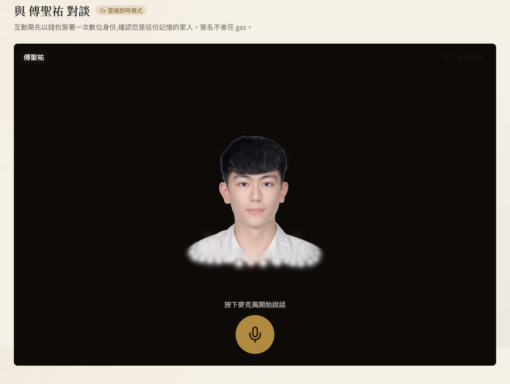
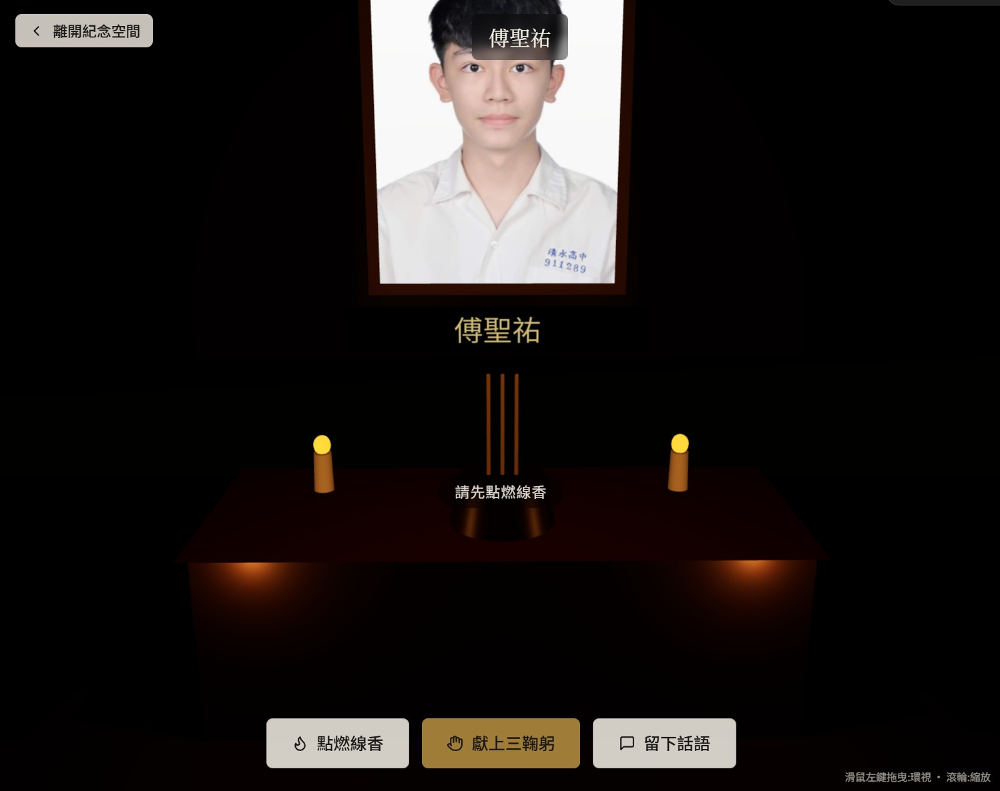
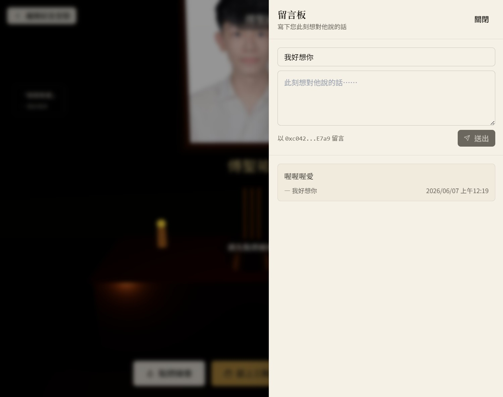

# Aeterlux 數位記憶燈塔
## 以區塊鏈、去中心化儲存與本地端生成式 AI 打造主權數位先祖系統

> **完整專題報告**
> 結合 ERC-721 / ERC-6150 NFT 家族樹、Arweave 永久儲存、Lit Protocol 隱私加密、
> 本地端 Qwen3-14B-AWQ 大型語言模型、RAG 檢索式記憶、LAM 3D 高斯潑濺頭像生成、
> IndexTTS2 語音克隆、ArTalk 頭部姿勢驅動,以及 WebGL 線上公祭



---

## 一、緒論

人類自有文明以來,便不斷透過墓碑、祠堂、族譜與遺物等實體載體,試圖讓逝去的親人「被記住」。然而當我們進入由社群網路、雲端相簿與串流服務所主導的數位時代,記憶的脆弱性反而急遽升高。家族照片、生前訪談、日常對話分散於 Google Photos、iCloud、LINE、Messenger 等中心化平台,使用者實際上並非「擁有」這些回憶,而僅僅是「租用」儲存空間;一旦平台倒閉、商業政策改變、帳號失效或遺族無法繼承登入資訊,珍貴的影像與聲音便將永遠消失於資訊洪流。更深一層的困境是,這些平台同時掌握了所有資料的讀取權,家族最私密的影像與文字實際上完全暴露於商業公司的眼下,個人與家族對自身記憶的主權幾近於零。

本研究提出「**Aeterlux 數位記憶燈塔**」(以下簡稱 Aeterlux),一個基於區塊鏈所有權、去中心化永久儲存與本地端生成式人工智慧的主權數位先祖系統 (Sovereign Digital Ancestor System, DSAS)。系統將每位逝者抽象為一座「數位塔位」,以符合 ERC-721 與 ERC-6150 標準的不可替代代幣 (NFT) 形式鑄造於以太坊相容鏈上,並透過 ERC-6150 階層介面在鏈上建構真正的家族脈絡。每座塔位之鏈上紀錄包含**兩條獨立指針**: 公開的 `tokenURI` 指向一份輕量化的 metadata,記載姓名、生卒、籍貫、小頭像、簡傳等任何人都可瀏覽之資訊; 私密的 `artifactURI` 則指向一份大型且加密的 artifact bundle,涵蓋完整的相簿、影片、語音檔與對話紀錄。這兩份內容皆透過 Irys 打包封存於 Arweave 永久儲存網路,而 artifact 之解密金鑰則藉由 Lit Protocol 之去中心化金鑰管理保障——唯有持有對應 NFT 之家屬才能取得。最後,Aeterlux 以本地端 Docker 容器一鍵啟動之 Qwen3-14B 大型語言模型、LAM 3D 高斯潑濺頭像、IndexTTS2 語音克隆、LAM Audio2Expression 與 ArTalk 頭部姿勢驅動,在使用者瀏覽器中以 WebGL 即時渲染出逝者的可互動數位分身,並結合 LiveKit WebRTC 提供多人線上公祭與儀式參與。

Aeterlux 的核心貢獻在於將「家族主權」、「永恆儲存」與「擬真互動」三項長期難以兼得的需求整合於單一系統中:家族不再將最珍貴的記憶託付給可能消失的商業公司,而是真正擁有一份**寫在鏈上、存於 permaweb、由自身金鑰掌控、能與先人視訊對話**的數位遺產。與此同時,所有 AI 推理皆在本地端 GPU 完成,家屬之私密對話、聲音樣本與肖像不流出任何第三方雲端,真正落實「資料主權」之承諾。即使本平台明日即停止服務,只要使用者持有 NFT 對應之私鑰、metadata 中的儲存交易 ID 與 Lit 加密規則仍可被讀取,任何具備本系統開放規格之客戶端均能還原該數位分身。本文後續章節將依序闡述研究動機、相關文獻、系統架構與設計、介面操作說明、目前完成度與展望,以及結語。

---

## 二、研究動機與研究問題

### 2.1 數位時代家族記憶的爆炸性增長與隱憂

過去二十年來,個人與家族產生的數位內容呈指數型成長。根據 IDC (2022) 之全球資料球 (Global DataSphere) 預測,2025 年全球年產資料量將達 175 ZB,其中個人使用者貢獻佔比逐年攀升,涵蓋手機相機、社群貼文、即時通訊、語音留言與短影音等多種型態。然而當代數位內容多儲存於少數寡頭平台 (Google、Apple、Meta) 之集中式雲端,其壽命受限於三項脆弱性。其一為**商業壽命**:雲服務的營運受市場波動、企業併購、區域法規影響,Google Reader、Google Plus、Picasa 等案例顯示即便是大型平台亦可能於十年內關閉,使用者僅能於遷移窗口內被動搶救;其二為**帳號壽命**:多數平台對逝者帳號之繼承機制設計薄弱,二十年後遺族常因無法取得登入資訊而永久喪失存取;其三為**資料主權**:平台條款多賦予業者「無限期、可分發、可訓練 AI」之資料授權,個人對家族影像之掌控實際上接近於零。當家族最私密的訊息——例如逝者最後一段語音留言、與家人的對話紀錄——皆儲存於這些平台時,「失去記憶」已不再是浪漫主義式的形容,而是一個有具體機率與時程的工程問題。

### 2.2 現有解決方案及其限制

針對上述問題,市面上已出現數類產品試圖回應。第一類為**雲端相簿與紀念網站** (例如 ForeverMissed、Beyond.life、Tribute.co):它們提供制式紀念頁面與留言功能,但本質仍建立於單一公司的伺服器,使用者繳費期滿或公司營運中斷即面臨資料消失之風險,且家族對隱私毫無掌控。第二類為**實體塔位與生命禮儀數位加值** (例如龍巖、萬安等):雖能保留實體骨灰罈與墓碑,卻無法承載當代家族最重要的數位影音記憶,亦無法提供與先人對話之能力。第三類為**通用 AI 數位人服務** (例如 HeyGen、Synthesia、D-ID):雖能基於照片與語音樣本生成可說話之虛擬人像,卻僅作為短期商業內容生成工具,並未提供永久儲存與所有權保障,且模型權重、訓練資料、生成 API 完全依附於該公司雲端,訂閱中斷即無法再現逝者;更關鍵的是,所有家族最私密的肖像與聲音皆須上傳至該公司之雲端伺服器才能訓練與推理,完全無資料主權可言。最後,亦有少數早期 Web3 概念性產品 (例如 Etherealist、Hereafter AI),嘗試以 NFT 結合 AI 對話,但多止於「靜態檔案上鏈」或「對話提詞上鏈」之表層應用,缺乏完整的家族樹模型、隱私加密層與即時擬真互動。換言之,這四類方案皆無法同時解決前述「商業壽命、帳號壽命、資料主權」之三重脆弱性,亦未在「擬真互動」與「跨世代傳承」上提供完整解答。

### 2.3 Aeterlux 的技術組合與系統願景

針對上述缺口,本研究提出 Aeterlux 數位記憶燈塔,透過以下四層技術組合給出完整解答。在**身分與所有權層**,系統採用 ERC-721 不可替代代幣標準鑄造每座數位塔位,並以 ERC-6150 階層介面在鏈上記錄逝者間之血緣脈絡,構成可永久驗證的家族樹;搭配 MPC 錢包,使用者得以社群帳號一鍵登入,完全免除助記詞、私鑰等門檻。在**永久儲存層**,所有影像、音檔、文字透過 Irys 打包上傳至 Arweave 永久儲存網路,以一次付費換取數百年保存承諾;系統並刻意將公開的小型 metadata 與私密的大型 artifact 拆為兩份獨立交易,使家屬日後可單獨修改任一份而不需動到另一份,亦可對 artifact 設定不同層級之存取控制。在**隱私加密層**,artifact 以 Lit Protocol 之分散式門檻密碼學加密,解密金鑰碎片化於數十個 Lit 節點,唯有持有對應 NFT 之錢包經鏈上驗證後方能集體還原金鑰。最後在**生成式 AI 層**,Aeterlux 將所有 AI 推理皆部署於本地端 Docker 容器: Qwen3-14B-AWQ 量化大型語言模型結合 RAG 檢索逝者真實對話、LAM 3D 高斯潑濺技術從單張肖像建立可動畫之 3D 頭像、IndexTTS2 從少量錄音克隆其音色、LAM Audio2Expression 與 ArTalk 分別生成嘴型表情與頭部姿勢序列,最終於使用者瀏覽器中以 WebGL 即時渲染——家屬之肖像、聲音與對話皆不需離開本機 GPU,真正實現「家族記憶不出家門」。多人互動情境如線上公祭則透過 LiveKit WebRTC 串流整合上述各模組為一可共享的房間。Aeterlux 之最終願景,是在數位荒野中為每段生命建立一座永不熄滅的記憶燈塔——即使家屬全數離世,只要設定了死亡開關與繼承鏈,該記憶仍能自動傳承至下一代,實現真正的「數位宗祠永續」。

---

## 三、文獻回顧與探討

本章節分區塊鏈與所有權、去中心化儲存、隱私計算、生成式 AI、3D 渲染、語音合成、即時通訊七大領域,回顧本研究所引用之核心技術文獻及其近年發展,並闡述其如何被整合至 Aeterlux 系統。

### 3.1 區塊鏈與 NFT 標準

以太坊區塊鏈 (Buterin, 2014; Wood, 2014) 於 2015 年提出之圖靈完備虛擬機,使智能合約得以承載自我執行之資產規則。其上 ERC-721 標準 (Entriken et al., 2018, EIP-721) 首次為每一枚代幣賦予獨一身分,促成數位收藏品、藝術品與會員憑證等不可替代資產之爆發,然原始 ERC-721 並未提供階層或語意關聯之表示能力。Wang et al. (2023) 提出之 ERC-6150 標準擴充了 ERC-721 之介面,以父子關係查詢方法明確記錄代幣間之階層,使家譜、組織結構、檔案目錄等階層結構得以原生表示於鏈上。Aeterlux 採用此標準作為「純逝者譜」之底層機制:每位逝者之塔位為一枚 NFT,父子節點對應血緣鏈,鏈上即可重建完整家族脈絡,無需仰賴任何離鏈資料庫。為兼顧低 gas 與成熟生態系,系統優先部署於 Polygon 與 Base 兩條 L2 鏈,測試階段則使用 Sepolia 與 Base Sepolia 測試網。在身份驗證部分,Sign-In with Ethereum (SIWE, EIP-4361) 為標準化之無 gas 簽章協議,允許後端透過 nonce-challenge 機制驗證使用者錢包持有,並結合短時效 JWT 作為後端會話憑證。

### 3.2 去中心化永久儲存:Arweave 與 IPFS

IPFS (InterPlanetary File System, Benet, 2014) 為內容定址之分散式檔案系統,其 CID (Content Identifier) 由內容之 SHA-256 雜湊計算而得,確保內容與識別碼之密碼學一致性。然 IPFS 本質上為「點對點快取網路」,並未強制節點長期保存資料,實務上常須仰賴 Pinata、Web3.Storage 等釘選服務維持可用性,服務一旦中斷,內容仍會被網路 GC 清除。Williams 與 Jones (2018) 提出之 Arweave 協議,則直接以「儲存捐贈基金 (Storage Endowment)」之經濟模型解決長期儲存問題:使用者一次付清 AR 代幣,協議將其中大部分存入捐贈基金,假設儲存硬體成本逐年下降之歷史趨勢,基金衍生之利息可支撐長期 (數百年級) 之礦工儲存酬勞。Arweave 並設計了**隨機存取證明 (Succinct Proofs of Random Access, SPoRA)** 之共識機制,要求礦工於挖礦時隨機證明持有任一歷史區塊之資料片段,使「保存資料」與「挖礦獎勵」直接掛鉤,激勵節點主動維護冗餘副本。Irys (前 Bundlr Network) 則為 Arweave 之上傳加速層,透過交易打包 (bundling) 機制將數百筆小額上傳合併為單一 Arweave 交易,顯著降低 gas 成本並提升吞吐量。Aeterlux 採用統一之儲存供應商抽象介面,目前開發階段以 Pinata IPFS 作為儲存供應商以降低開發期成本,生產階段將遷移至 Irys + Arweave 達成真正永久儲存;此抽象設計可無痛切換儲存供應商。

### 3.3 隱私計算:Lit Protocol 與分散式門檻密碼學

當資料置於公開或半公開之去中心化儲存層時,若無加密機制,任何節點皆可讀取內容。傳統做法為使用者持有對稱金鑰於本地加密後上傳,但此模式難以實作「持有 NFT 才能解密」之動態存取控制。Lit Protocol (2022) 提出基於 BLS 門檻簽章 (Boneh-Lynn-Shacham, 2001) 之分散式金鑰管理網路:加密金鑰被切分為 N 個 shares 並分散儲存於數十個 Lit 節點,當 t 個節點 (t > N/2) 同時驗證一組存取控制條件 (Access Control Conditions, ACC) 成立時,方共同生成解密金鑰,過程中完整金鑰從不出現於任何單一節點。Aeterlux 之 ACC 設定為「持有特定塔位之 NFT」與「該塔位對應之公開等級為 PUBLIC」之交集,Lit 節點透過跨鏈呼叫合約之擁有者查詢與可見度查詢即時驗證,使私密素材得以真正只對 NFT 持有者開放。系統並設計三層可見度模型: PUBLIC (任何人可見,如姓名與大頭照)、FAMILY (鏈上授權之家族成員地址可見)、PRIVATE (僅持有人可見,如含活人個資之對話紀錄),不同層級對應不同 ACC 設定。

### 3.4 大型語言模型與檢索式記憶 (RAG)

Vaswani et al. (2017) 提出之 Transformer 架構為當代大型語言模型之基礎,其自注意力機制使模型得以高效率處理長序列文本。OpenAI GPT 系列、Anthropic Claude、Meta LLaMA 等模型在多項自然語言任務上展現接近人類水準之能力,但雲端 LLM 之使用涉及資料外送與按量計費,不利於需保護家族隱私之記憶系統。Bai et al. (2023) 之 Qwen 系列為阿里通義千問實驗室之開源大型語言模型,其 Qwen3-14B 版本在中文理解、長上下文與指令遵循上表現優異;搭配 Lin et al. (2023) 之 Activation-aware Weight Quantization (AWQ) 量化技術,模型可從 28 GB FP16 壓縮至約 7 GB INT4,使其能於單張消費級 GPU (RTX 3090 / 4090) 運行。Kwon et al. (2023) 之 vLLM 推理引擎則透過 PagedAttention 與 Continuous Batching 等技術,將吞吐量相較標準推理框架提升十倍以上,使本地推理之延遲達到實用級水準。Aeterlux 將 vLLM 與 Qwen3-14B-AWQ 封裝於 Docker 容器,使用者於本機具備支援 CUDA 之 GPU 環境後,**僅需一行 docker compose 指令即可啟動完整推理服務**,作為對話生成之核心。

純依賴 LLM 之提詞雖能模擬一般人格,卻無法重現逝者特有的口頭禪、用詞習慣與真實過往。Lewis et al. (2020) 提出之 Retrieval-Augmented Generation (RAG) 為解決此問題之代表性架構: 將外部知識來源切分為段落、編碼為向量,於每次推理前以使用者查詢檢索 top-k 段落並注入提詞。Aeterlux 之 RAG 設計如下: 家屬於 mint 階段上傳 LINE、Telegram、Facebook Messenger 等對話紀錄之匯出檔, 後端解析後過濾僅保留逝者本人發送之訊息,以 120 字為粒度切分為段落,透過 Wang et al. (2024) 之多語言 E5-small 384 維句子嵌入模型轉為向量,儲存於 PostgreSQL 之 pgvector 擴充。互動時每一輪對話皆先以使用者問題作為查詢進行向量檢索 (餘弦距離閾值 0.62),取出最相關之 4 段逝者真實訊息注入系統提詞,使 LLM 之回應確實帶有逝者之語氣與記憶。相較 Qdrant、Pinecone 等獨立向量資料庫,pgvector (Kane et al., 2022) 於 Postgres 內提供原生向量類型與距離運算子,大幅簡化部署架構;且此 pgvector 亦同樣封裝於 Docker compose 中,使用者無需額外安裝向量資料庫即可使用 RAG 功能。

### 3.5 3D Gaussian Splatting 與可動畫頭像生成

Kerbl et al. (2023) 提出之 3D Gaussian Splatting (3DGS) 為近年計算機圖形學之突破性進展,以數百萬顆各自帶有位置、協方差、顏色與透明度之三維高斯橢球表示場景,渲染時透過可微分光柵化在 GPU 上以實時影格率產生高品質新視角影像。相較傳統 NeRF 之神經輻射場 (Mildenhall et al., 2020) 需逐像素查詢神經網路, 3DGS 直接以 splat-based rasterization 完成,訓練與推理速度均提升一個數量級。然而,原始 3DGS 為靜態場景,無法直接用於說話之頭像生成。Cao et al. (2024) 之 LAM (Large Animatable Models) 系列將 3DGS 與 ARKit 標準 52 維表情參數綁定,並設計音訊轉表情之子模型,使單張人物肖像可於約 100 秒內重建為可隨任意語音動畫之 3DGS 角色。Aeterlux 採用 LAM 作為頭像生成主路徑:家屬於 mint 階段上傳逝者之清晰正面照,系統送至本地端推理服務,LAM 模型完成重建後回傳一份 splat 資料檔, 其下載連結寫入 NFT 之 artifact 內。

為使頭像之表情與語音同步,Aeterlux 引入兩個額外模型: LAM Audio2Expression 接收 PCM 語音輸入,輸出每秒 30 frame 之 52 維表情參數,精確控制嘴型與面部肌肉;ArTalk (Liu et al., 2024) 則為另一個專注於說話頭部 3D 旋轉之模型, 從語音中推估自然之 pitch、yaw、roll 姿勢序列,使頭像不至於僵硬如殭屍。兩模型之輸出與 IndexTTS2 之 PCM 音訊以同步串流傳輸至前端。前端則透過 Three.js 與 WebGL2 之 splat 渲染器載入模型並逐 frame 套用表情與頭部旋轉,於使用者瀏覽器中即時渲染。此純前端渲染之設計繞過了傳統雲端 lip-sync 服務所需之 WebRTC 串流, 顯著降低頻寬需求並提供更低延遲、可自由旋轉視角之互動體驗。

### 3.6 神經語音合成與克隆:IndexTTS2

語音合成領域近年從基於拼接 (concatenative) 與隱馬可夫模型 (HMM) 之傳統方法,轉向以神經網路 end-to-end 訓練之模型。Wang et al. (2017) 之 Tacotron 系列、Kim et al. (2021) 之 VITS 等模型在自然度與可控性上達到接近人類之水準,但商業 API 涉及資料外送、按字元計費,以及語音克隆所需之大量參考音檔。IndexTTS2 (Bilibili Index Lab, 2024) 為近期開源之中英文神經 TTS 模型,以 in-context learning 機制實現少樣本語音克隆: 僅需 5 至 30 秒參考音檔即可萃取 voice profile,後續合成之語音保留參考音色之音調、節奏與口音特徵。Aeterlux 將 IndexTTS2 整合於本地端 Docker 容器內,家屬上傳逝者之生前訪談、語音留言或影片擷取音檔後,系統自動萃取 voice profile 並儲存於 artifact。對話時 Qwen3 產生之回覆文字逐句送入 IndexTTS2,以該 profile 即時合成保有逝者音色之語音串流,經同步傳輸機制與 LAM 表情、ArTalk 頭部姿勢一同送至前端。

### 3.7 WebRTC 即時通訊與 LiveKit

線上公祭情境涉及多人同時觀看 AI 數位分身之講述、聆聽彼此之追思,並進行即時互動,此類需求超出傳統 HTTP 之能力,須引入 WebRTC (RFC 8825) 之點對點即時通訊協議。原始 WebRTC 採用全網狀拓樸,當參與者超過 4 至 5 人時頻寬呈平方增長而難以擴展。Selective Forwarding Unit (SFU) 架構透過引入中繼伺服器將每位參與者之上行流分發給其他人,使頻寬隨參與者線性增長。LiveKit (LiveKit Inc., 2021) 為開源之 SFU 實作,支援百人房間、文字資料通道、虛擬參與者 (用於 AI 化身以參與者身分加入)、以及錄製與直播輸出。Aeterlux 之線上公祭模組規劃如下:持有者開設公祭房間後系統建立 LiveKit 房間,親友以分享連結進房 (免帳號可僅旁觀),AI 數位分身則由後端產生一個伺服器端參與者,將 Qwen3 + IndexTTS2 + LAM 之即時輸出發布為一條音視訊軌道,所有參與者可同時聽見、看見,並透過文字資料通道留言彼此互動。

---

## 四、系統架構與設計

### 4.1 總體架構

Aeterlux 系統採用四層解耦架構: **身分與所有權層**、**永久儲存層**、**隱私加密層**、**生成式 AI 層**,並由一薄後端進行協調。四層之間以明確的邊界劃分,任一層皆可獨立替換或升級。整體架構如下圖所示:


架構圖中央之綠色區塊清楚呈現了 Aeterlux 之核心設計取捨——每枚塔位 NFT 在鏈上以**兩條獨立指針**指向 Arweave 上的兩份不同內容: 上方「metadata」為公開可見的小型 JSON 檔, 內含姓名、出生年月日 (DOB)、逝世年月日 (DOD)、小張頭像 (Avatar)、籍貫 (Origin) 與簡短生平 (Short Bio); 右側「artifact」則是經 Lit 加密的大型 bundle, 內含完整的相簿 (Photos)、影音 (Videos) 與對話紀錄 (Chat History)。圖中以「眼睛」與「眼睛被劃掉」之圖示直觀表達兩者的可見度差異——任何人都能瀏覽 metadata 確認該塔位的基本身份,但唯有持有 NFT 之家屬才能透過 Lit 解密 artifact 內的私密與大型素材。

整體流程為:使用者透過 MPC 錢包登入後,於 mint 階段上傳素材並簽署同意聲明,系統將輕量 metadata 與加密 artifact 分別封存於 Arweave 永久儲存網路並取得兩組 TXID。NFT 鑄造交易則寫入 EVM 鏈,內含 owner、parent、family role、visibility、successor、tokenURI、artifactURI 等狀態。互動時,後端從 Arweave 透過 TXID 取回 metadata,並請求 Lit Protocol 核對使用者持有後解密 artifact,將內容送入本地端推理服務 (Qwen3-14B 推論加上 RAG 檢索、LAM 3DGS 渲染、ArTalk 頭部姿勢),最終透過 WebGL 在瀏覽器中渲染。多人線上公祭則由 LiveKit 提供 WebRTC 多人通訊基礎設施。

### 4.2 前端架構

前端基於 Next.js 14 之 App Router 架構,採用 React 18 配合 TypeScript 全面型別檢查。樣式系統由 Tailwind CSS 結合自製組件庫構成,提供按鈕、卡片、表單、頁籤、進度條等基礎元素。錢包連線採用 wagmi、viem 與 RainbowKit,支援 MetaMask、Rabby、WalletConnect 等主流注入式與遠端錢包,並可無縫切換至 MPC 錢包以降低 Web3 門檻。

下圖展示系統首頁,以 Aeterlux 之拉丁文命名為視覺主軸,中央懸浮主標語「為每段生命,留下一道永不熄滅的光」,搭配三張並排卡片簡述「家族傳承 / 永久保存 / AI 記憶互動」三大核心價值,引導使用者快速理解系統定位。



**鑄造流程**採用五階段引導式設計: 基本資料、上傳素材、家族紀錄、家族脈絡與同意聲明、簽名鑄造。每階段表單狀態自動持久化於瀏覽器本地儲存,允許使用者中斷後恢復。素材上傳元件支援多檔拖拉、即時進度回報、失敗重試與單檔/多檔模式切換。對話紀錄則由專屬匯入元件提供平台選擇 (LINE、WhatsApp、FB Messenger、Telegram、Discord、Instagram) 與檔案格式 (txt、json、html) 之雙軸配置。

**塔位詳情頁**整合鏈上資料與離鏈快取機制,展示大頭照、生卒籍貫、墓誌銘等基本資訊,並提供啟動數位分身、家族樹、頭像訓練、對話紀錄、影音檔案等多個頁籤。**對話介面**為核心互動元件,採用可拖拉之三欄佈局: 左欄為對話訊息流 (自動 scroll 至底)、中欄為頭像顯示、右欄為語音播放區。對話訊息經串流接收逐字渲染至訊息泡泡;頭像區塊載入 splat 渲染器,透過 WebSocket 直連本地端推理服務,接收同步串流之 LLM token、PCM 音訊、表情參數與頭部姿勢資料,於每個動畫影格套用至 3DGS 模型。WebGL 不可用之瀏覽器則降級顯示警示。

**朝聖式體驗**為四階段 3D 互動流程,使用 React Three Fiber 構建。以 stage 狀態機驅動四個場景: 遺忘庭院 (引導員 NPC + 燈籠拾取)、思念長廊 (三個相框)、淨手靜心室 (三樣遺物收集)、正殿靈堂 (香爐、三鞠躬、留言板)。每場景內部各有獨立 Canvas、燈光、粒子系統 (雨、煙)、互動物件,並以 OrbitControls 提供 360 度環視。場景切換以 700 毫秒黑幕淡出構成「跨閾值」儀式感。

**WebGL 線上公祭** 規劃以 LiveKit 客戶端 SDK 連接後端建立之房間,每位參與者作為一般參與者加入 (亦可純旁觀模式),AI 數位分身則由後端以伺服器端 SDK 注入為虛擬參與者,其音視訊軌道由 Qwen3 加上 IndexTTS2 與 LAM 之即時輸出產生並發布至房間。文字資料通道用於留言板與情緒投票 (例如「向 X 公獻花」彈幕)。

### 4.3 後端架構

後端採用 Fastify 4 作為高效能 HTTP 伺服器,搭配 Prisma 5 ORM 連接 PostgreSQL 16 與 pgvector 擴充,以及 BullMQ 與 Redis 處理離線任務佇列。整體後端設計為「**加速與編排層**」,並非權威來源——所有權真實儲存於區塊鏈,資料真實儲存於 Arweave,後端僅快取查詢結果與協調跨服務之請求。所有後端服務 (Fastify、PostgreSQL 與 pgvector、Redis、本地端推理服務) 皆封裝於單一 Docker Compose 設定,**使用者僅需執行一行指令即可啟動完整環境**,大幅降低部署門檻。

主要 API 領域涵蓋:

- **認證**: 完整實作 SIWE 流程,後端簽發短時效 nonce 並於使用者錢包簽章後驗證合法性,通過後簽發以地址為 claim 之 JWT。
- **塔位 CRUD**: 採用懶載入同步策略——若資料庫無記錄則即時從鏈上抓取擁有者、tokenURI、artifactURI 與父子關係並寫入快取。家族樹查詢透過廣度優先搜尋遞迴展開,深度上限 6 層。
- **中繼上傳**: 開發階段以 Pinata IPFS 為儲存供應商,接收使用者之多部份上傳後伺服器端轉送 Pinata;生產階段將切換至 Irys 之上傳介面,將檔案打包成 bundle 後送上 Arweave。系統明確區分公開 metadata (小型 JSON,直接上傳) 與私密 artifact (相簿、影音、對話紀錄,先加密再上傳) 兩條上傳路徑。
- **對話與多模態生成**: 提供系統提詞動態組裝 (含 RAG 注入)、對話串流、語音合成、頭像渲染等端點,作為前端與本地端推理服務之中介層。
- **本地推理服務整合**: 從 Arweave 取得肖像與音檔後送至本地推理服務之頭像建構與語音克隆端點,並以共用之 JWT 密鑰簽發短時效授權,讓前端能直接以 WebSocket 連接本地推理服務取得串流; 同時亦提供 WebSocket 反向代理以規避瀏覽器之私網位址安全限制。
- **留言板**: 不需登入即可留言 (匿名訪客或鏈上錢包均可),時序倒序顯示。
- **RAG 索引重建**: 從對話紀錄之儲存指針下載原始檔、解析、過濾僅保留逝者本人訊息、切片、嵌入,最後寫入向量資料表。

**RAG 子系統**使用 transformers 套件於 Node.js 環境本地載入 multilingual-e5-small 嵌入模型 (約 110 MB,首次執行時自動從模型倉庫下載並快取於本機)。pgvector 之向量資料表結構包含塔位 ID、文本、來源指針、平台、發言者、嵌入向量、建立時間等欄位,並於塔位 ID 與向量上分別建立索引以加速檢索。檢索 SQL 使用餘弦距離運算子取得相關段落,並過濾距離 ≤ 0.62 之結果以避免低相關性段落污染提詞。

### 4.4 區塊鏈層: DigitalTablet 合約設計

合約以 Solidity 0.8.24 撰寫,繼承 OpenZeppelin v5 之 ERC-721 實作與自定義之 ERC-6150 介面,並引入存取控制管理鑄造者角色。核心狀態與函式如下:

```solidity
mapping(uint256 => uint256)   private _parentOf;
mapping(uint256 => uint256[]) private _childrenOf;
mapping(uint256 => string)    private _tokenURIs;     // 指向公開 metadata
mapping(uint256 => string)    private _artifactURI;   // 指向加密 artifact
uint256 private _nextTokenId = 1;

function mintRoot(address to, string calldata tokenURI_) external returns (uint256);
function safeMintWithParent(address to, uint256 parentId, string calldata tokenURI_) external returns (uint256);

function setArtifactURI(uint256 tokenId, string calldata uri) external;
function setTokenURI(uint256 tokenId, string calldata uri) external;

function parentOf(uint256 tokenId) external view returns (uint256);
function childrenOf(uint256 tokenId) external view returns (uint256[] memory);
function isRoot(uint256 tokenId) external view returns (bool);
function isLeaf(uint256 tokenId) external view returns (bool);
```

合約之核心設計取捨在於 **`_tokenURIs` 與 `_artifactURI` 兩個獨立 mapping**,使每枚塔位 NFT 在鏈上同時持有兩條互不相干的指針: 前者指向 Arweave 上之公開 metadata, 任何人皆可瀏覽; 後者指向 Arweave 上之加密 artifact bundle, 須通過 Lit Protocol 之 NFT 持有驗證方能解密。此雙指標模式之優勢有三: 一是公開與私密內容之更新可獨立進行,例如家屬日後若要補上更多相片至 artifact, 不需重新發行整份 metadata; 二是不同的 artifact 版本可對應不同的可見度規則,讓 PUBLIC、FAMILY、PRIVATE 三層存取控制各自有獨立的加密產物; 三是若鏈上 NFT 轉移所有權,新持有人立即透過 Lit 取得 artifact 解密權,無需任何額外搬移操作。

家族樹之鏈上呈現透過 `safeMintWithParent` 函式建構: 該函式允許父節點之擁有者或鑄造者呼叫,將新塔位接於既有家族之下,父子關係即時寫入父子查詢映射,並觸發鑄造事件供前端監聽。`setTokenURI` 與 `setArtifactURI` 兩函式則供持有人或鑄造者更新對應指針,前者用於修正公開資訊之筆誤或補充生平,後者則用於 artifact 重新加密 (例如可見度切換) 或新增更多素材後之指針更新。

合約亦規劃 (近期實作中) **死亡開關與繼承機制**: 額外的繼承人映射、最後活躍時間戳記錄、心跳函式與繼承宣告函式,當持有者超過自訂時長未呼叫心跳時,繼承人可宣告接手該塔位; 此設計確保第一代家屬離世後,家族記憶仍能自動延續至下一代。

### 4.5 永久儲存層: metadata 與 artifact 之雙軌封存

如總體架構所述, 每枚塔位 NFT 對應 Arweave 上之兩份獨立交易, 對應公開與私密兩種屬性截然不同的內容。

**公開 metadata** 為一份小型 JSON 檔 (通常數 KB 內), 內容涵蓋逝者之姓名、別名、出生與逝世日期與地點、籍貫、性別、簡傳、墓誌銘、小張代表性頭像之指針、家族成員快照、同意聲明等。由於其完全公開, 不需加密, 直接以原文上傳 Arweave 即可。該檔案之交易 ID 隨後寫入 NFT 之 `tokenURI` 欄位, 任何人皆可透過 Arweave gateway 取回查閱, 達成「鏈上即家譜」之效果——即使本平台日後消失, 任何具備 ERC-721 知識的訪客仍能從鏈上讀出每枚塔位的基本身份。

**私密 artifact** 則為一份大型 bundle (通常數十 MB 至數 GB), 內含家族最珍貴卻最不希望被外人窺見之內容: 完整解析度的相簿、家庭錄影、生前訪談錄音、與逝者完整的對話紀錄, 以及供 AI 推理使用的語音聲紋與表情參數預處理結果。此 bundle 經 Lit Protocol 加密後才上傳 Arweave, 取得之交易 ID 寫入 NFT 之 `artifactURI` 欄位。由於 Lit 之存取控制條件鎖定於「持有特定塔位之 NFT」, 任何試圖直接從 Arweave 取得 artifact 之第三方僅能拿到無法解讀之密文; 唯有家屬以錢包簽章證明持有 NFT 後, Lit 節點群方共同生成解密金鑰, 還原原始 bundle。

開發階段為降低成本,系統暫時使用 Pinata IPFS 取代 Arweave 作為儲存後端,並保留可無痛切換之介面抽象。生產上架前將完成遷移: 新增 Irys 上傳模組,整合 MoonPay 或 Transak 之法幣 on-ramp 服務使家屬於鑄造時直接以信用卡支付,平台金庫於背後完成法幣到 AR 之兌換,完全隱藏加密貨幣複雜性。前端工具與後端儲存介面均已預留對應之 Arweave 標準前綴支援,遷移工程可平滑進行。

### 4.6 隱私加密層: Lit Protocol 整合 (規劃中)

Lit Protocol 整合採三層可見度模型: PUBLIC、FAMILY、PRIVATE,對應不同之存取控制條件配置。PUBLIC 內容直接寫入 metadata, 無需經 Lit; FAMILY 與 PRIVATE 內容則寫入 artifact, 由前端於上傳前使用 Lit SDK 進行門檻加密。加密金鑰之碎片自動分散至 Lit 網路節點群。存取控制條件設定範例: 「呼叫合約之 ownerOf 方法, 帶入該 tokenId, 回傳值須等於請求者錢包地址」。讀取時前端呼叫 Lit SDK 之解密方法, Lit 節點群驗證請求者錢包簽章對應之地址是否為該塔位之 owner (透過跨鏈 RPC 呼叫), 通過後集體生成解密金鑰交付前端。當持有者切換可見度時, 由於存取控制條件改變,需重新加密並更新 artifact 指針,此操作以批次離線任務處理。

### 4.7 本地端 AI 推理服務

本地端 AI 推理服務**完整封裝於 Docker 容器**,使用者於本機具備支援 CUDA 之 GPU (建議 RTX 3090 或 4090 等級, 至少 24 GB VRAM) 環境後,**僅需執行一行 docker compose 指令即可啟動全部推理服務**,無需任何外部 API 金鑰、無需設定 VPN、無需註冊任何雲端帳號。容器內部運行五個 Python 服務,以統一之 FastAPI 暴露 HTTP 與 WebSocket 端點:

- **vLLM 加上 Qwen3-14B-AWQ**: 占用約 7 GB VRAM,提供與 OpenAI 相容之 API,單次提詞首 token 延遲低於 500 毫秒,輸出吞吐量約每秒 30 token。
- **IndexTTS2**: 約 3 GB VRAM,接受文字與聲紋識別碼,輸出 16 kHz PCM 語音。
- **LAM AIGC3D**: 一次性建構服務,輸入肖像 JPEG,輸出 splat 資料檔,耗時約 100 秒。
- **LAM Audio2Expression**: 輸入 PCM,輸出每秒 30 frame 之 52 維表情參數序列。
- **ArTalk**: 輸入 PCM,輸出每秒 30 frame 之 3 維頭部旋轉序列。

對話時,WebSocket 端點接受訊息序列 (系統提詞、歷史對話、使用者問題) 並啟動串流回應流程: vLLM 串流產生 token, 句邊界檢測後 (中文以逗號、句號、驚嘆號、問號分句), 每完成一句送入 IndexTTS2、LAM Audio2Expression、ArTalk 三模型, 三者輸出以二進位框架同步打包送回前端 (內含 JSON metadata、WAV 音訊、表情參數浮點陣列、頭部姿勢浮點陣列)。前端解析框架後分送至音訊上下文 (PCM 排程播放) 與 WebGL 渲染器 (表情與頭部套用),並維持 1.8 秒之音訊預緩衝避免句邊界結巴。

**Aeterlux 此「本地端 Docker 推理」設計之核心價值**: 家屬之肖像、聲音樣本與對話紀錄全程不離開本機 GPU,無任何資料外送至雲端;推理成本一次付清 GPU 硬體費用後無持續訂閱費用;且即使各家雲端 AI 服務商日後關閉 API,本系統仍能完整運作。此設計與「家族記憶不應託付給任何單一公司」之核心理念高度契合。

### 4.8 RAG 子系統設計細節

RAG 子系統實作完整的對話紀錄處理管線:

1. **拉取**: 根據 metadata 內所列之對話紀錄指針,從儲存層 gateway 下載原始檔。
2. **解析**: 依平台與格式分支處理。LINE 文字格式以日期區塊切分後逐行解析時間戳與發言者; Telegram JSON 格式取訊息陣列中之文本與發送者欄位; Facebook Messenger 類似。最終得到統一之發言者、文本、時間戳扁平列表。
3. **過濾**: 僅保留發送者與逝者姓名模糊匹配之訊息 (Levenshtein 編輯距離 ≤ 2)。
4. **切片**: 以 120 字為目標長度,沿句邊界切分,允許 ±30 字浮動以避免破壞語義。
5. **嵌入**: 批次送入多語言 E5 嵌入模型,前綴特定指令以符合該模型之訓練設定。
6. **儲存**: 寫入向量資料表,並建立索引以加速檢索。

檢索時, 將使用者問題前綴查詢指令後嵌入, 執行 SQL 取得餘弦距離最近之 4 段且距離低於閾值之段落, 注入系統提詞。此設計使 LLM 之回應確實帶有逝者特有之口頭禪、用詞偏好與情感語氣,而非通用之 metadata 驅動角色扮演。

---

## 五、系統介面說明

本章節依循使用者實際操作流程,展示主要介面並闡述對應之後端處理。

### 5.1 註冊與登入

首頁採用全頁式 hero 設計,中央以拉丁文命名「Aeterlux」搭配主標語「為每段生命,留下一道永不熄滅的光」呈現品牌精神;副標進一步說明「透過 AI 與永久保存技術,延續聲音、影像與家族記憶」,並提供「建立一座燈塔」與「瀏覽紀念館」兩顆主要呼叫行動按鈕。右上角為錢包連線按鈕,由 RainbowKit 提供連線視窗。下方三張並排卡片分別介紹三大核心價值: 家族傳承 (對應 ERC-721 與 ERC-6150)、永久保存 (對應 IPFS 與 Arweave)、AI 記憶互動 (對應 RAG、聲音克隆、3D 對話人像)。

**背後處理**: 使用者點擊連線後,前端取得連線地址並向後端請求一組單次性 nonce,使用者於錢包簽署符合 EIP-4361 格式之 SIWE 訊息,前端將訊息與簽章送至後端驗證。後端確認簽章合法、nonce 未過期且未被使用後,標記該 nonce 為已使用,寫入或更新使用者表,並簽發短時效 JWT 作為後續會話憑證。

### 5.2 鑄造流程

鑄造頁面採五階段引導式設計,每階段右上角顯示進度提示,導航限制為「往前可,往後須通過驗證」。下圖為第一階段「基本資料」表單,使用者填入逝者姓名、別名、性別、籍貫、出生與逝世日期與地點、生平與墓誌銘等資料,標星號者為必填欄位。



整體流程拆解如下:

- **基本資料填寫**: 表單欄位包含姓名 (必填)、別名、性別、籍貫、出生日期與地、逝世日期與地、生平、墓誌銘。
- **素材上傳**: 拆為大頭照、生平照片、影音、文字資料、對話紀錄五個區塊。大頭照僅保留最後一張作為公開頭像; 其餘為多檔模式。**此步驟為 metadata 與 artifact 分流的關鍵節點**: 系統將小張頭像納入公開 metadata, 而所有完整解析度照片、影片、語音檔與對話紀錄則進入私密 artifact, 後者將於後續步驟透過 Lit 加密後再上傳儲存層。
- **家族紀錄**: 動態表單,可新增多列陽世子孫的姓名、關係、塔位編號 (若已建立)、錢包地址等欄位。此資料寫入 metadata 之子孫快照欄位作為可讀資訊,鏈上權威來源仍為 ERC-6150 之父子映射。
- **家族脈絡與同意聲明**: 二選一: 「新家族 (作為根節點)」或「既有家族的子節點 (需填入父節點塔位編號)」。下方為同意聲明表單,使用者勾選肖像權、聲音權與文字使用同意三項後輸入錢包地址 (自動帶入連線地址) 與時間戳,點擊簽署觸發錢包簽章。簽章後得到完整的同意聲明物件,於下一步寫入 metadata。
- **簽名鑄造**: 顯示完整 metadata 預覽,點擊開始鑄造後系統依序完成: 組裝 metadata JSON、加密 artifact bundle、分別上傳兩者至儲存層取得兩組 TXID、呼叫合約鑄造函式並帶入 metadata 指針、監聽鑄造事件取得新塔位編號, 最後跳轉至塔位詳情頁。

### 5.3 燈塔總覽與塔位詳情頁

「燈塔總覽」頁面以卡片網格展示所有已鑄造之塔位,每張卡片顯示大頭照、姓名、生卒年、持有人錢包地址,並以小型徽章呈現該塔位之記事指針、肖像指針與記憶模型狀態。右上角提供卡片或清單之視圖切換、重新整理與「掃描鏈上新鑄造」三顆功能按鈕。下圖為實際操作畫面,可見已有多座塔位 (包含「傅聖祐」、「豬哥亮」等) 被鑄造。



塔位詳情頁顯示大頭照、姓名、家族脈絡、墓誌銘等基本資訊,並提供五個頁籤: 生平、照片牆、影音、子孫、對話紀錄。頁面頂部有「啟動數位分身互動」之呼叫行動按鈕,點擊後跳轉至對話介面。下圖為「傅聖祐」之塔位詳情頁,生平頁籤中可見其完整生命故事 (建築師、永續設計理念、教育背景等)。



**背後處理**: 進入頁面時前端向後端請求該塔位資料,後端若快取無記錄則懶載入: 即時從鏈上抓取擁有者、tokenURI、artifactURI 與父子關係,並嘗試從儲存層下載 metadata 解析後存入快取。家族樹則以廣度優先搜尋遞迴查詢父子節點建構結構。私密的 artifact 此時並未下載——僅當使用者啟動數位分身對話且通過 Lit 驗證後才會解密下載相關內容。

### 5.4 對話介面

對話頁進入時自動觸發 SIWE 簽章, 此簽章除了確認使用者身份外, 亦作為向 Lit Protocol 證明 NFT 持有並請求解密 artifact 的憑據。完成後渲染兩欄佈局。下圖為實際操作畫面,左欄為訊息流 (使用者與「傅聖祐」之對話),右欄為 LAM 3DGS 即時渲染之頭像; 對話中可見系統能根據 RAG 檢索到之歷史對話片段 (例如「我們之前吃火鍋是在哪裡碰頭啊?」「噢對對對,是捷運站二號出口啊!」),展現其「記住共同記憶」之能力。



點擊右上角「語音模式」按鈕後,介面切換為全螢幕視訊對話模式,中央顯示 LAM 頭像,下方為麥克風按鈕,使用者按下開始說話即可進入即時語音互動,類似一通普通的視訊電話。



**背後處理**: 使用者送出訊息後系統依序完成以下動作: 確保 JWT 已就緒; 透過 WebSocket 連線至本地端推理服務 (走後端反向代理以規避瀏覽器安全限制); 後端先依該問題進行 RAG 檢索, 組裝含逝者真實對話片段之系統提詞; 將完整訊息序列送至 Qwen3-14B-AWQ, 串流回 token; 同時 IndexTTS2、LAM Audio2Expression、ArTalk 三模型分別產生 PCM 音訊、52 維表情參數序列、3 維頭部旋轉序列, 以同步框架打包傳輸; 前端逐 token 累積至訊息泡泡,並於每次更新自動滑至底部; WebGL 渲染器於每個動畫影格將當下對應之表情套用至模型之臉部變形、姿勢套用至頭部變換; 音訊上下文則排程播放 PCM 並維持 1.8 秒預緩衝避免句邊界結巴。

### 5.5 朝聖式體驗

朝聖式體驗為四階段 3D 互動流程,結合敘事性與儀式感,提供異於對話之深度緬懷體驗。使用者選定塔位後進入朝聖大廳,依序經歷:

- **遺忘庭院**: 灰藍色調搭配細雨粒子背景,左側出現引導員「阿福」NPC,點擊長椅上發光之燈籠拾取後場景隨即變暖,進入下一區之按鈕亮起。
- **思念長廊**: 暖橘光線下三面牆上各掛一空白相框,使用者須先前往靜心室收集三樣遺物 (舊鋼筆、泛黃車票、乾燥花) 才能填入。
- **淨手靜心室**: 冷白光下中央有石盆 (水面以正弦波微動),三樣遺物散佈於桌、牆、盆邊,點擊各自拾取。
- **正殿靈堂**: 中央祖位掛肖像,供桌、香爐、兩支蠟燭、漂浮於四周之生平照片。

下圖為正殿靈堂之畫面,中央懸掛逝者肖像,下方為供桌、香爐與兩支蠟燭,底部三顆儀式按鈕「點燃線香 / 獻上三鞠躬 / 留下話語」對應完整祭拜流程。



使用者點擊「留下話語」後右側滑入留言板,可輸入訊息送出,留言將永久存進留言資料表,並飄浮於祭壇兩側供後續訪客觀看。



**背後處理**: 使用者依序點擊「點燃線香」(三炷香之發光強度由暗到亮,香煙粒子系統啟動)、「獻上三鞠躬」(攝影機位置以餘弦半週期下沉與上升三次,並透過 Web Audio API 合成寺廟銅鐘聲)、「留下話語」(訊息送至後端寫入留言資料庫)。完成三步儀式後底部冒出金色「下載祭拜紀念卡」與「與他對話」兩顆按鈕,前者使用 Canvas 即時繪製 1080×1080 紀念卡 PNG 供下載,後者跳轉至對話介面。

### 5.6 線上公祭 (規劃中)

線上公祭頁規劃以 LiveKit 客戶端 SDK 連接後端建立之房間。使用者進房後自動加入為一般參與者 (可選擇開啟或關閉相機與麥克風); AI 數位分身則由後端產生之伺服器端參與者注入,其音視訊軌道來源為 Qwen3-14B 加上 IndexTTS2 與 LAM 之即時輸出。畫面採網格佈局,中央為 AI 數位分身之大窗格,四周為親友縮圖; 右側面板為即時留言區,左下角為禮儀互動按鈕 (獻花、上香、鞠躬,觸發後送出資料通道廣播,所有人畫面同步播放對應動畫)。

---

## 六、預期成果與展望

### 6.1 目前完成進度

截至本報告撰寫時點,Aeterlux 系統已完成以下核心功能之實作與驗證:

**區塊鏈層**已部署完整之 DigitalTablet 合約於 Sepolia 測試網,通過 20 項 Foundry 測試,涵蓋根節點鑄造、子節點鑄造、所有權轉移、metadata 與 artifact 指針更新、父子查詢、根葉判斷等核心路徑。前端透過 wagmi 與 viem 完成鑄造、轉移、指針設定之完整流程,SIWE 驗證鏈路打通至後端 JWT 簽發。

**後端 API 層**已實作 30 餘個 HTTP 端點,涵蓋認證、塔位 CRUD、家族樹遞迴查詢、IPFS 中繼上傳、本地端推理服務代理、RAG 索引重建、留言板等領域。PostgreSQL 與 Prisma 已建立塔位、會話、使用者、留言、記憶向量、訓練任務等核心資料表,pgvector 擴充與向量檢索功能運作正常。BullMQ 與 Redis 處理離線任務佇列。**整套後端服務 (Fastify、PostgreSQL 與 pgvector、Redis、本地端推理服務) 完整封裝於 Docker Compose,使用者於本機具備 GPU 環境後僅需執行一行指令即可一鍵啟動全部服務**,完全無需設定外部 API 金鑰、無需註冊任何雲端帳號、無需 VPN 或代理。

**前端應用層**完成包含首頁、關於、鑄造、儀表板、燈塔總覽、塔位詳情、對話介面、家族樹、朝聖式體驗等 8 條主要路由,並建立 30 餘個元件,包含對話介面 (含 LAM 即時渲染)、啟動分身彈窗、錯誤對話框、媒體上傳器、對話紀錄匯入器、同意聲明表單、家族樹視覺化、朝聖大廳與四個 3D 場景等。

**本地端 AI 推理層**已完成 vLLM 加 Qwen3-14B-AWQ 對話、IndexTTS2 語音克隆、LAM 3DGS 頭像建構、LAM Audio2Expression 表情同步、ArTalk 頭部姿勢驅動之完整管線整合,並透過 WebSocket 同步框架統一串流至前端 WebGL 渲染。RAG 子系統完成對話紀錄解析、多語言嵌入、向量檢索之端到端流程,使逝者之回應確實帶有其真實對話之語氣與用詞。

**朝聖式體驗**完成四階段完整 3D 流程,結合燭光閃爍、香煙粒子、留言板飄浮、Web Audio 合成鐘聲、入場黑幕、儀式引導文字、可下載紀念卡等元素,提供有別於對話之深度緬懷儀式。

### 6.2 未來擴充規劃

**第一階段 — 永久儲存遷移 (IPFS 邁向 Arweave)**: 目前系統採用 Pinata IPFS 作為儲存供應商,主要考量為 prototype 階段之**成本因素**——Arweave 之每筆儲存交易須一次付清 AR 代幣,雖長期成本低於訂閱式服務,但 prototype 階段密集測試上傳會產生不必要支出;Pinata 之免費 1 GB 額度與直觀的 API 文件,使其成為開發期更務實的選擇。然而 IPFS 之本質仍為點對點快取網路,長期可用性仰賴 Pinata 服務持續釘選,並非真正永久。生產上架前將完成 Arweave 遷移: 新增 Irys 上傳模組,整合 MoonPay 或 Transak 之法幣 on-ramp 服務使家屬於鑄造時直接以信用卡支付,平台金庫於背後完成法幣到 AR 之兌換,完全隱藏加密貨幣複雜性。前端工具與後端儲存介面均已預留 Arweave 標準前綴之支援,遷移工程可平滑進行。值得強調的是, metadata 與 artifact 雙指針之設計本就為 Arweave 遷移做了準備——兩份內容可分別獨立遷移、獨立驗證,毋須一次性大型作業。

**第二階段 — Lit Protocol 隱私加密整合**: 實作三層可見度模型 (PUBLIC、FAMILY、PRIVATE) 之完整加密流程。前端整合 Lit SDK,於上傳 artifact 之前對其進行門檻加密; 智能合約新增可見度查詢映射供 Lit 跨鏈驗證使用; 並建立存取控制條件動態更新機制,當持有者切換可見度時觸發重新加密與指針更新。此功能完成後,家屬之私密對話、家庭錄影等可完全只對 NFT 持有者開放,連儲存供應商之節點本身亦無法讀取內容。

**第三階段 — WebGL 線上公祭與 LiveKit 整合**: 完整實作線上公祭房間之多人 WebRTC 體驗。後端整合 LiveKit 伺服器端 SDK 建立房間管理 API; 前端整合 LiveKit 客戶端 SDK 並設計多人視訊網格、即時留言、禮儀互動動畫等使用者介面; 並設計 AI 數位分身以伺服器端參與者身分注入房間之機制,使遠距家族成員得以同時聽見、看見 AI 化身的講述。此階段亦將擴充朝聖式體驗為**多人線上同步祭拜模式**,允許家族成員以分身身份共同上香、鞠躬,並能彼此看見對方之即時互動,將儀式從個人體驗推進為跨地理之家族共同體驗。

**第四階段 — ERC-6150 死亡開關與繼承機制**: 智能合約新增繼承人設定、心跳函式與繼承宣告函式,並於前端建立繼承人設定介面與週期性心跳觸發機制; 設計多簽備援機制以避免單點失誤; 並整合第三方預言機 (例如 Chainlink Functions) 監聽逝者宣告 API 以自動觸發繼承流程,確保第一代家屬離世後家族記憶仍能自動延續。

### 6.3 學術與社會貢獻

從學術角度,Aeterlux 提出之「主權數位先祖系統」框架整合區塊鏈、永久儲存、隱私計算與本地端生成式 AI 四大技術,並透過具體之系統實作驗證其可行性,可作為後續 Web3 加 AI 融合應用之參考架構。特別是「鏈上以 metadata 與 artifact 雙指針區隔公開與私密內容」之設計模式,展示了如何在保持鏈上可驗證性的同時,將大型且敏感的素材合理隔離於門檻加密之保護下,值得後續類似情境 (醫療影像、法律文件、家族檔案) 之應用借鑒。「本地端 Docker 一鍵啟動完整 AI 推理服務」之設計模式,亦展現了在不仰賴雲端 API 之前提下,仍能達成生產可用之多模態互動體驗,對於需保護敏感資料之應用場景具有重要的參考價值。從社會角度,Aeterlux 回應了當代家庭對數位遺產傳承之深層焦慮,提供一個技術上可驗證之解決方案,使「永恆記憶」不再依賴對任何單一公司之信任,而是建立於去中心化技術與密碼學承諾之上。

---

## 七、結語

Aeterlux 數位記憶燈塔將傳統的祠堂、墓碑、族譜等實體紀念載體,延伸至數位時代之去中心化網路。我們認為,當人類產生的數位內容已遠超實體相片與信件之總量,記憶的保存方式亦需從「平台託管」演化為「家族主權」。透過 ERC-721 與 ERC-6150 將家族脈絡寫入區塊鏈、透過 Arweave 將公開 metadata 與加密 artifact 雙軌永久封存於 permaweb、透過 Lit Protocol 將解密金鑰碎片化於去中心化節點,我們建構了一座技術上**「即使本平台明日消失,只要鏈與 Arweave 還在,家族記憶就能被任何家屬以鏈上憑證還原」**之燈塔。再透過本地端 Docker 容器一鍵啟動之 Qwen3-14B 大型語言模型、LAM 3D 高斯潑濺頭像、IndexTTS2 語音克隆、ArTalk 頭部姿勢與 RAG 檢索式記憶,我們讓家族能與先人**用熟悉的臉孔、聲音與口吻即時對話**,讓冰冷的相簿轉化為有溫度的跨世代傳承——而所有 AI 推理皆在本地 GPU 完成,家屬之肖像、聲音與對話皆不流出第三方雲端,真正落實「家族記憶不出家門」之承諾。

我們深知本系統仍處於早期階段,Arweave 整合、Lit Protocol 加密、LiveKit 線上公祭、ERC-6150 死亡開關等多項核心功能尚待完整實作; LAM 之 3DGS 渲染品質、Qwen3 之中文長上下文穩定性、RAG 檢索之召回精度等亦需持續優化。然而,我們相信當技術組合趨於成熟時,Aeterlux 將為數位時代之家族記憶傳承提供一個全新的範式: 不再讓最珍貴的影像與聲音隨平台帳號與商業壽命一同湮滅,而是透過密碼學與去中心化網路之集體承諾,將每一段生命留下的光,化為一道跨越世代、永恆閃耀之燈塔。

---

## 八、參考文獻

**區塊鏈與 NFT 標準**

[1] Wood, G. (2014). *Ethereum: A Secure Decentralised Generalised Transaction Ledger.* Ethereum Yellow Paper.

[2] Entriken, W., Shirley, D., Evans, J., & Sachs, N. (2018). *EIP-721: Non-Fungible Token Standard.* Ethereum Improvement Proposals.

[3] Wang, K., et al. (2023). *EIP-6150: Hierarchical NFTs.* Ethereum Improvement Proposals.

[4] Frangella, E., Pasqua, F., & Boudjelal, A. (2022). *EIP-4361: Sign-In with Ethereum.* Ethereum Improvement Proposals.

**去中心化儲存與隱私**

[5] Benet, J. (2014). *IPFS — Content Addressed, Versioned, P2P File System.* arXiv:1407.3561.

[6] Williams, S., Diordiiev, V., Berman, L., Uemlianin, I., & Jones, S. (2019). *Arweave: A Protocol for Economically Sustainable Information Permanence.* Arweave Yellow Paper.

[7] Lit Protocol Foundation. (2022). *Lit Protocol: Decentralized Access Control and Key Management.* https://developer.litprotocol.com

[8] Boneh, D., Lynn, B., & Shacham, H. (2001). *Short Signatures from the Weil Pairing.* In Advances in Cryptology — ASIACRYPT 2001.

**大型語言模型與檢索式生成**

[9] Vaswani, A., et al. (2017). *Attention Is All You Need.* Advances in Neural Information Processing Systems (NeurIPS).

[10] Lewis, P., et al. (2020). *Retrieval-Augmented Generation for Knowledge-Intensive NLP Tasks.* Advances in Neural Information Processing Systems (NeurIPS 2020).

[11] Bai, J., et al. (2023). *Qwen Technical Report.* arXiv:2309.16609.

[12] Lin, J., et al. (2023). *AWQ: Activation-aware Weight Quantization for LLM Compression and Acceleration.* arXiv:2306.00978.

[13] Kwon, W., et al. (2023). *Efficient Memory Management for Large Language Model Serving with PagedAttention.* Proceedings of the 29th Symposium on Operating Systems Principles (SOSP 2023).

[14] Wang, L., et al. (2024). *Multilingual E5 Text Embeddings: A Technical Report.* arXiv:2402.05672.

**3D Gaussian Splatting 與可動畫頭像**

[15] Kerbl, B., Kopanas, G., Leimkühler, T., & Drettakis, G. (2023). *3D Gaussian Splatting for Real-Time Radiance Field Rendering.* ACM Transactions on Graphics (SIGGRAPH 2023).

[16] Mildenhall, B., et al. (2020). *NeRF: Representing Scenes as Neural Radiance Fields for View Synthesis.* European Conference on Computer Vision (ECCV 2020).

[17] Cao, J., et al. (2024). *LAM: Large Animatable Models for Single-Image Avatar Reconstruction.* Alibaba Tongyi Lab Technical Report.

**語音合成與即時通訊**

[18] Wang, Y., et al. (2017). *Tacotron: Towards End-to-End Speech Synthesis.* INTERSPEECH 2017.

[19] Bilibili Index Lab. (2024). *IndexTTS2: Few-Shot Voice Cloning with In-Context Learning.* Technical Report.

[20] Alvestrand, H. (2021). *RFC 8825: Overview: Real-Time Protocols for Browser-Based Applications.* Internet Engineering Task Force.

[21] LiveKit Inc. (2021-2024). *LiveKit: Scalable Real-time Video Infrastructure.* https://docs.livekit.io

**人機互動與社會學**

[22] Brubaker, J. R., & Callison-Burch, V. (2016). *Legacy Contact: Designing and Implementing Post-mortem Stewardship at Facebook.* Proceedings of CHI 2016.

[23] Massimi, M., & Charise, A. (2009). *Dying, Death, and Mortality: Towards Thanatosensitivity in HCI.* CHI EA 2009.
