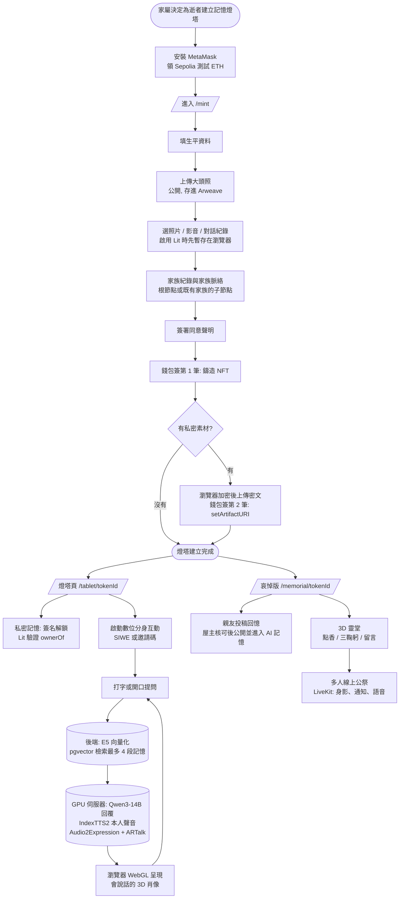
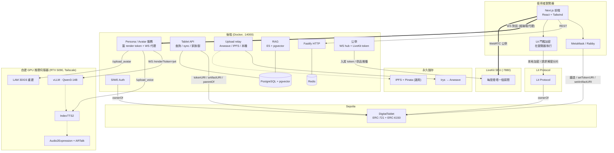

# Aeterlux 數位記憶燈塔 — 專案總覽報告

> **Aeterlux: Digital Memory Lighthouse**(repo 代號 DSAS)
>
> 家族數位記憶網絡:以「數位記憶燈塔」整合照片、影片、聲音、文字與家族關係,提供記憶保存、AI 數位分身互動與線上共同追思。

本文件是寫給沒有區塊鏈背景的同學看的「從零開始」版本,內容以 [Aeterlux_系統概述文件_0914.docx](Aeterlux_系統概述文件_0914.docx) 為準:先解釋每個名詞是什麼、為什麼要用它,再進入架構與實作細節。

---

## 目錄

1. [一句話介紹](#一句話介紹)
2. [問題與動機](#問題與動機)
3. [系統功能與特色](#系統功能與特色)
4. [系統架構總覽](#系統架構總覽)
5. [基礎名詞解釋(從零開始)](#基礎名詞解釋從零開始)
6. [使用者流程圖](#使用者流程圖)
7. [系統架構圖(開發者視角)](#系統架構圖開發者視角)
8. [我們使用的模型與服務清單](#我們使用的模型與服務清單)
9. [模組逐一解釋](#模組逐一解釋)
10. [完整流程走一遍(端到端)](#完整流程走一遍端到端)
11. [資料儲存策略](#資料儲存策略)
12. [權限與安全](#權限與安全)
13. [關鍵決策的 Why](#關鍵決策的-why)
14. [目前進度與下一步](#目前進度與下一步)
15. [名詞速查表](#名詞速查表)

---

## 一句話介紹

> 我們為每位逝者建立一座「記憶燈塔」NFT。家屬持有這張 NFT,就能管理逝者的生平、照片、錄音與對話紀錄:公開的部分讓親友瀏覽與共同追思,私密的部分加密保存、只有持有者能解鎖;AI 數位分身以這些經授權的資料為基礎,用本人克隆的聲音與會說話的 3D 肖像和家人互動。

---

## 問題與動機

### 記憶散落,保存了檔案不等於保存了故事

親人離開後,我們想念的往往不只是一張照片,而是一句熟悉的叮嚀、一個說話的停頓。然而照片散落在手機相簿,聲音留在通訊軟體,故事藏在不同親友的記憶裡。裝置更換、帳號失效、時間推移之後,即使資料仍在,也未必找得到、看得懂、傳得下去。

### 我們要解決的數位落差

系統概述文件把問題定義為**資訊落差**,並延伸到**地理**與**世代**落差:

- **資訊落差**:家族記憶分散在不同親友的手機、社群帳號與影音檔案中,每個人取得與理解的能力不一致。
- **地理落差**:遠方親友因距離無法共同參與追思。
- **世代落差**:下一代缺乏與長輩相處的經驗,難以理解家族故事。

Aeterlux 透過集中整理家族記憶、AI 語意檢索與互動、線上共同追思,以及家族關係串聯,讓不同地點、不同世代的家人都能以一致的方式接觸家族記憶。對仍在世的長輩,也能主動留下想傳給家人的聲音與故事。

### 為什麼要用區塊鏈與永久儲存

Web2 平台收掉、帳號被凍結、家屬不知道密碼,記憶就可能永久消失。我們的設計目標是:**平台就算不在了,只要鏈還在、家屬還持有錢包,資料指標與公開內容仍然找得回來**。這個承諾有它的邊界(見[資料儲存策略](#資料儲存策略)最後的誠實說明)。

---

## 系統功能與特色

**四個主要功能**(系統概述文件 第三節):

| 功能 | 內容 |
|---|---|
| 燈塔建立與管理 | 錢包 + SIWE 簽章驗證身分,填寫生平、家族關係與同意資訊,鑄造 NFT 並上傳素材 |
| 家族紀念與共創 | 家族樹串聯生命故事、影像與追思訊息;親友投稿經屋主核可後,才公開或納入 AI 記憶索引 |
| 數位分身互動 | 文字或語音提問,以 RAG 找出相關記憶,再生成回覆、聲音與人物動態 |
| 共同追思 | 虛擬祭拜場域:上香、鞠躬、留言,以及多人即時參與的線上公祭 |

**三個系統特色**(第四節):

- **家屬掌握記憶**:管理者審核投稿、設定可見性並管理使用範圍。隱藏內容或停止 AI 使用,不等於移除已封存於儲存網路的資料,兩者會明確區分。
- **鏈上可驗證、鏈下可擴充**:NFT 記錄持有關係與資料指標,實際影音另行保存;持有 NFT 不自動等於取得所有肖像、聲音及第三方資料的使用授權。
- **AI 有來源與邊界**:只檢索經同意或核可的記憶,資料不足時保守回覆。數位分身是模擬內容,不代表逝者真實意志,也不取代家人及專業支持。

---

## 系統架構總覽

系統概述文件的圖二把系統分成五塊:

| 區塊 | 解決什麼 | 用什麼 |
|---|---|---|
| **前端** | 操作介面、3D 靈堂、數位分身呈現 | React(Next.js 14)+ Tailwind CSS;HTTPS / REST 交換資料、WebSocket 接收即時訊息、WebGL 呈現數位分身與追思場景 |
| **後端** | 驗證、資料管理、投稿審核、服務協調 | Node.js(Fastify + Prisma);PostgreSQL 保存業務資料、**pgvector** 支援記憶向量檢索;Redis 處理背景任務;**LiveKit** 提供多人公祭的即時通訊 |
| **GPU 推理伺服器** | 對話、聲音、人物動態 | 自建 RTX 5090 主機(Tailscale 內網),Python / FastAPI;vLLM 執行 **Qwen3-14B**;**LAM** 高斯潑濺人物;**IndexTTS2** 個人化語音;**Audio2Expression** 嘴型表情;**ARTalk** 頭部動作 |
| **Web3 層** | 持有關係、家族階層、私密資料的解密控制 | Solidity + Foundry;**ERC-721** 記錄燈塔持有、**ERC-6150** 表達家族節點階層;**Lit Protocol** 依錢包簽章與 NFT 持有關係控制解密(可選擇啟用) |
| **永久儲存** | 影音與 metadata 放哪裡 | 兩條路徑:主要路徑為 **Arweave**,素材經 **Irys** 打包上傳,以交易識別碼與 URI(`ar://…`)定位;備援路徑為 IPFS(Pinata) |

後端、資料庫與 GPU 推理服務都以 Docker 封裝,本機開發用 Docker Compose 一次起齊(postgres / redis / minio / anvil / livekit / backend / frontend)。語音辨識(Whisper)由後端呼叫 OpenAI API,記憶向量(E5)在後端執行,其餘模型都在自建 GPU 伺服器上。

---

## 基礎名詞解釋(從零開始)

如果你已經懂這些,可以直接跳到[使用者流程圖](#使用者流程圖)。

### 區塊鏈是什麼?

把它想成「一台所有人都能讀、沒有單一管理員的全球資料庫」。每個人都拷貝同一份帳本,任何人想改帳本要先讓多數電腦同意。

- **以太坊 (Ethereum)**:目前最大的「可程式化」區塊鏈。除了轉帳,還能跑「智能合約」(寫死的小程式)。
- **Sepolia**:以太坊的「測試網路」,規則跟主網一樣但代幣沒有實際價值,**免費領、免費實驗**。我們的合約部署在 Sepolia。

### 錢包是什麼?

「錢包」這個詞會誤導 — 它**不是放錢的地方**,而是「一把鑰匙」。

- 你產生一對「私鑰 + 公鑰」。私鑰是密碼,公鑰雜湊後變成你的「地址」(類似 `0xAbCd1234...`)。
- 鏈上的資產(代幣、NFT)登記在「地址」名下。
- 要動這些資產,必須用私鑰簽名一筆交易。
- **MetaMask / Rabby** 是瀏覽器外掛,幫你保管私鑰、產生簽名。

> **比喻**:私鑰像家裡保險箱的鑰匙,地址像保險箱在銀行的編號。鑰匙在你手上,銀行倒了你還是能找另一家銀行讀取你保險箱裡的東西(只要那家銀行接同一套協議)。

### EOA 錢包

**EOA = Externally Owned Account**,就是「一般人用私鑰控制的錢包地址」。MetaMask、Rabby 開出來的就是 EOA。家屬用 EOA 持有燈塔 NFT。

### NFT 是什麼?

**NFT = Non-Fungible Token / 非同質化代幣**。同質化代幣(ETH、USDC)互相可替代;NFT 每張都有獨立 ID 與獨立資料,像「畢業證書」。NFT 通常代表**「這個獨一無二的東西的所有權」** — 在這裡是一座記憶燈塔。

### ERC-721 是什麼?

以太坊的 NFT 標準。它規定 NFT 合約必須有 `ownerOf(tokenId)`、`transferFrom(...)`、`tokenURI(tokenId)` 等函式,所以所有錢包與工具都認得它。

> 我們的 [contracts/src/DigitalTablet.sol](../contracts/src/DigitalTablet.sol) 繼承 OpenZeppelin 的 ERC-721 實作,再加上 ERC-6150 與我們自己的欄位。

### ERC-6150 是什麼?(層級 NFT)

ERC-721 的 NFT 之間沒有關係,但**家族**有父子關係:爺爺 → 爸爸 → 我。ERC-6150 讓每張 NFT 指向一張「父 NFT」,合約維護 `parentOf`、`childrenOf` — 鏈上即家譜。

```solidity
mapping(uint256 => uint256) private _parentOf;
mapping(uint256 => uint256[]) private _childrenOf;
```

### tokenURI 與 artifactURI

鏈上儲存很貴,所以 NFT 只記「指標」:

- **`tokenURI`**:ERC-721 標準欄位,指向鏈下的**公開 metadata JSON**(姓名、生卒、生平、大頭照、核可的回憶、數位分身設定)。
- **`artifactURI`**:我們合約自己加的欄位,指向**加密私密素材的清單(manifest)**。啟用 Lit 時,照片、錄音、對話紀錄的密文位置、資料雜湊與解密條件都在這份清單裡。

```json
{
  "name": "王大明",
  "image": "ar://<大頭照交易 ID>",
  "description": "1940 年生於台灣彰化...",
  "dsas": {
    "deceased": { "name": "王大明", "birth": {}, "death": {}, "biography": "..." },
    "descendants": [],
    "assets": { "portrait": "ar://..." },
    "avatar": { "avatarLabel": "...", "voiceLabel": "..." }
  }
}
```

鏈上只記 `tokenURI = "ar://<這個 JSON 的交易 ID>"`,JSON 本體放在 Arweave。

### Arweave 是什麼?

Arweave 是為「永久儲存」設計的網路:**一次付費**,之後由網路持續保存。上傳後得到一個**交易識別碼(TXID)**,我們寫成 `ar://<TXID>` 放進 metadata 或鏈上。

系統概述文件對 Arweave 有兩段重要的「誠實說明」:

- **「一次付費」不是後續保存沒有成本**:預付的費用進入儲存基金並搭配節點獎勵,支撐長期保存。構想是,若單位儲存成本持續按固定比例下降,累積費用便可趨近有限值;但實際保存仍依賴成本假設與網路持續運作,**不等同無條件的永久保證**。
- **驗證方式是抽查 + Merkle tree**:節點提供被抽中的資料片段及雜湊路徑,驗證者就能檢查內容是否與紀錄吻合,不必每次下載整份檔案。這是可驗證的保存機制,但單次驗證不代表未來所有資料永遠存在。

另外,交易識別碼只是幫你**找到**資料;私密素材仍須通過解密授權才能讀。

### Irys 是什麼?

Irys(舊名 Bundlr)是 Arweave 的打包服務:把多筆上傳打包成一筆 Arweave 交易(ANS-104 bundle),上傳快、按容量用 ETH 付費(約 0.000033 ETH / MB,主網 ETH)。我們的後端先走 Irys,失敗時自動改走 ArDrive Turbo。

對應實作:[backend/src/lib/arweave.ts](../backend/src/lib/arweave.ts)、[backend/src/routes/uploads.ts](../backend/src/routes/uploads.ts)。

### IPFS / Pinata(備援路徑)

IPFS 是「內容定址」的 P2P 檔案系統:檔案的雜湊(CID)就是地址,但**沒人 pin 就會消失**,需要 Pinata 這類服務持續保留。我們的儲存層有兩條路徑:主要路徑是 Arweave,另一條是經 Pinata 的 IPFS 備援路徑,以 `STORAGE_DRIVER` 切換;兩者產生的 `ar://` 與 `ipfs://` 位址都能寫進鏈上指標、在前端顯示。IPFS 上的資料可用 [backend/scripts/migrate-to-arweave.ts](../backend/scripts/migrate-to-arweave.ts) 轉存到 Arweave。

### Lit Protocol 是什麼?

Arweave 上的東西任何人都下載得到。要讓「私密照片、聲音與對話」只有持有者能看,就要**加密**,而且解密的鑰匙不能落在平台手上。Lit Protocol 做的就是「依條件交出解密能力」:條件是「錢包簽章 + 這個錢包持有這座燈塔的 NFT」。

Lit 的核心是**門檻式密碼學**:解密能力由多個節點協作提供,每個節點只持有一部分,節點各自上鏈驗證條件後才交出自己那一份,在使用者的瀏覽器裡組合。授權端拿到的是協作結果,不是重新拼出 Lit 網路的主私鑰,所以沒有任何一方(包括平台)能單獨解密。

實際的步驟:

1. 上傳前,瀏覽器用 Lit 網路的公開金鑰把每個檔案(連檔名)加密,只上傳密文;加密不需要跟任何節點互動。解鎖條件(`ownerOf(tokenId)` 必須等於請求者)在加密時就綁進密文,改條件等於換一把完全不同的金鑰,平台無法事後放寬。
2. manifest 記下每個密文的位置、資料雜湊與這組條件。
3. 解鎖時,持有者用錢包簽名,Lit 各節點各自上鏈確認簽名者就是 `ownerOf(tokenId)`,才交出自己那一片;瀏覽器湊滿門檻組合出解密金鑰,下載密文自己解密。

私密素材加密是選用功能,以 `NEXT_PUBLIC_LIT_MODE` 設定啟用或不啟用(設定方式見 [README](../README.md))。

### LiveKit 是什麼?

LiveKit 是開源的即時通訊伺服器(SFU,Selective Forwarding Unit):每個人把自己的聲音與資料送到伺服器一次,伺服器再轉給房間裡其他人,比每兩人直接連線(P2P)更能撐多人。我們用它做**多人線上公祭**:同在 3D 靈堂的親友看得到彼此的身影、點香與鞠躬的通知、頭上的聊天氣泡,也可以開麥克風說話。

以 `CEREMONY_TRANSPORT` 切換:`livekit` 用 LiveKit 房間;`ws` 用後端自建的 WebSocket hub(沒有語音)。LiveKit 連不上時瀏覽器會自動退回 `ws`。

### RAG、E5、pgvector 是什麼?

- **RAG(Retrieval-Augmented Generation)**:先「檢索」再「生成」。每輪對話先用問題去記憶庫找最相關的幾段真實語料,放進 prompt,讓 LLM 的回答有來源。
- **E5**:我們用的文字向量模型(multilingual-e5-small,384 維),把「問題」和「記憶片段」都轉成向量,語意越接近向量越接近。
- **pgvector**:PostgreSQL 的向量擴充,用 cosine 距離(`<=>`)快速找出最接近的片段。我們每輪檢索**最多 4 段**,距離超過 0.62 的丟掉。

記憶來源有三種:公開的對話紀錄、持有者解鎖後提供的**私密對話紀錄**、屋主核可的**親友回憶**。只索引逝者本人的發言;親友回憶會和本人發言分開標示,避免 LLM 把別人的話當成自己說過的。

### 智能合約、Gas、SIWE

- **智能合約**:跑在區塊鏈上的程式,部署後沒有人能偷改。我們的 DigitalTablet 用 **Solidity** 撰寫、用 **Foundry** 編譯測試與部署。
- **Gas**:寫入鏈上要付的手續費(Sepolia 用免費的測試 ETH)。讀取免費。
- **SIWE(Sign-In With Ethereum,EIP-4361)**:用錢包簽一段訊息登入,**不花 gas**。後端驗證簽名與一次性 nonce 後簽發 JWT。實作:[backend/src/auth/siwe.ts](../backend/src/auth/siwe.ts)。

### LLM、TTS、高斯潑濺、blendshape

- **LLM**:大型語言模型。我們在自建 GPU 伺服器上用 vLLM 跑開源的 **Qwen3-14B**(AWQ int4 量化),扮演逝者以第一人稱回答。
- **TTS / 聲音克隆**:文字轉語音。**IndexTTS2** 用逝者本人的錄音樣本克隆音色。
- **高斯潑濺(3D Gaussian Splatting)**:系統概述文件的比喻是「大量帶有顏色與透明度的柔邊色點,共同呈現熟悉的臉孔」。這些點有空間位置與形狀,並非真的發光;**LAM** 從單張正面照重建出可驅動的人物,瀏覽器用 WebGL 即時渲染,不是播放預錄影片。
- **blendshape**:把臉部表情拆成 52 個標準維度(ARKit)。**Audio2Expression** 從語音推出這 52 維驅動嘴型與表情,**ARTalk** 補上頭部動作。
- **Whisper**:語音辨識,把家屬說的話轉成文字(目前走 OpenAI API)。

---

## 使用者流程圖



家屬需要簽的東西:鑄造交易(花一點 gas)、有私密素材時的 `setArtifactURI` 交易、登入用的 SIWE 訊息(免費),以及解鎖私密記憶時的一段訊息(免費)。

---

## 系統架構圖(開發者視角)



**幾個觀察重點**:

1. **前端直接跟錢包 + 鏈互動**:鑄造與更新指標都由家屬錢包簽名,後端從不持有使用者私鑰。
2. **後端是「薄」的**:查鏈、查 DB、組 persona prompt、做 RAG、代理對話、簽短期 token。真理來源在鏈上。
3. **加密在瀏覽器完成**:後端與 Arweave 只看得到密文;解密能力由 Lit 依鏈上持有關係交給持有者。
4. **GPU 伺服器無狀態、persona 無關**:每輪由前端帶上完整 `messages`(含後端組好的 system prompt);改 persona 或記憶只動後端。
5. **對話 WS 走後端代理**:Chrome 的 Private Network Access 會擋公開網頁 → 私網 IP 的 WS,所以瀏覽器連後端 `/api/avatar/ws`,後端再轉給 GPU 伺服器。

---

## 我們使用的模型與服務清單

### AI(自建 GPU 伺服器 + 後端)

| 用途 | 模型 / 服務 | 在哪裡跑 |
|---|---|---|
| 對話生成 | **Qwen3-14B**(AWQ int4,vLLM) | 自建 GPU 伺服器 |
| 個人化語音 | **IndexTTS2**(本人錄音克隆) | 自建 GPU 伺服器 |
| 人物外觀 | **LAM**(單張照重建高斯潑濺人物) | 自建 GPU 伺服器 |
| 嘴型與表情 | **Audio2Expression**(52 維 ARKit) | 自建 GPU 伺服器 |
| 頭部動作 | **ARTalk** | 自建 GPU 伺服器 |
| 記憶向量 | **E5**(multilingual-e5-small,384 維) | 後端(`@xenova/transformers`) |
| 語音辨識 | **Whisper**(`whisper-1`) | OpenAI API(由後端呼叫) |

對話時 GPU 伺服器**每句一個二進位幀**回傳:`[uint32 LE meta_len][meta JSON][WAV 24kHz mono PCM16][float32 (n,52) 表情][float32 (n,3) 頭姿(可選)]`。LLM 首 token 約 100ms;TTS 是瓶頸(IndexTTS2 RTF≈2.7),瀏覽器預緩衝約 1.8–3 秒再播放。

### 區塊鏈與加密

| 用途 | 工具 / 服務 |
|---|---|
| 智能合約 | **Solidity 0.8.24** + **OpenZeppelin**(ERC-721、AccessControl) |
| 開發框架 | **Foundry**(`forge` / `cast`) |
| 鏈 | Sepolia 測試網 |
| 前端鏈互動 | **wagmi v2 + viem** + **RainbowKit** |
| 後端唯讀鏈互動 | **viem PublicClient** |
| 私密素材解密控制 | **Lit Protocol**(依錢包簽章與 NFT 持有關係交出解密分片) |
| 瀏覽器加密 | Lit SDK 門檻加密(執行時從 CDN 載入) |

### 儲存

| 用途 | 服務 |
|---|---|
| 主要路徑 | **Arweave**,經 **Irys** 打包上傳,ArDrive **Turbo** 備援 |
| 備援路徑 | IPFS + **Pinata**(`STORAGE_DRIVER=pinata`);開發時另可存本機磁碟(`local`) |
| 讀取閘道 | `arweave.net`(剛上傳尚未索引時改讀 `gateway.irys.xyz`) |

### 應用層基礎建設

| 用途 | 工具 |
|---|---|
| 後端 HTTP server | **Fastify** |
| ORM / Migration | **Prisma** |
| 資料庫 | **PostgreSQL + pgvector** |
| 背景任務 / 執行期設定 | **Redis**(BullMQ) |
| 即時通訊 | **LiveKit**(多人公祭)、`ws` 套件(自建 WebSocket hub 與對話代理) |
| 容器 | **Docker Compose**:postgres / redis / minio / anvil / livekit / backend / frontend |
| 前端 | **Next.js 14 (App Router) + TypeScript + Tailwind CSS**;3D 靈堂用 React Three Fiber |

---

## 模組逐一解釋

### 1. [contracts/](../contracts/) — 智能合約

鏈上身分層。記錄每座燈塔的 owner、家族父子關係、兩個 URI 指標。

```solidity
mapping(uint256 => uint256) private _parentOf;       // ERC-6150 父節點
mapping(uint256 => uint256[]) private _childrenOf;   // ERC-6150 子節點
mapping(uint256 => string) private _tokenURIs;       // 公開 metadata(ar://…)
mapping(uint256 => string) private _artifactURI;     // 加密私密素材的 manifest(ar://…)
```

關鍵函式:

- `mintRoot(to, tokenURI_)` — 鑄造家族根節點(只有 `MINTER_ROLE`)
- `safeMintWithParent(to, parentId, tokenURI_)` — 鑄造子節點(必須是 parent 的 owner 或 `MINTER_ROLE`)
- `setTokenURI(tokenId, uri)` — 更新公開 metadata(owner 或 MINTER)
- `setArtifactURI(tokenId, uri)` — 更新加密素材 manifest(owner 或 MINTER)
- `parentOf` / `childrenOf` / `isRoot` / `isLeaf` — 唯讀
- 事件:`Minted` / `Burned` / `TokenURIUpdated` / `ArtifactURIUpdated`

合約詳解:[docs/contracts.md](contracts.md)。

### 2. [backend/](../backend/) — 應用後端(Fastify)

**薄薄一層**:接前端 REST、查鏈、查 DB、組 persona prompt、RAG、代理對話、簽短期 token。不持有家屬私鑰;GPU 伺服器與 LiveKit 的密鑰只在後端。

| 檔案 / 路由 | 負責 |
|---|---|
| [src/auth/](../backend/src/auth/) | SIWE nonce + 簽名驗證 + JWT;`requireAuth` / `requireOwner`(一律上鏈查 `ownerOf`) |
| [src/lib/access.ts](../backend/src/lib/access.ts) | 追悼頁可見度(PUBLIC / UNLISTED / PRIVATE)與邀請碼 |
| [src/routes/tablets.ts](../backend/src/routes/tablets.ts) | 燈塔查詢、從鏈上 sync(含 `artifactURI`)、家族樹 |
| [src/routes/uploads.ts](../backend/src/routes/uploads.ts) + [src/lib/arweave.ts](../backend/src/lib/arweave.ts) | 上傳中繼:Irys → Arweave(Turbo 備援)/ Pinata / 本機 |
| [src/lib/rag.ts](../backend/src/lib/rag.ts) | 記憶索引(對話紀錄、私密對話紀錄、核可回憶)與 top-4 檢索 |
| [src/routes/personas.ts](../backend/src/routes/personas.ts) | persona prompt(每輪帶問題做 RAG)、`reindex-memory`、語音辨識 |
| [src/routes/avatar.ts](../backend/src/routes/avatar.ts) + [src/lib/ws-proxy.ts](../backend/src/lib/ws-proxy.ts) | avatar / voice 預構建代理、render token、WS 代理 |
| [src/routes/stories.ts](../backend/src/routes/stories.ts) | 親友投稿回憶與審核;核可即進 AI 記憶 |
| [src/routes/tributes.ts](../backend/src/routes/tributes.ts) | 靈堂留言獻供 |
| [src/routes/ceremony.ts](../backend/src/routes/ceremony.ts) + [src/lib/livekit.ts](../backend/src/lib/livekit.ts) + [src/lib/ceremony-hub.ts](../backend/src/lib/ceremony-hub.ts) | 公祭:LiveKit 入房 token、供品推播;WebSocket hub(`ws` 模式) |
| [src/routes/admin.ts](../backend/src/routes/admin.ts) | 單密碼 admin API:切換儲存模式 / 鏈模式、anvil 餵 gas(沒有前端頁面) |
| [scripts/](../backend/scripts/) | `irys-account.ts`(Irys 餘額 / 儲值)、`migrate-to-arweave.ts`、`lit-chipotle-setup.ts` |

### 3. [frontend/](../frontend/) — 使用者介面(Next.js)

| 頁面 | 內容 |
|---|---|
| `/` | 首頁 |
| `/mint` | 5 步驟鑄造向導;Lit 模式下私密素材暫存 → 鑄造後加密封存 |
| `/tablet/[tokenId]` | 燈塔頁:生平 / 照片 / 影音 / 子孫 / 對話紀錄 / **私密記憶**;持有者就地編輯、保存上鏈 |
| `/tablet/[tokenId]/chat` | 數位分身對話(語音全屏 / 打字雙布局) |
| `/memorial/[tokenId]` | 哀悼版:生平、回憶投稿、留言;進入 **3D 靈堂** |
| `/dashboard`、`/dashboard/[tokenId]` | 我持有的燈塔;管理哀悼版(外觀、可見度、邀請碼、回憶審核、批次上鏈、重建記憶索引) |
| `/registry` | 燈塔典藏 / 線上紀念館(舊的 `/baibai` 轉址到這裡) |
| `/lineage/[rootId]` | 家族樹 |

關鍵程式:

- [lib/lit/](../frontend/src/lib/lit/) — `config.ts`(加密開關)、`legacy.ts` + `legacy-sdk.ts`(Lit 門檻加密,SDK 從 CDN 載入)、`payload.ts`(檔名 + 內容打包)、`chipotle.ts` + `envelope.ts`(chipotle 模式的檔案金鑰包裝與 AES-GCM)、`artifact.ts`(封存 / 解鎖)、`pending-files.ts`(暫存檔)
- [components/PrivateMemories.tsx](../frontend/src/components/PrivateMemories.tsx) — 私密記憶解鎖與檢視
- [lib/ceremony.ts](../frontend/src/lib/ceremony.ts) — 公祭即時通道(LiveKit / WebSocket 共用一套事件)
- [components/baibai/MemorialHall.tsx](../frontend/src/components/baibai/MemorialHall.tsx) — 3D 靈堂(身影、儀式、聊天氣泡、語音)
- [components/ChatInterface.tsx](../frontend/src/components/ChatInterface.tsx) — 數位分身對話
- [lib/tablet-save.ts](../frontend/src/lib/tablet-save.ts) — 合併 metadata、加密封存、`setTokenURI` / `setArtifactURI`、重建記憶

### 4. [lit-actions/](../lit-actions/) — Lit Action

`aeterlux-artifact-key.js`:以 Lit Action 寫成的解鎖規則(`chipotle` 模式使用)。`op=publicKey` 回傳身分公鑰;`op=unwrap` 驗證錢包簽章、訊息時效(5 分鐘)、訊息屬於本合約與本 tokenId、鏈上 `ownerOf`,再確認信封屬於同一座燈塔,才交出檔案金鑰。

### 5. 自建 GPU 推理伺服器

不在本 repo(見 [docs/server/](server/))。RTX 5090、Tailscale 內網,對外端點:`POST /upload_voice`、`POST /upload_avatar`、WS `/render?token=<jwt>`。無狀態、persona 無關。`compute/` 與 `training/` 是獨立的實驗目錄,不在系統的執行路徑上。

### 6. [shared/types/](../shared/types/) 與 [storage/](../storage/)

- `shared/types/tablet.ts` — 公開 metadata schema;`shared/types/artifact.ts` — 加密 manifest schema 與 Lit 模式型別。
- `storage/` — 獨立的儲存抽象套件(`IStorageProvider`)與 6 平台對話紀錄 parser;應用程式的上傳由 backend 處理。

---

## 完整流程走一遍(端到端)

以「王小華為父親王大明建立燈塔、之後與父親對話、邀親友線上公祭」為例(啟用 Arweave、Lit 加密與 LiveKit)。

### Phase 1 — 鑄造燈塔

1. 連 MetaMask,進 `/mint`:填「王大明 / 男 / 台灣彰化 / 1940-02-15 / 2024-01-01」與生平。
2. 上傳大頭照 → 後端經 Irys 存進 Arweave,拿到 `ar://…`;可順便生成 3D 數位分身(LAM,約 100 秒)。
3. 選 30 張照片、兩段影片、LINE 對話紀錄 → 只暫存在瀏覽器,畫面標示「待加密上傳」。
4. 家族紀錄、家族脈絡(根節點)、勾選同意聲明。
5. 按「開始鑄造」:
   - 先確認 Lit 可用 → 上傳公開 metadata(只含大頭照與基本資料)→ 錢包簽 `mintRoot`
   - 等交易確認,從 Transfer 事件讀出 tokenId
   - 瀏覽器以 Lit 網路公鑰逐檔加密(含檔名)後上傳密文,再上傳 manifest(密文位置、資料雜湊、存取條件)
   - 錢包簽第二筆 `setArtifactURI(tokenId, ar://manifest)`
   - 私密對話紀錄的原文趁還在瀏覽器,SIWE 登入後送去建立 AI 記憶索引

### Phase 2 — 解鎖私密記憶

王小華在燈塔頁「私密記憶」按解鎖 → 簽一段訊息 → Lit 各節點驗證簽名並查鏈上 `ownerOf` → 交出解密分片 → 瀏覽器湊滿門檻、下載密文、本機解密顯示。如果 NFT 轉給兒子,下次就只有兒子的錢包解得開。

### Phase 3 — 與數位分身對話

1. 按「啟動數位分身互動」→ SIWE 登入 → 後端簽短期 render token → 前端經後端代理連上 GPU 伺服器。
2. 王小華說:「爸,你還記得老家後院的芒果樹嗎?」→(語音時先經 Whisper 轉文字)
3. 前端帶著問題呼叫 `persona-prompt?q=…`:後端用 E5 把問題轉成向量,在 pgvector 找最多 4 段相關記憶(例如對話紀錄裡父親提過的芒果樹),距離夠近的才放進 system prompt。
4. GPU 伺服器用 Qwen3-14B 串流回覆,IndexTTS2 以父親的聲音念出,Audio2Expression + ARTalk 產生嘴型與頭部動作,瀏覽器即時渲染。
5. 記憶裡沒有的事,persona prompt 要求溫和承認記憶有限、不編造。

### Phase 4 — 家族共創與線上公祭

1. 王小華在「管理哀悼版」把可見度設為不公開(UNLISTED),把邀請碼傳給親友。
2. 親友在哀悼版投稿回憶;王小華核可後,回憶公開並即時進入 AI 記憶。
3. 公祭當天,親友進入 3D 靈堂:彼此看得到身影、點香與鞠躬的通知、頭上的聊天氣泡;遠在國外的姑姑開麥克風說了一段追思,大家即時聽到。
4. 有人留言獻供,後端存進 DB 後透過 LiveKit 即時推給房間裡所有人。

---

## 資料儲存策略

| 資料 | 放在哪 | 為什麼 | 改動成本 |
|---|---|---|---|
| **NFT 所有權** | Sepolia 鏈上 | 唯一真理來源 | 一筆交易 gas |
| **家族父子關係** | Sepolia 鏈上(`_parentOf` / `_childrenOf`) | 鏈上即家譜 | 鑄造子節點時寫入 |
| **公開 metadata**(姓名、生卒、生平、大頭照、核可回憶、avatar / voice label) | Arweave(`tokenURI`) | JSON 較大,鏈上太貴 | 上傳新 JSON + `setTokenURI` |
| **私密素材**(照片、影音、文字、對話紀錄) | Arweave 上的**密文**;清單在 `artifactURI` | 任何人下載得到但讀不到 | 加密上傳 + `setArtifactURI` |
| **解密條件** | 寫在 manifest 裡,由 Lit 節點各自驗證 | 平台不持有金鑰,也改不了條件 | 補傳沿用同一組條件 |
| **AI 記憶索引** | PostgreSQL `MemoryChunk`(切片文字 + 384 維向量) | 檢索要快 | 可隨時重建;私密對話紀錄的切片只在持有者再次提供時替換 |
| **投稿回憶、留言、可見度、邀請碼** | PostgreSQL | 需審核與即時互動 | 回憶可批次寫進鏈上快照 |
| **離鏈快取**(`Tablet` 表) | PostgreSQL | 加速查詢 | 隨時可從鏈上重建 |
| **Secrets**(`JWT_SECRET`、`RENDER_JWT_SECRET`、LiveKit / Irys 金鑰) | `.env`(不進 git) | 只在後端 | 換新即可 |

> **想像最壞的情況**:平台一夜倒閉、後端與資料庫消失。**家屬會失去什麼?** 快取、投稿審核狀態與 AI 記憶索引(可重建)。鏈上的 NFT 與指標、Arweave 上的公開 metadata 與密文都還在:任何人拿著 tokenId 就能從鏈上讀到 `tokenURI`,抓回公開資料。
>
> **誠實的邊界**:Arweave 的長期保存依賴儲存基金與成本下降的假設;私密素材能否解開,取決於 Lit 服務是否持續運作(見[威脅模型](threat-model.md) T11)。

---

## 權限與安全

### 1. 「誰是 NFT 的 owner」是鏈上問題

後端的 [`requireOwner`](../backend/src/auth/middleware.ts) 一律上鏈查 `ownerOf`,不信 DB 快取(NFT 轉手後 DB 不會立刻知道)。Lit 解鎖時也是直接查鏈。

### 2. 鑄造權限分根節點 / 子節點

- **根節點**(`mintRoot`):只有 `MINTER_ROLE`。
- **子節點**(`safeMintWithParent`):呼叫者必須是 parent 的 owner(或 `MINTER_ROLE`)。

### 3. 只有 owner(或 MINTER)能改指標

`setTokenURI` / `setArtifactURI` 都檢查 `msg.sender == ownerOf(tokenId) || hasRole(MINTER_ROLE, msg.sender)`。

### 4. SIWE nonce 一次性

nonce 存 DB、一次性、有時效,防重放。

### 5. 可見度與邀請碼

追悼頁三態:PUBLIC(公開)、UNLISTED(憑邀請碼)、PRIVATE(僅屋主)。邀請碼只存在 DB,絕不上鏈。對話、投稿、公祭房間都依此把關;PRIVATE 不開放公祭。

### 6. 隱私

- 對話紀錄可能含活人:UI 警示;RAG 只索引逝者本人的發言。
- 啟用 Lit 時私密素材在瀏覽器加密,連檔名也加密。
- 後端讀不到加密的對話紀錄;只有持有者解鎖後主動送出的原文才會被索引。
- 「本機推理」不代表資料不離開家屬裝置:互動內容仍須經網路傳到自建服務,但不交給第三方 AI 平台(語音辨識例外,見上)。

完整清單見 [threat-model.md](threat-model.md)。

---

## 關鍵決策的 Why

### Why 真的上鏈,不用 DB 模擬?

核心承諾是「平台倒了,只要鏈在,指標就在」。只用 DB 模擬會直接打臉自己的價值主張;Sepolia 測試網免費,沒有理由不做真合約。

### Why Arweave(經 Irys)?

- 「一次付費、長期保存」的模型比「要有人持續 pin」的 IPFS 更符合記憶燈塔的長期性(但不是無條件永久,見上)。
- Irys 打包上傳快、用 ETH 付費,不必另外持有 AR 代幣;失敗時自動改走 ArDrive Turbo。
- IPFS(Pinata)作為備援路徑,以 `STORAGE_DRIVER` 切換;開發時也可存本機。

### Why 用 Lit?

- 加密要能「只讓持有者解開」,又不能讓平台拿著萬能鑰匙:Lit 以門檻式密碼學讓解密能力不集中在任何一方。
- 條件綁的是「現在誰持有這顆 NFT」,轉讓後新持有者自動取得解密權,不需要重新加密。
- 加密是選用功能,可依家屬需求啟用或不啟用。

### Why 用 LiveKit 做線上公祭?

- 多人語音需要 SFU:每人上傳一次、由伺服器轉發,比兩兩 P2P 省頻寬也更穩。
- 事件(身影、儀式、聊天)走同一個房間的 data channel,不必另外維持一套連線。
- 自建 WebSocket hub 保留為 `ws` 模式與自動備援。

### Why 用 ERC-6150,不用 ERC-6551(TBA)?

逝者是被緬懷的對象,不是需要主動簽交易的行為主體;一般 EOA 就能持有多座燈塔。少一層合約更省 gas、風險更低。未來需要「祭祀基金」等功能時,ERC-6551 可以再加掛。

### Why 後端與 GPU 伺服器拆開?

後端是 Node/TS、常駐、輕量;GPU 伺服器是吃顯卡的重活。GPU 伺服器刻意做成無狀態、persona 無關,改 persona 或記憶只動後端,也方便水平擴充。

### Why 運算層自建,不打雲端 API?

- **隱私**:家族對話不交給第三方 AI 平台。
- **擬真**:本人錄音克隆聲音、本人照片重建 3D 人物。
- **韌性**:全是開源模型,任何人都能自架同樣的環境。
- **成本**:一台機器跑到飽,不必逐次計費。

### Why 預構建 avatar / voice?

LAM 重建約 100 秒、聲音克隆也要時間;每位逝者只做一次,label 存進 metadata,對話時就能即時開始。

### Why Foundry?

編譯 / 測試比 Hardhat 快,測試與部署腳本都用 Solidity 寫,跟合約同語言。

---

## 目前進度與下一步

| 項目 | 狀態 |
|---|---|
| 合約(ERC-721 + ERC-6150 + `artifactURI`)部署於 Sepolia | ✅ |
| 鑄造向導、燈塔頁就地編輯與保存上鏈 | ✅ |
| 儲存層兩條路徑:Arweave(Irys + Turbo)與 IPFS 備援 | ✅ 程式完成;Irys 付款地址以主網 ETH 儲值後即可全面使用 Arweave |
| Lit 私密素材加密(可啟用 / 不啟用) | ✅ 程式完成並通過測試;正式啟用需建立 Lit 帳號並執行設定腳本 |
| 數位分身即時對話(Qwen3-14B + IndexTTS2 + LAM + Audio2Expression + ARTalk) | ✅ |
| RAG(對話紀錄 + 私密對話紀錄 + 核可回憶,top-4) | ✅ |
| 哀悼版、投稿審核、可見度與邀請碼 | ✅ |
| 3D 靈堂與多人線上公祭(LiveKit:身影、儀式、聊天、語音;WebSocket 備援) | ✅ |
| 語音辨識部署於自建 GPU 伺服器 | ⏳ 規劃中(現使用 OpenAI Whisper API) |

下一步:為 Irys 儲值,把所有燈塔統一封存到 Arweave;建立 Lit 帳號正式啟用加密;為私密素材增加備援解密條件(例如家族多簽),降低對單一 Lit 服務的依賴;LiveKit 以雲端服務或 TURN 支援對外展示。

---

## 名詞速查表

| 名詞 | 一句話 |
|---|---|
| **區塊鏈** | 沒有單一管理員的全球資料庫,任何人都能讀,寫入需多數同意 |
| **以太坊 / Sepolia** | 可程式化區塊鏈;Sepolia 是免費測試網 |
| **EOA** | 一般人用私鑰控制的錢包地址 |
| **NFT / ERC-721** | 獨一無二的代幣標準,代表所有權 |
| **ERC-6150** | 層級式 NFT,有父子關係,適合家譜 |
| **tokenURI** | NFT 上的公開 metadata 連結 |
| **artifactURI** | 我們合約加的欄位,指向加密私密素材清單 |
| **smart contract / Solidity / Foundry** | 鏈上程式 / 撰寫語言 / 開發工具 |
| **gas** | 寫入鏈上的手續費 |
| **SIWE** | 用錢包簽訊息登入(免 gas) |
| **Arweave / TXID** | 一次付費、長期保存的儲存網路;TXID 是資料的識別碼 |
| **Irys** | Arweave 的打包上傳服務,用 ETH 付費 |
| **IPFS / Pinata** | 內容定址檔案系統 / pinning 服務(備援路徑) |
| **Lit Protocol** | 依條件(簽章 + NFT 持有)交出解密能力的網路 |
| **門檻式密碼學** | 多個節點各持一部分,達到門檻數量才能完成解密 |
| **Lit Action** | 寫成程式的 Lit 解鎖規則(見 `lit-actions/`) |
| **LiveKit / SFU** | 開源即時通訊伺服器;每人上傳一次、由伺服器轉發給其他人 |
| **RAG** | 先檢索相關記憶再讓 LLM 生成回答 |
| **E5 / pgvector** | 文字向量模型 / PostgreSQL 的向量檢索擴充 |
| **Whisper** | 語音辨識模型 |
| **LLM / Qwen3-14B** | 大型語言模型;我們用 vLLM 跑開源 Qwen3-14B |
| **IndexTTS2** | 開源 TTS,用本人錄音克隆音色 |
| **高斯潑濺 / LAM** | 用大量帶顏色與透明度的柔邊色點呈現 3D 人物 / 從單張照重建的模型 |
| **Audio2Expression / ARTalk** | 從語音產生嘴型表情 / 頭部動作 |
| **ARKit blendshape** | 把臉部表情拆成 52 個標準維度 |
| **Tailscale** | 把分散的機器組成私有內網 |
| **WebSocket** | 雙向串流連線 |
| **Prisma / Fastify / Next.js** | ORM / Node HTTP 框架 / React 框架 |

---

> 讀完還有「為什麼這樣?」「那個是什麼?」的疑問,把對應段落圈出來提問即可。本文件隨開發持續更新,規格以系統概述文件為準。
