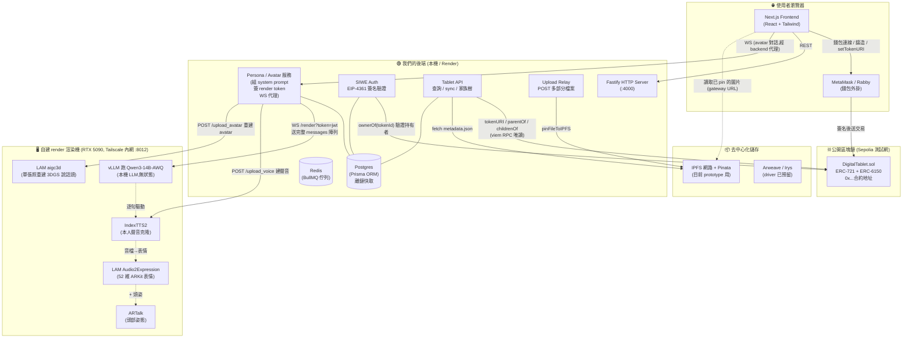

# DSAS 專案總覽報告

> **DSAS — Data Sovereignty as Soul / 主權數位先祖系統**
>
> 一個結合「區塊鏈 NFT」+「永久去中心化儲存」+「生成式 AI」的數位永生服務:讓家屬透過 NFT「擁有」逝者的數位塔位,並能與其互動(即時對話、本人聲音、3D 說話頭)。

本份文件是寫給沒有區塊鏈背景的同學看的「從零開始」版本。我們會先解釋每個名詞是什麼、為什麼要用它,再進入專案架構與實作細節。**運算層採用「自建 render 渲染機」**:一台自家的 RTX 5090 主機(透過 Tailscale 內網存取)在本機跑 Qwen3-14B LLM、IndexTTS2 聲音克隆、LAM 3DGS 說話頭與 ARTalk 頭部姿態,不再呼叫任何第三方雲端 API。早期曾設想另一條「本地離線訓練流程」(LoRA / GPT-SoVITS / RAG),**現已廢棄並統一走自建 render 機**。

---

## 目錄

1. [一句話介紹](#一句話介紹)
2. [問題與動機:為什麼要做這個](#問題與動機為什麼要做這個)
3. [解決方案總覽:三層架構](#解決方案總覽三層架構)
4. [基礎名詞解釋(從零開始)](#基礎名詞解釋從零開始)
5. [使用者流程圖](#使用者流程圖)
6. [系統架構圖(開發者視角)](#系統架構圖開發者視角)
7. [運算層:自建 render 渲染機(早期離線訓練設想已廢棄)](#運算層自建-render-渲染機早期離線訓練設想已廢棄)
8. [我們使用的模型與服務清單](#我們使用的模型與服務清單)
9. [模組逐一解釋](#模組逐一解釋)
10. [完整流程走一遍(端到端)](#完整流程走一遍端到端)
11. [資料儲存策略](#資料儲存策略)
12. [權限與安全](#權限與安全)
13. [關鍵決策的 Why(為什麼這樣選)](#關鍵決策的-why為什麼這樣選)
14. [目前進度與下一步](#目前進度與下一步)
15. [名詞速查表](#名詞速查表)

---

## 一句話介紹

> 我們把每位逝者做成一張「鏈上塔位 NFT」。家屬持有這張 NFT,就擁有逝者的照片、影片、音檔、文字記憶等資料的所有權,並能透過自建 render 渲染機上的 AI 模型即時與「數位分身」互動 — 即時對話、聽到本人聲音、看到會說話的 3D 肖像。

---

## 問題與動機:為什麼要做這個

### Web2 時代:記憶是「租來」的

我們現在習慣把照片、訊息、影片放在雲端 — Google Photos、Facebook、Instagram、LINE。
看起來這些東西「在那裡」,但實際上:

- **平台收掉,記憶就沒了。** Google+ 關了、Yahoo Blog 關了、無名小站關了 — 用戶資料一夜蒸發。
- **資料不是你的。** 你不能保證十年後 Meta 不會清空舊帳號、不會改 ToS、不會把你的資料拿去訓練模型。
- **沒有所有權證明。** 帳號可以被盜、被封、被忘記密碼。

### 一個更急迫的問題:逝者

家裡有人過世時,他的 LINE / Facebook / 手機相簿,通常會在幾年後因為:
- 帳號太久沒登入被平台凍結
- 家屬不知道密碼
- 平台政策變更刪除「停用帳號」

而**永久消失**。對家屬來說,這是第二次死亡 — 這次是記憶的死亡。

### 我們的承諾

> **即使 DSAS 平台 20 年後倒閉,只要區塊鏈還在運行 + 家屬持有 NFT 錢包,任何人都能把資料抓回來重現逝者。**

這是這個專案的核心。所有技術選擇都是為了支撐這句話。

---

## 解決方案總覽:三層架構

我們把系統切成三層,每層都用「不依賴單一公司」的技術:

| 層級 | 它解決什麼問題 | 我們用什麼技術 |
|---|---|---|
| **身分層** | 「誰擁有這份記憶?家族關係怎麼記?」 | NFT(ERC-721 + ERC-6150)在 Sepolia 測試鏈上 |
| **儲存層** | 「照片、影片、音檔放在哪裡能永遠存活?」 | IPFS(Pinata 服務),未來可切到 Arweave |
| **運算層** | 「怎麼讓 AI 用這些素材重現逝者?」 | 自建 render 渲染機(本地 Qwen3-14B LLM + IndexTTS2 聲音克隆 + LAM 3DGS 說話頭),Tailscale 內網 |

**重點是這三層彼此獨立**:
- 平台倒了,**身分層**(NFT 紀錄)還在鏈上。
- 平台倒了,**儲存層**(IPFS 上的檔案)只要還有人 pin 著就在。
- 平台倒了,**運算層**用的全是開源模型(Qwen3 / IndexTTS2 / LAM / ARTalk),任何人都能自架一台同樣的機器、餵同樣的素材跑出同樣的數位分身,不被任何一家雲端供應商綁定。

---

## 基礎名詞解釋(從零開始)

如果你已經懂這些,可以直接跳到[使用者流程圖](#使用者流程圖)。

### 區塊鏈是什麼?

把它想成「一台所有人都能讀、沒有單一管理員的全球資料庫」。每個人都拷貝同一份帳本,任何人想改帳本要先讓多數電腦同意。

- **以太坊 (Ethereum)**:目前最大的「可程式化」區塊鏈。除了轉帳,還能跑「智能合約」(寫死的小程式)。
- **Sepolia / Base Sepolia**:以太坊的「測試網路」,規則跟主網一樣但代幣沒實際價值,**免費領、免費實驗**。我們 prototype 用 Sepolia,因為實驗階段不適合花真錢。

### 錢包是什麼?

「錢包」這個詞會誤導 — 它**不是放錢的地方**,而是「一把鑰匙」。

- 你產生一對「私鑰 + 公鑰」。私鑰是密碼,公鑰雜湊後變成你的「地址」(類似 `0xAbCd1234...`)。
- 鏈上的資產(代幣、NFT)登記在「地址」名下。
- 要動這些資產,必須用私鑰簽名一筆交易。
- **MetaMask / Rabby** 是瀏覽器外掛,幫你保管私鑰、產生簽名。

> **比喻**:私鑰像家裡保險箱的鑰匙,地址像保險箱在銀行的編號。鑰匙在你手上,銀行倒了你還是能找另一家銀行讀取你保險箱裡的東西(只要那家銀行接同一套協議)。

### EOA 錢包

**EOA = Externally Owned Account**,就是「一般人用私鑰控制的錢包地址」。MetaMask、Rabby 開出來的就是 EOA。家屬用 EOA 持有塔位 NFT,跟用 EOA 持有 USDC 沒兩樣。

### NFT 是什麼?

**NFT = Non-Fungible Token / 非同質化代幣**。

- 「同質化」代幣(像 USDC、ETH)互相可以替代:你的 1 USDC 跟我的 1 USDC 一樣。
- 「非同質化」代幣每張都有獨立 ID + 獨立資料,像「畢業證書」 — 你的證書跟我的證書內容不同。

NFT 通常用來代表**「這個獨一無二的東西的所有權」**。媒體上常聽到的 NFT 都是猴子頭像,但同樣的技術可以代表房地產、票券、會員卡 — 或一座數位塔位。

### ERC-721 是什麼?

ERC-721 是「以太坊的 NFT 標準」。它規定:NFT 合約必須有 `ownerOf(tokenId)`、`transferFrom(...)` 這些函式。所有錢包、所有 marketplace(OpenSea 等)都認識這個介面 — 寫一次合約,生態所有工具都能用。

> 我們的 [contracts/src/DigitalTablet.sol](../contracts/src/DigitalTablet.sol) 繼承 OpenZeppelin 的 ERC-721 實作,加上下面的 ERC-6150 與我們自己的欄位。

### ERC-6150 是什麼?(層級 NFT)

ERC-721 預設 NFT 之間沒有關係 — 每張獨立。但**家族**有父子關係:爺爺 → 爸爸 → 我。

ERC-6150 是「層級式 NFT」標準:每張 NFT 可以指向一張「父 NFT」,合約幫忙維護 `parentOf`、`childrenOf`。

- 「鏈上即家譜」 — 不需要外部資料庫記家族關係。
- 完美呼應東方文化的「宗祠」結構。

我們的合約實作了 minimal IERC6150,核心 mapping:
```solidity
mapping(uint256 => uint256) private _parentOf;
mapping(uint256 => uint256[]) private _childrenOf;
```
參見 [contracts/src/DigitalTablet.sol:18-27](../contracts/src/DigitalTablet.sol#L18-L27)。

### tokenURI 是什麼?

NFT 合約本身只能存有限的資料(鏈上儲存很貴)。所以 ERC-721 規定每張 NFT 有一個 `tokenURI` 欄位,指向**鏈下**(off-chain)的 metadata JSON 檔案 — 通常是一個 IPFS 或 Arweave 連結。

例如我們塔位的 metadata 長這樣(節錄自 [PROTOTYPE_PLAN.md §4.3](../PROTOTYPE_PLAN.md)):
```json
{
  "name": "王大明",
  "image": "ipfs://<大頭照 CID>",
  "description": "1940 年生於台灣彰化...",
  "dsas": {
    "deceased": { "name": "王大明", "birth": {...}, "death": {...}, "biography": "..." },
    "descendants": [...],
    "assets": { "photos": [...], "videos": [...], "audios": [...], "chatlogs": [...] }
  }
}
```
鏈上只記 `tokenURI = "ipfs://<這個 JSON 的 CID>"`,JSON 本體放在 IPFS。

### IPFS 是什麼?

**IPFS = InterPlanetary File System**,一個 P2P 的去中心化檔案系統。

- 你上傳一個檔案 → IPFS 給你一串 hash(內容雜湊),叫做 **CID(Content ID)**。
- CID 完全由內容決定:只要檔案內容一個 byte 改了,CID 就完全不一樣。
- 任何人拿著 CID,從任何 IPFS 節點都能下載到一模一樣的內容。**這叫「內容定址」(content addressing)**,跟 HTTP 的「位置定址」(URL 是某台機器的位置)是相反思維。

> **比喻**:HTTP 是「去 google.com 第三層樓 24 號房間拿檔案」 — google.com 倒了就拿不到。IPFS 是「拿著檔案內容的指紋,問任何路過的人有沒有這份內容」 — 只要還有一個人留著,你就拿得到。

#### 但 IPFS 的「永久性」需要有人 pin

IPFS 本身只是「點對點的檔案網路協議」 — 沒有「pin 住(固定保留)」就沒有人會持續儲存。所以你需要一個 **pinning 服務**(像 Pinata、web3.storage)持續幫你保留檔案。

### Pinata 是什麼?

Pinata 是一家提供 IPFS pinning 服務的公司。我們:
1. 把照片 / 影片 / metadata.json POST 給 Pinata
2. Pinata 把內容上傳到 IPFS、計算 CID、並承諾持續保留
3. 我們把 CID 寫進 NFT 的 `tokenURI`

> Pinata 倒了怎麼辦? 因為 IPFS 是內容定址,**任何人**都可以用同一個 CID 在 IPFS 網路尋找該檔案。家屬只要把家裡留的檔案再 pin 到別的服務,世界就還能讀到同一個 CID。**這比 Google Drive 有韌性得多。**

對應實作:[backend/src/routes/uploads.ts](../backend/src/routes/uploads.ts) — 後端把瀏覽器上傳的檔案中繼到 Pinata 的 `pinFileToIPFS`。

### Arweave 是什麼?

Arweave 是另一條為「永久儲存」量身打造的區塊鏈。

- IPFS 沒人 pin 就會被清掉 → Arweave 走相反路線:你**一次性付費**,礦工被經濟學保證會永遠保存它。
- Arweave 給你一個 **TXID**(交易雜湊),功能跟 IPFS 的 CID 類似。
- 缺點:上傳要花真錢(AR 代幣),頻繁迭代很燒。

#### 為什麼 prototype 階段用 IPFS,不直接用 Arweave?

| 原因 | 說明 |
|---|---|
| Arweave 主網要錢 | AR 代幣要花錢買;測試網會定期清空,demo 完資料就沒了 |
| 開發階段頻繁迭代 | 每次改 metadata 都重新付費太傷 |
| IPFS Pinata 有免費額度 | 1GB 免費,prototype 期間夠用 |
| **架構上可切換** | 我們的 [storage/src/providers/](../storage/src/providers/) 抽象成 `IStorageProvider` 介面,實作了 `pinata.ts` / `web3storage.ts` / `irys.ts`,**換 driver 不需要改合約** |

正式上線時切到 Arweave,只需要把 driver 從 `pinata` 改成 `irys`,合約完全不動。

### Irys 是什麼?

Irys(舊名 Bundlr)是「Arweave 的快速通道」。直接上傳 Arweave 慢且大檔貴,Irys 把多筆上傳打包(bundle)成一筆 Arweave 交易,適合大檔案高速上傳。我們在 [storage/src/providers/irys.ts](../storage/src/providers/irys.ts) 預留了實作。

### 智能合約是什麼?

智能合約就是「跑在區塊鏈上的程式」。寫好部署上鏈後:
- 任何人都能呼叫它
- **沒有人(包括我們開發者)能修改它的程式碼或竊取資料**(除非你預先寫了升級機制)
- 它的執行歷史全部公開可驗證

我們的 [DigitalTablet.sol](../contracts/src/DigitalTablet.sol) 是用 **Solidity** 寫的、編譯成 EVM bytecode、部署到 Sepolia。它定義了:
- 怎麼鑄造一張塔位 NFT(`mintRoot`、`safeMintWithParent`)
- 誰可以鑄造(角色 `MINTER_ROLE`)
- 怎麼查 owner、parent、children
- 補傳更新 metadata 用的 `setTokenURI`(owner 或 MINTER 可調),以及預留的附加資源 URI `setArtifactURI`
- 事件:`Minted` / `Burned` / `TokenURIUpdated` / `ArtifactURIUpdated`

部署用 **Foundry**(`forge`)— 是目前以太坊圈最快的開發 / 測試 / 部署工具。

### Gas 是什麼?

每次跟智能合約互動(寫操作)都要付「燃料費」(gas) — 給網路上幫你跑運算的礦工的報酬。
- **讀**(查 owner、查 metadata)免費。
- **寫**(鑄造、轉移、更新 URI)要付 gas,以原生代幣支付(主網是 ETH,Sepolia 是測試 ETH,可以從水龍頭免費領)。

### SIWE 是什麼?

**SIWE = Sign-In With Ethereum**(EIP-4361)。

- 一般網站登入是「帳號 + 密碼」。
- Web3 登入是「我用我的私鑰簽一段訊息給你看,你驗證簽名 → 確認我是這個地址的主人 → 給我一個 session token(JWT)」。
- 整個過程**不花 gas**(只是簽訊息,不是上鏈交易),但結果跟登入一樣。

我們的後端流程:
1. 前端 `GET /api/auth/nonce?address=0x...` → 後端產生一次性 nonce
2. 前端組 SIWE 訊息(包含 nonce、domain、URI)請使用者用 MetaMask 簽
3. 前端 `POST /api/auth/verify { message, signature }` → 後端驗證簽名 + 比對 nonce → 簽發 JWT
4. 後續所有受保護 API 都帶這個 JWT

實作位置:[backend/src/auth/siwe.ts](../backend/src/auth/siwe.ts)。

### LLM、TTS、3DGS、blendshape 是什麼?

- **LLM (Large Language Model)**:大型語言模型。給它文字 prompt,它生成文字回應。我們用它扮演「逝者」,以第一人稱回答家屬問題。我們在自建 render 機上用 vLLM 跑開源的 **Qwen3-14B-AWQ**,完全本機推理、不出網。
- **TTS (Text-to-Speech)**:文字轉語音。給一段文字,生成音檔。我們用開源的 **IndexTTS2**:拿逝者本人的錄音樣本克隆音色,之後任意句子都能用「本人的聲音」念出來,推理在本機完成不出網。
- **3DGS (3D Gaussian Splatting)**:一種用大量「高斯點雲」表示 3D 場景的技術,可在瀏覽器 WebGL 即時渲染。我們用 **LAM(aigc3d)** 從單張正面照重建出一個 3D 的「說話頭」avatar。
- **blendshape / ARKit 表情**:把臉部表情拆成一組標準化的維度(例如張嘴、眨眼、揚眉)。我們用 **LAM Audio2Expression** 從語音推出 52 維 ARKit blendshape,讓 3D avatar 的嘴型表情跟著聲音動;再用 **ARTalk** 補上自然的頭部姿態。
- **聲音克隆**:用逝者本人的錄音(metadata 裡 pin 在 IPFS 的 audios)在 IndexTTS2 上克隆出專屬音色,而不是用通用音庫。需要鑄造或補傳時上傳過本人錄音才做得到。

---

## 使用者流程圖

從家屬視角,從第一次接觸到完成一次互動:

```mermaid
flowchart TD
    Start([家屬決定為逝者建立數位塔位]) --> Wallet[安裝 MetaMask 錢包<br/>從水龍頭領 Sepolia 測試 ETH]
    Wallet --> Connect[進入 DSAS 網站<br/>連接錢包]

    Connect --> Mint[/進入 /mint 鑄造流程/]
    Mint --> Step1[填基本資料<br/>姓名 / 生卒 / 籍貫 / 生平]
    Step1 --> Step2[上傳素材<br/>大頭照 / 照片 / 影片 / 音檔 / 對話紀錄]
    Step2 --> UploadIPFS[(系統自動<br/>Pin 到 IPFS<br/>取得 CID)]
    UploadIPFS --> Step3[列出陽世子孫<br/>姓名 / 關係]
    Step3 --> Step4{是新家族<br/>還是接到既有家族?}
    Step4 -->|新家族| Root[根節點塔位<br/>mintRoot]
    Step4 -->|接續| Child[子節點塔位<br/>safeMintWithParent]
    Root --> Consent[簽署同意聲明<br/>確認對逝者素材有使用權]
    Child --> Consent
    Consent --> Sign[用 MetaMask 簽名<br/>支付少量 Sepolia ETH gas]
    Sign --> NFTMinted([NFT 鑄造完成<br/>家屬地址持有塔位 NFT])

    NFTMinted --> View[/進入 /tablet/「tokenId」<br/>查看塔位/]
    View --> Browse[瀏覽逝者照片牆 / 生平 / 家族脈絡]
    Browse --> Wake{要與逝者互動嗎?}

    Wake -->|否| End1([結束 — 純展示用])
    Wake -->|是| Activate[點「啟動數位分身」]
    Activate --> SIWE[SIWE 簽名登入<br/>不花 gas 只簽訊息]

    SIWE --> Verify[(後端驗證<br/>1.簽名有效<br/>2.這地址確實持有此 NFT)]
    Verify --> Chat[進入語音/打字聊天介面]

    Chat --> ChatBox[輸入訊息]
    ChatBox --> WS[(前端開一條 WS<br/>經 backend 代理到 render 機<br/>送完整 messages 陣列)]
    WS --> LLM[(render 機:vLLM 跑 Qwen3-14B<br/>backend 已組好 persona system prompt)]
    LLM --> Stream[文字幀 text_delta<br/>逐 token 串流回傳]
    Stream --> Synth[(render 機逐句合成<br/>IndexTTS2 本人聲音 +<br/>LAM Audio2Expression 52維表情 +<br/>ARTalk 頭姿)]
    Synth --> Binary[二進位幀:每句一幀<br/>WAV 音檔 + 表情 + 頭姿]
    Binary --> Play[瀏覽器 WebGL 渲染 3DGS 說話頭<br/>嘴型/表情/聲音同步播放]

    Play --> Optional{需要更多?}
    Optional -->|繼續對話| ChatBox
    Optional -->|關閉| CloseEnd

    Play --> CloseEnd([關閉視窗<br/>WS 斷線<br/>原始素材永留 IPFS])
```



**重點是:從鑄造到對話,家屬只跟 MetaMask 簽過兩次有意義的東西**:
1. **鑄造 NFT**(交易簽名,花一點 gas)
2. **登入互動**(SIWE 訊息簽名,免費)

> 對話本身完全在自家的 render 渲染機(RTX 5090,Tailscale 內網)上跑,不經過任何第三方雲端 API。

---

## 系統架構圖(開發者視角)



**幾個觀察重點**:

1. **Frontend 直接跟錢包 + 鏈互動**:鑄造 NFT 不經後端 — 後端從來不持有用戶私鑰。
2. **Backend 是「薄」的**:它做的只是**查鏈、查 DB、組 persona prompt、把對話代理到自建 render 機**。它不是真理來源,鏈才是。
3. **運算在自己的機器上**:LLM / 聲音克隆 / 3D 說話頭全在自家 RTX 5090 上跑,不打任何第三方雲端 AI API,家族敏感對話的隱私更好。
4. **render 機無狀態、persona 無關**:每輪對話由 backend 把完整 `messages` 陣列發過去;要加 RAG/記憶或改 persona 只動 backend,render 機不用動。
5. **WS 走 backend 代理**:Chrome 的 Private Network Access 會擋 localhost→私網 IP 的 ws,所以瀏覽器不直連 render 機,而是連到 backend 的 `/api/avatar/ws` 再轉發。

---

## 運算層:自建 render 渲染機(早期離線訓練設想已廢棄)

> **早期設想 vs 現況**:專案早期曾規劃「兩條路」——「雲端即時喚起」(打 OpenAI / Anthropic / fal.ai / ElevenLabs)與「親身打造的記憶」(離線跑 LoRA / GPT-SoVITS / RAG 訓練)。這兩條路**現在都已廢棄**,統一改成一台**自建 render 渲染機**:既保有「本人聲音、本人長相」的擬真度,又不需要每位逝者離線跑數小時訓練,也不把家族對話送出去給第三方雲端。下面這張表是給你理解我們為什麼這麼選。

| 維度 | 自建 render 渲染機(現行唯一方案) |
|---|---|
| 機器 | 一台自家的 RTX 5090,透過 Tailscale 內網(`http://100.122.149.34:8012`)存取 |
| LLM 對話 | 本機 vLLM 跑開源 **Qwen3-14B-AWQ**;backend 組好 persona system prompt 後把完整 messages 發過去 |
| 聲音還原 | **IndexTTS2** 用本人錄音克隆音色,本機推理不出網,任意句子都用「本人聲音」念 |
| 肖像 / 表情 | **LAM aigc3d** 從單張正面照重建 3DGS 說話頭;**LAM Audio2Expression** 出 52 維 ARKit 表情;**ARTalk** 補頭部姿態;瀏覽器 WebGL 即時渲染 |
| 啟動延遲 | 即時(WS 串流)。LLM 首 token ~100ms;TTS 是瓶頸(IndexTTS2 RTF≈2.7),瀏覽器需預緩衝約 1.8-3s 音檔再播 |
| 資料隱私 | 對話完全在自己的機器上跑,**不經過任何第三方雲端 API** |
| 預構建 | 每位逝者一次:`/upload_voice` 建聲音、`/upload_avatar`(阻塞 ~100s)重建 avatar,label 存進 NFT metadata |
| 上鏈紀錄 | avatar / voice 的 label 寫在 metadata.dsas.avatar;素材本體 pin 在 IPFS |

> **為什麼能做到「平台倒了還能重現」**:render 機跑的全是開源模型(Qwen3 / IndexTTS2 / LAM / ARTalk),任何人都能自架一台同樣的機器、餵同一份 IPFS 素材跑出同一個數位分身,不被任何一家供應商綁定。

---

## 我們使用的模型與服務清單

運算層全部跑在自建 render 渲染機(RTX 5090,Tailscale 內網 `http://100.122.149.34:8012`)上。backend 負責組 persona system prompt、簽發短期 render token、並把對話經 WS 代理到 render 機;render 機本身無狀態、persona 無關。

### 文字對話(LLM)

| 模型 | 為什麼 |
|---|---|
| **Qwen3-14B-AWQ**(render 機上用 vLLM 跑) | 開源、本機推理不出網;中文自然;首 token 約 100ms。服務端會把模型輸出的 `<think>` 段先剝掉再回傳 |

> **Prompt 設計**:每輪對話,後端用 `buildPersonaSystemPrompt` 把鏈上 metadata 的「姓名 / 生卒 / 籍貫 / 傳記 / 墓誌銘 / 子孫名單」組成 system prompt,風格要求「像家人朋友般口語閒聊、回覆短(通常 1-2 句)」。每輪由 backend 把完整 messages 陣列發給 render 機。

### 語音(Voice / TTS)

| 模型 | 為什麼 |
|---|---|
| **IndexTTS2**(render 機本機推理) | 開源、支援聲音克隆;用逝者本人錄音樣本克隆音色,本機推理不出網。瓶頸在這裡(RTF≈2.7),所以瀏覽器需預緩衝約 1.8-3s 音檔再播放,否則句間有空白 |

> 聲音克隆從鑄造 / 補傳時上傳的本人音檔(`metadata.dsas.assets.audios`)來做;若當初沒傳,聊天頁會提示用戶去塔位頁補傳。預構建走 render 機的 `POST /upload_voice`,backend 包成 `/api/avatar/build-voice`,回傳 voice label 存進 metadata。

### 肖像 / 表情 / 頭姿(3D 說話頭)

| 模型 | 角色 |
|---|---|
| **LAM aigc3d** | 從單張正面照重建 3D Gaussian Splat 說話頭,瀏覽器 WebGL 渲染。預構建走 `POST /upload_avatar`(阻塞 ~100s),backend 包成 `/api/avatar/build`,回傳 avatar label + zip url |
| **LAM Audio2Expression** | 從合成出來的語音推出 52 維 ARKit blendshape,驅動 avatar 嘴型表情 |
| **ARTalk** | 補上自然的頭部姿態 |

> 對話時 render 機**每句一個二進位幀**回傳:`[uint32 LE meta_len][meta JSON][WAV 24kHz mono PCM16 音檔][float32 (n,52) ARKit 表情][float32 (n,3) 頭姿(可選)]`,瀏覽器拿到就同步播放聲音 + 驅動 3DGS 說話頭。

### 區塊鏈相關

| 用途 | 工具 / 服務 |
|---|---|
| 智能合約語言 | **Solidity 0.8.24** |
| 開發框架 | **Foundry** (`forge` / `cast`) |
| 鏈 / RPC | Sepolia 測試網,RPC 走 publicnode.com |
| 前端鏈互動 | **wagmi v2 + viem**(以太坊 TS 客戶端) |
| 錢包連線 UI | **RainbowKit**(整合 MetaMask / Rabby / Coinbase / WalletConnect) |
| 後端唯讀鏈互動 | **viem PublicClient** |
| 標準函式庫 | **OpenZeppelin Contracts**(ERC-721、AccessControl) |

### 儲存

| 用途 | 服務 |
|---|---|
| Pin 內容到 IPFS | **Pinata**(免費 1GB) |
| 抽象介面(已預留切換) | `IStorageProvider`,driver = `pinata` / `web3storage` / `irys` / `local` |

### 應用層基礎建設

| 用途 | 工具 |
|---|---|
| 後端 HTTP server | **Fastify**(比 Express 快、TypeScript 友善) |
| ORM / Migration | **Prisma**(自動生 type-safe client) |
| Postgres / Redis / Qdrant / MinIO | **Docker Compose** 一鍵起 |
| 任務佇列 | **BullMQ**(Redis 上面的 job queue) |
| 前端 | **Next.js 14 (App Router) + TypeScript + TailwindCSS + shadcn/ui** |
| Logger | **pino**(production)+ **pino-pretty**(dev) |

---

## 模組逐一解釋

對應 monorepo 的目錄結構:

### 1. [contracts/](../contracts/) — 智能合約

職責:鏈上身分層。在 Sepolia 部署一份合約,記錄每張塔位的 owner、家族父子關係、metadata URI。

關鍵檔案:[contracts/src/DigitalTablet.sol](../contracts/src/DigitalTablet.sol)

核心狀態:
```solidity
mapping(uint256 => uint256) private _parentOf;       // ERC-6150 父節點
mapping(uint256 => uint256[]) private _childrenOf;   // ERC-6150 子節點
mapping(uint256 => string) private _tokenURIs;       // 指向 IPFS 上的 metadata.json
mapping(uint256 => string) private _artifactURI;     // 預留的附加資源 URI(一般留空)
```

關鍵函式:
- `mintRoot(to, tokenURI_)` — 鑄造家族根節點(只有 MINTER_ROLE 能呼叫)
- `safeMintWithParent(to, parentId, tokenURI_)` — 鑄造子節點(必須是 parent 的 owner 或 MINTER_ROLE)
- `setTokenURI(tokenId, uri)` — 補傳時把更新後的 metadata 重新指過去(owner 或 MINTER 可調)
- `setArtifactURI(tokenId, uri)` — 預留的附加資源 URI(owner 或 MINTER 可調)
- `parentOf` / `childrenOf` / `isRoot` / `isLeaf` — 唯讀視圖
- 事件:`Minted` / `Burned` / `TokenURIUpdated` / `ArtifactURIUpdated`

### 2. [storage/](../storage/) — 儲存層抽象

職責:把「Pinata IPFS / web3.storage / Irys Arweave / 本地檔案系統」抽成統一介面。後端跟 storage 講話只透過介面,**不知道底下用哪個 driver**。

關鍵檔案:
- [storage/src/providers/IStorageProvider.ts](../storage/src/providers/IStorageProvider.ts) — 介面定義
- [storage/src/providers/pinata.ts](../storage/src/providers/pinata.ts) — Pinata IPFS driver(prototype 用)
- [storage/src/providers/irys.ts](../storage/src/providers/irys.ts) — Arweave driver(預留,正式版用)
- [storage/src/chatlog/](../storage/src/chatlog/) — 6 平台對話紀錄解析(LINE / WhatsApp / Facebook / Instagram / Telegram / Discord)→ 統一 schema
- [storage/src/metadata_builder.ts](../storage/src/metadata_builder.ts) — 組 NFT metadata JSON
- [storage/src/encryption.ts](../storage/src/encryption.ts) — 端對端加密(AES-256-GCM,可選)

### 3. [backend/](../backend/) — 應用後端(Fastify)

職責:**薄薄一層**,接前端 REST、查鏈、查 DB、組 persona prompt、把對話 WS 代理到自建 render 機。**從不持有家屬私鑰**;render 機的共享密鑰也**只有後端持有**,前端只拿短期簽發的 token。

關鍵檔案 / 路由:
- [backend/src/server.ts](../backend/src/server.ts) — Fastify 啟動,掛載各條路由
- [backend/src/auth/siwe.ts](../backend/src/auth/siwe.ts) — SIWE nonce + 簽名驗證 + JWT 簽發
- [backend/src/auth/middleware.ts](../backend/src/auth/middleware.ts) — `requireAuth` + `requireOwner(tokenId)`
- [backend/src/chain.ts](../backend/src/chain.ts) — viem 唯讀合約呼叫(`ownerOf` / `tokenURI` / `parentOf` / `childrenOf` / `artifactURI`)
- **Persona / Avatar 邏輯** — `buildPersonaSystemPrompt` 組 persona system prompt;用共享密鑰 HS256 JWT(`RENDER_JWT_SECRET`,`aud=ymid-render`,預設 TTL 1800s)簽短期 render token;把瀏覽器 WS 代理到 render 機的 `/render?token=<jwt>`
- [backend/src/routes/auth.ts](../backend/src/routes/auth.ts) — `POST /api/auth/nonce` + `POST /api/auth/verify`
- [backend/src/routes/tablets.ts](../backend/src/routes/tablets.ts) — 塔位查詢 / sync / 家族樹 BFS
- [backend/src/routes/uploads.ts](../backend/src/routes/uploads.ts) — Pinata pin 中繼上傳
- **Avatar 路由** — `/api/avatar/ws`(WS 代理到 render 機)、`/api/avatar/build-voice`(包 render 機 `/upload_voice`)、`/api/avatar/build`(包 render 機 `/upload_avatar`)
- [backend/prisma/](../backend/prisma/) — 資料庫 schema:`Tablet` / `Session`(SIWE nonce)/ `User` 等

### 4. [frontend/](../frontend/) — 使用者介面(Next.js)

關鍵頁面:
- [/](../frontend/src/app/page.tsx) — 首頁介紹
- [/mint](../frontend/src/app/mint/page.tsx) — 5 步驟鑄造向導(基本資料 → 上傳 → 子孫 → 家族脈絡 → 簽名)
- [/tablet/[tokenId]](../frontend/src/app/tablet/) — 塔位展示頁 + 啟動數位分身
- [/tablet/[tokenId]/chat](../frontend/src/app/tablet/) — avatar 聊天介面(語音全屏 / 打字左右雙布局)
- [/dashboard](../frontend/src/app/dashboard/page.tsx) — 我持有的塔位列表
- [/registry](../frontend/src/app/registry/page.tsx) — 全平台塔位總覽
- [/lineage/[rootId]](../frontend/src/app/lineage/) — 家族樹視覺化

關鍵元件:
- [WalletConnect.tsx](../frontend/src/components/WalletConnect.tsx) — RainbowKit Connect Button
- [ChainGuard.tsx](../frontend/src/components/ChainGuard.tsx) — 偵測非 Sepolia 鏈時跳切換
- [MediaUploader.tsx](../frontend/src/components/MediaUploader.tsx) — 拖拉上傳 → 自動 pin → 回 CID
- [ChatLogImporter.tsx](../frontend/src/components/ChatLogImporter.tsx) — 6 平台對話紀錄匯入
- [ConsentForm.tsx](../frontend/src/components/ConsentForm.tsx) — 鑄造前的同意聲明
- [PersonaActivationModal.tsx](../frontend/src/components/PersonaActivationModal.tsx) — 啟動數位分身的入口 modal(檢查 avatar / voice 是否已預構建)
- [ChatInterface.tsx](../frontend/src/components/ChatInterface.tsx) — avatar 聊天主元件:開 WS 經 backend 代理到 render 機,3DGS 說話頭 WebGL 渲染 + 本人聲音同步播放
- [FamilyTree.tsx](../frontend/src/components/FamilyTree.tsx) — react-flow 家族樹

關鍵 lib:
- [lib/wagmi.ts](../frontend/src/lib/wagmi.ts) — wagmi v2 設定,鏈 / 錢包 / RPC
- [lib/contract.ts](../frontend/src/lib/contract.ts) — DigitalTablet ABI 與互動封裝
- [lib/wallet.ts](../frontend/src/lib/wallet.ts) — Hooks(`useMintTablet` / `useSiweLogin` / 補傳時用 `setTokenURI` 更新 metadata)
- [lib/api.ts](../frontend/src/lib/api.ts) — Backend REST client
- [lib/chat-stream.ts](../frontend/src/lib/chat-stream.ts) — WS 幀解析:文字幀逐 token 顯示、二進位幀拆出音檔 / 表情 / 頭姿
- [lib/metadata-builder.ts](../frontend/src/lib/metadata-builder.ts) — 組 NFT metadata JSON

### 5. 自建 render 渲染機(取代早期的 compute/ 與 training/)

> 早期 monorepo 裡的 `compute/`(FastAPI 推理服務)與 `training/`(離線 LoRA / GPT-SoVITS / RAG 7 步 pipeline)這兩條路**已廢棄,不再使用**。運算層統一改成一台自建 render 渲染機。

render 機(RTX 5090,Tailscale 內網 `http://100.122.149.34:8012`)上跑:
- **vLLM + Qwen3-14B-AWQ** — LLM 執行
- **IndexTTS2** — 用本人錄音克隆聲音,本機推理不出網
- **LAM Audio2Expression** — 音檔→52 維 ARKit blendshape
- **ARTalk** — 頭部姿態
- **LAM aigc3d** — 單張照重建 3DGS 說話頭

對外端點:`POST /upload_voice`(建聲音)、`POST /upload_avatar`(重建 avatar)、WS `/render?token=<jwt>`(即時對話)。render 機**無狀態、persona 無關**:每輪對話由 backend 把完整 messages 陣列發過去。

### 6. [shared/types/](../shared/types/) — 跨服務型別

- [tablet.ts](../shared/types/tablet.ts) — `TabletMetadata` JSON schema(NFT metadata,含 `dsas.avatar` 的 avatar / voice label)

---

## 完整流程走一遍(端到端)

以「家屬王小華,為他爸王大明建立塔位、之後與爸對話」為例。

### Phase 1 — 鑄造塔位(花一次 gas)

1. 王小華打開 https://localhost:3000,點右上角「Connect Wallet」用 MetaMask 連線。
2. 進 `/mint`,5 步驟:
   - **基本資料**:輸入「王大明 / 男 / 台灣彰化 / 1940-02-15 / 2024-01-01」
   - **上傳素材**:拖入大頭照(必填) + 30 張生前照片 + 兩段影片 + LINE 對話 .txt
     - 每個檔案前端 POST 到 [/api/uploads/relay](../backend/src/routes/uploads.ts) → 後端轉送 Pinata → 取得 `ipfs://Qm...` CID
     - LINE .txt 由 [storage/src/chatlog/line.ts](../storage/src/chatlog/line.ts) 解析成統一 schema 後也 pin 到 IPFS
   - **陽世子孫**:王小華(長子)、王小美(次女)
   - **家族脈絡**:選「根節點」(因為這是家族始祖)
   - **同意聲明**:勾選「我聲明持有逝者之肖像、聲音、文字使用同意」
3. 前端用 [metadata-builder.ts](../frontend/src/lib/metadata-builder.ts) 組好 metadata JSON(姓名、生卒、所有素材 CIDs、子孫名單、同意書)→ pin 到 Pinata → 拿到 `ipfs://<metadata-cid>`
4. 王小華按「簽名鑄造」:MetaMask 跳出來,要求簽署一筆 `mintRoot(王小華地址, "ipfs://<metadata-cid>")` 交易,扣一點 Sepolia 測試 ETH。
5. 交易上鏈 → 合約執行 `_safeMint(to, tokenId=1)` + 把 `_tokenURIs[1] = "ipfs://..."` 寫好 → emit `Minted` event
6. 前端 `POST /api/tablets/sync/1` → 後端用 viem 呼叫 `ownerOf(1)`、`tokenURI(1)`、抓 IPFS metadata 回來,upsert 進 Postgres 快取 → 完成。

### Phase 2 — 啟動數位分身(不上鏈)

1. 王小華進 `/tablet/1`,看到爸爸的照片牆 + 生平 + 子孫脈絡。
2. 點「啟動數位分身」→ [PersonaActivationModal](../frontend/src/components/PersonaActivationModal.tsx) 彈出。
3. 前端確認這張塔位的 metadata.dsas.avatar 已有預構建好的 avatar label / voice label(鑄造時或塔位頁補傳時透過 `/api/avatar/build` 與 `/api/avatar/build-voice` 建好)。若沒有,提示去塔位頁補傳本人照片 / 錄音。
4. 前端 router push 到 `/tablet/1/chat`。
5. 進到 [ChatInterface](../frontend/src/components/ChatInterface.tsx),自動觸發 `useSiweLogin(1)`:
   - 前端 GET `/api/auth/nonce?address=王小華地址` → 後端產生 nonce 寫進 DB
   - 前端組 SIWE 訊息(包含 nonce、domain、URI)→ MetaMask 跳出**簽名訊息**(注意:不是交易,**免費**)
   - 前端 POST `/api/auth/verify { message, signature }` → 後端跑 `siwe.verify` + 比對 nonce + 確認 nonce 沒被用過 → 簽發 JWT
6. 前端拿到 JWT,儲存在 React state,後續開 avatar WS 時用它換一個短期 render token。

### Phase 3 — 對話(WS 串流,經 backend 代理到 render 機)

1. 王小華輸入「爸,你還記得我們在彰化老家後院種的芒果樹嗎?」
2. 前端開一條 WS 連到 backend 的 `/api/avatar/ws`(帶 JWT)。Backend:
   - `requireAuth`:檢查 JWT 有效
   - `requireOwner("tokenId")`:從鏈上查 `ownerOf(1)` 必須等於 JWT.address
   - `prisma.tablet.findUnique({ where: { tokenId: 1n } })` 取出快取 metadata
   - 用 `buildPersonaSystemPrompt(metadata)` 組 persona system prompt(把生卒、籍貫、傳記、墓誌銘、子孫名單塞進去,風格要求像家人朋友口語閒聊、回覆短)
   - 用共享密鑰 HS256 JWT(`RENDER_JWT_SECRET`,`aud=ymid-render`)簽一個短期 render token,代理連到 render 機的 `/render?token=<jwt>`
     - (註:Chrome 的 Private Network Access 會擋瀏覽器 localhost→私網 IP 的 ws,所以一定要走 backend WS 代理,瀏覽器不直連 render 機)
3. 每輪 backend 把 `{type:'chat', request_id, messages:[...完整陣列...], voice, temperature}` 發給 render 機。
4. render 機回兩種幀:
   - **文字幀** `text_delta`:vLLM 跑 Qwen3-14B 的串流 token(`<think>` 已被服務端剝掉)+ `done` / `error`
   - **二進位幀(每句一幀)**:`[uint32 LE meta_len][meta JSON][WAV 24kHz mono PCM16 音檔][float32 (n,52) ARKit 表情][float32 (n,3) 頭姿(可選)]`,音檔用 IndexTTS2 的本人克隆音色,表情由 LAM Audio2Expression、頭姿由 ARTalk 產生
5. 前端 [chat-stream.ts](../frontend/src/lib/chat-stream.ts) 解析:文字幀逐字顯示;二進位幀拆出音檔 + 表情 + 頭姿,預緩衝約 1.8-3s 後播放,並驅動 WebGL 上的 3DGS 說話頭嘴型與表情同步。

### Phase 4 — 結束

1. 王小華關掉視窗 → WS 斷線。
2. Backend / render 機都沒有持久記住對話內容(render 機無狀態;history 由前端 state 維持,每輪都把完整 messages 陣列帶過來)。
3. 鏈上的 metadata + IPFS 上的素材**永遠不變**。下次王小華(或他兒子,只要持有 NFT)登入,可以再 demo 一次。

---

## 資料儲存策略

整理整套系統「什麼資料放哪裡」:

| 資料 | 放在哪 | 為什麼 | 改動成本 |
|---|---|---|---|
| **NFT 所有權** | Sepolia 鏈上(`_owners` mapping) | 唯一真理來源,不可篡改 | 一筆交易 gas |
| **家族父子關係** | Sepolia 鏈上(`_parentOf` / `_childrenOf`) | 鏈上即家譜,不依賴 DB | 鑄造子節點時自動寫 |
| **metadata.json**(姓名、生卒、傳記、子孫名單、所有素材 CIDs、`dsas.avatar` 的 avatar/voice label)| IPFS via Pinata | JSON 較大,鏈上太貴 | Pin 新 JSON 後一筆 setTokenURI gas |
| **大頭照、照片、影片、音檔、對話紀錄** | IPFS via Pinata | 同上 | Pin 一次免費 |
| **avatar / voice label**(指向 render 機重建好的 3DGS avatar 與克隆音色)| 寫在 metadata.dsas.avatar(IPFS) | label 本身很小,跟 metadata 一起 pin | 補傳時 merge 進 metadata 重新 pin |
| **avatar zip / 原始照片 / 原始錄音** | IPFS via Pinata | 大檔案,只能放鏈下 | Pin 一次免費 |
| **離鏈快取**(Postgres `Tablet` 表)| 後端 DB | 加速前端查詢,不必每次都打 RPC | 隨時可重建 |
| **SIWE nonce / Session** | Postgres `Session` 表 | 一次性、TTL 10 分鐘 | 短期狀態 |
| **JWT secret / RENDER_JWT_SECRET** | `.env`(永不進 git,render 共享密鑰僅後端持有) | Secrets | 換新就行 |

> **想像最壞的情況**:DSAS 平台一夜倒閉、後端伺服器消失、Postgres 資料被刪。**家屬會失去什麼?** 答案是:**只失去快取**。鏈上的 NFT、IPFS 上的素材都還在,任何懂技術的人拿著家屬錢包地址,可以從 Etherscan 查到所有 tokenId、用 `tokenURI` 從 IPFS 抓回 metadata、再順著 metadata 抓回所有素材 — 這就是「資料主權」。

---

## 權限與安全

幾個關鍵不變式(invariants):

### 1. 「誰是 NFT 的 owner」是鏈上問題,不是後端問題

當家屬登入後想做某件事(例如改塔位 metadata、發起 chat),後端的 [`requireOwner`](../backend/src/auth/middleware.ts) middleware 一律去**鏈上 RPC 查 `ownerOf`**,不信 DB 快取。原因:

- 如果 NFT 被轉給別人(`transferFrom`),DB 不會立刻知道。
- 如果有人偽造 JWT(雖然有 `JWT_SECRET` 簽名,理論上不可能),鏈上查驗會擋下來。

### 2. 鑄造權限分根節點 / 子節點

- **根節點**(`mintRoot`):只有 `MINTER_ROLE` 能呼叫 — prototype 階段是 deployer 自己。未來可以改成「只有預先白名單的家族管理者」。
- **子節點**(`safeMintWithParent`):呼叫者**必須是 parent 的 owner**(或有 `MINTER_ROLE`),這對應「兒子過世時,做兒子塔位的權力應該屬於父母」。

### 3. 更新 metadata URI 只有 owner(或 MINTER)能改

補傳時呼叫的 `setTokenURI(tokenId, uri)`(以及預留的 `setArtifactURI`)強制檢查 `msg.sender == ownerOf(tokenId) || hasRole(MINTER_ROLE, msg.sender)`。

### 4. SIWE nonce 一次性 + TTL

- nonce 寫進 DB,有 `used` 旗標
- 過期 10 分鐘
- 同一 nonce 不能用兩次(防 replay attack)

### 5. 隱私警告

對話紀錄含**活人**(家屬本身)。Public IPFS = 永久公開。我們在 [PROTOTYPE_PLAN.md §4.4](../PROTOTYPE_PLAN.md) 提到要做的:
- UI 警告
- 「僅上傳已逝者單方訊息」過濾
- 端對端加密(AES-256-GCM,key 由 EIP-712 簽名 + HKDF 推導),目前實作預留在 [storage/src/encryption.ts](../storage/src/encryption.ts)

---

## 關鍵決策的 Why(為什麼這樣選)

把 prototype 文件的核心取捨整理在這:

### Why 真的上鏈,不用 DB 模擬?

專案的核心承諾是「平台倒了,只要鏈在,記憶就在」。如果只用 DB 模擬,prototype 直接打臉自己的價值主張。Sepolia 測試網**完全免費**(水龍頭領 ETH),沒有理由不做真合約。

### Why 用 IPFS,不直接 Arweave?

- Arweave 主網要花真錢買 AR 代幣
- Arweave 測試網會定期清空
- 開發階段每天迭代,每次都付費 / 被清空都不可接受
- IPFS Pinata 1GB 免費,內容定址跟 Arweave 一樣不可篡改
- 我們的 `IStorageProvider` 抽象介面設計成「只要換 driver,合約完全不動」,正式版切 Arweave 沒包袱

### Why 用 ERC-6150,不用 ERC-6551(TBA)?

ERC-6551 是讓 NFT 本身擁有錢包。對我們的場景:
- 逝者是「被緬懷的對象」,不是行為主體,不需要主動簽交易
- 一般 EOA 錢包能持有任意數量 ERC-721,家屬不需要 TBA「裝」多個塔位
- 少一層合約 = 更省 gas、更低風險、更簡單 UX
- 未來想加「祭祀基金」、「子 NFT 容器」等功能,ERC-6551 可以隨時加掛在現有 ERC-721 上,不破壞既有架構

### Why backend 與 render 機拆開?

- `backend` 是 Node/TS,薄、快,處理鏈互動 + DB + 組 persona prompt + WS 代理。常駐
- **render 渲染機**是吃 GPU 的重活(RTX 5090):vLLM 跑 Qwen3-14B、IndexTTS2 聲音克隆、LAM 3DGS / Audio2Expression、ARTalk

render 機刻意做成**無狀態、persona 無關**:每輪由 backend 把完整 messages 陣列發過去。這樣要加 RAG / 記憶或改 persona 只動 backend,render 機不必重啟,也方便日後多台 render 機水平擴展。

### Why 運算層自建,不打雲端 API?

早期曾打算直接呼叫 OpenAI / Anthropic / fal.ai / ElevenLabs,但改成自建 render 機後:
- **隱私**:家族敏感對話只在自己的機器上跑,不送任何第三方雲端
- **擬真**:IndexTTS2 用本人錄音克隆音色、LAM 從本人照片重建 3D 說話頭,比通用音色 / 文字生圖更像本人
- **韌性**:全是開源模型(Qwen3 / IndexTTS2 / LAM / ARTalk),任何人都能自架同樣的栈跑同樣素材,不被供應商綁定
- **成本**:一台機器跑到飽,不必逐次計費

### Why 對話用 WebSocket(經 backend 代理)?

- 一輪對話要同時串「文字 token + 每句的音檔/表情/頭姿二進位幀」,雙向 + 二進位用 WS 最自然
- Chrome 的 Private Network Access 會擋瀏覽器 localhost→私網 IP 的 ws,所以 WS 不是瀏覽器直連 render 機,而是走 **backend WS 代理**(`/api/avatar/ws`),順便在這層做持有者驗證並簽短期 render token
- 對話 history 由 client 維護,render 機 stateless

### Why 預構建 avatar / voice 要先做一次?

`/upload_avatar`(LAM 重建 3DGS)阻塞約 100s、`/upload_voice`(IndexTTS2 克隆)也要時間。把它們做成「每位逝者鑄造時(或塔位頁補傳時)一次性預構建」,label 存進 metadata,聊天時就能即時開 WS、不必每次重建。

### Why 用 Foundry 不用 Hardhat?

- Foundry 編譯 / 測試比 Hardhat 快 5-10 倍
- Solidity 寫測試(fuzz / invariant 都好寫)
- 部署 script 用 Solidity 寫,跟合約同語言

---

## 目前進度與下一步

對應 PROTOTYPE_PLAN.md 的里程碑表:

| 里程碑 | 狀態 |
|---|---|
| W1 合約 MVP(ERC-721 + ERC-6150 + Foundry test + Sepolia 部署)| ✅ 已完成 |
| W2 儲存層 + metadata(Pinata IPFS + chatlog parser × 6)| ✅ 已完成 |
| W3 前端鑄造流程(5 步驟向導 + IPFS pin + 簽名)| ✅ 已完成 |
| W4 自建 render 機:vLLM Qwen3-14B + IndexTTS2 聲音克隆 | ✅ 本機推理已通 |
| W5 avatar 預構建 + 即時對話(LAM 3DGS / Audio2Expression + ARTalk,WS 經 backend 代理)| 🚧 WS 串流與瀏覽器 WebGL 渲染整合中 |
| W6 互動前端(語音全屏 / 打字雙布局聊天)| ✅ 文字對話 + 本人聲音已可用 |
| W7 持有驗證 + 家族樹 | ✅ SIWE 通、family tree BFS 通 |
| W8 整合測試 + demo | 🚧 端到端錄影中 |

**目前已可端到端 demo**:鑄造 → SIWE 登入 → 預構建 avatar/voice → 對話(Qwen3-14B 串流)→ 本人克隆聲音播放。

下一階段重點是把 3DGS 說話頭的 WebGL 渲染與表情/頭姿同步打磨到順暢,並降低 TTS 句間延遲。

---

## 名詞速查表

| 名詞 | 一句話 |
|---|---|
| **區塊鏈** | 沒有單一管理員的全球資料庫,任何人都能讀,寫入需多數同意 |
| **以太坊 / Sepolia** | 可程式化區塊鏈;Sepolia 是免費測試網 |
| **EOA** | 一般人用私鑰控制的錢包地址(MetaMask / Rabby 開出來的) |
| **MetaMask** | 最普及的瀏覽器錢包外掛 |
| **NFT / ERC-721** | 獨一無二的代幣標準,代表所有權 |
| **ERC-6150** | 層級式 NFT,有父子關係,適合家譜 |
| **ERC-6551** | 讓 NFT 本身有錢包(我們不用) |
| **smart contract / Solidity** | 跑在區塊鏈上的程式;以太坊用 Solidity 寫 |
| **Foundry** | 寫 / 測試 / 部署合約的工具 |
| **gas** | 寫操作的手續費 |
| **wagmi / viem** | TypeScript 與以太坊互動的客戶端套件 |
| **RainbowKit** | 整合多家錢包連線的前端 UI 套件 |
| **tokenURI** | NFT 上記錄的「鏈下 metadata 連結」 |
| **IPFS / CID** | 內容定址的去中心化檔案系統;CID 是內容雜湊 |
| **Pinata** | IPFS pinning 服務,讓你的內容持續被保留 |
| **Arweave / TXID** | 為「永久儲存」設計的區塊鏈;TXID 類似 CID |
| **Irys** | Arweave 的快速通道,適合大檔上傳 |
| **SIWE / EIP-4361** | 用錢包簽訊息登入(免 gas) |
| **JWT** | 後端發給前端的 session token |
| **LLM / Qwen3-14B** | 大型語言模型;我們在 render 機用 vLLM 跑開源 Qwen3-14B-AWQ |
| **system prompt** | 給 LLM 的「你是誰、怎麼回」初始指令 |
| **render 渲染機** | 自家 RTX 5090 主機,Tailscale 內網 `:8012`,跑 LLM / TTS / 3DGS 說話頭,不出網 |
| **Tailscale** | 把分散的機器組成一個私有內網的工具(讓 backend 安全連到 render 機) |
| **WS / WebSocket** | 雙向串流,用來推文字 token + 每句的音檔/表情/頭姿(經 backend 代理) |
| **IndexTTS2** | 開源 TTS,用本人錄音克隆音色,本機推理 |
| **3DGS / 3D Gaussian Splatting** | 用高斯點雲表示 3D 場景的技術,瀏覽器 WebGL 可即時渲染 |
| **LAM(aigc3d / Audio2Expression)** | 從單張照重建 3DGS 說話頭;從語音推 52 維 ARKit 表情 |
| **ARTalk** | 從語音產生自然頭部姿態 |
| **ARKit blendshape** | 把臉部表情拆成 52 個標準維度,用來驅動 avatar |
| **聲音克隆** | 用本人錄音樣本讓 TTS 學會本人音色 |
| **Prisma** | TypeScript 的 ORM |
| **Fastify** | Node 的 HTTP server framework,比 Express 快 |
| **Next.js / App Router** | React 的 SSR / 路由 framework |
| **BullMQ** | Redis 上面的 job queue |

---

> 如果讀完這份還有任何「為什麼這樣?」「那個是什麼?」的疑問,直接在 issue 上開問題,或把這份文件對應段落圈出來提問都可以。本份報告會隨開發迭代持續更新。
