# DSAS 專案總覽報告(雲端版)

> **DSAS — Data Sovereignty as Soul / 主權數位先祖系統**
>
> 一個結合「區塊鏈 NFT」+「永久去中心化儲存」+「生成式 AI」的數位永生服務:讓家屬透過 NFT「擁有」逝者的數位塔位,並能與其互動(對話、聲音、影像、短片)。

本份文件是寫給沒有區塊鏈背景的同學看的「從零開始」版本。我們會先解釋每個名詞是什麼、為什麼要用它,再進入專案架構與實作細節。**本版本聚焦「雲端模式」**(直接呼叫 OpenAI / Anthropic / fal.ai / ElevenLabs 等外部 API);本地離線訓練流程(LoRA / GPT-SoVITS / RAG)的細節會放到另一份文件。

---

## 目錄

1. [一句話介紹](#一句話介紹)
2. [問題與動機:為什麼要做這個](#問題與動機為什麼要做這個)
3. [解決方案總覽:三層架構](#解決方案總覽三層架構)
4. [基礎名詞解釋(從零開始)](#基礎名詞解釋從零開始)
5. [使用者流程圖](#使用者流程圖)
6. [系統架構圖(開發者視角)](#系統架構圖開發者視角)
7. [雲端模式 vs 離線訓練模式](#雲端模式-vs-離線訓練模式)
8. [我們使用的模型與服務清單](#我們使用的模型與服務清單)
9. [模組逐一解釋](#模組逐一解釋)
10. [完整流程走一遍(端到端)](#完整流程走一遍端到端)
11. [資料儲存策略](#資料儲存策略)
12. [權限與安全](#權限與安全)
13. [關鍵決策的 Why(為什麼這樣選)](#關鍵決策的-why為什麼這樣選)
14. [目前進度與下一步](#目前進度與下一步)
15. [名詞速查表](#名詞速查表)

---

## 一句話介紹

> 我們把每位逝者做成一張「鏈上塔位 NFT」。家屬持有這張 NFT,就擁有逝者的照片、影片、音檔、文字記憶等資料的所有權,並能透過 AI 模型即時與「數位分身」互動 — 對話、聽到聲音、看到肖像甚至短片。

---

## 問題與動機:為什麼要做這個

### Web2 時代:記憶是「租來」的

我們現在習慣把照片、訊息、影片放在雲端 — Google Photos、Facebook、Instagram、LINE。
看起來這些東西「在那裡」,但實際上:

- **平台收掉,記憶就沒了。** Google+ 關了、Yahoo Blog 關了、無名小站關了 — 用戶資料一夜蒸發。
- **資料不是你的。** 你不能保證十年後 Meta 不會清空舊帳號、不會改 ToS、不會把你的資料拿去訓練模型。
- **沒有所有權證明。** 帳號可以被盜、被封、被忘記密碼。

### 一個更急迫的問題:逝者

家裡有人過世時,他的 LINE / Facebook / 手機相簿,通常會在幾年後因為:
- 帳號太久沒登入被平台凍結
- 家屬不知道密碼
- 平台政策變更刪除「停用帳號」

而**永久消失**。對家屬來說,這是第二次死亡 — 這次是記憶的死亡。

### 我們的承諾

> **即使 DSAS 平台 20 年後倒閉,只要區塊鏈還在運行 + 家屬持有 NFT 錢包,任何人都能把資料抓回來重現逝者。**

這是這個專案的核心。所有技術選擇都是為了支撐這句話。

---

## 解決方案總覽:三層架構

我們把系統切成三層,每層都用「不依賴單一公司」的技術:

| 層級 | 它解決什麼問題 | 我們用什麼技術 |
|---|---|---|
| **身分層** | 「誰擁有這份記憶?家族關係怎麼記?」 | NFT(ERC-721 + ERC-6150)在 Sepolia 測試鏈上 |
| **儲存層** | 「照片、影片、音檔放在哪裡能永遠存活?」 | IPFS(Pinata 服務),未來可切到 Arweave |
| **運算層** | 「怎麼讓 AI 用這些素材重現逝者?」 | 雲端 API(OpenAI / Anthropic / fal.ai / ElevenLabs) |

**重點是這三層彼此獨立**:
- 平台倒了,**身分層**(NFT 紀錄)還在鏈上。
- 平台倒了,**儲存層**(IPFS 上的檔案)只要還有人 pin 著就在。
- 平台倒了,**運算層**(LLM 模型)是商品化的,任何人都能買 API 跑同樣的素材。

---

## 基礎名詞解釋(從零開始)

如果你已經懂這些,可以直接跳到[使用者流程圖](#使用者流程圖)。

### 區塊鏈是什麼?

把它想成「一台所有人都能讀、沒有單一管理員的全球資料庫」。每個人都拷貝同一份帳本,任何人想改帳本要先讓多數電腦同意。

- **以太坊 (Ethereum)**:目前最大的「可程式化」區塊鏈。除了轉帳,還能跑「智能合約」(寫死的小程式)。
- **Sepolia / Base Sepolia**:以太坊的「測試網路」,規則跟主網一樣但代幣沒實際價值,**免費領、免費實驗**。我們 prototype 用 Sepolia,因為實驗階段不適合花真錢。

### 錢包是什麼?

「錢包」這個詞會誤導 — 它**不是放錢的地方**,而是「一把鑰匙」。

- 你產生一對「私鑰 + 公鑰」。私鑰是密碼,公鑰雜湊後變成你的「地址」(類似 `0xAbCd1234...`)。
- 鏈上的資產(代幣、NFT)登記在「地址」名下。
- 要動這些資產,必須用私鑰簽名一筆交易。
- **MetaMask / Rabby** 是瀏覽器外掛,幫你保管私鑰、產生簽名。

> **比喻**:私鑰像家裡保險箱的鑰匙,地址像保險箱在銀行的編號。鑰匙在你手上,銀行倒了你還是能找另一家銀行讀取你保險箱裡的東西(只要那家銀行接同一套協議)。

### EOA 錢包

**EOA = Externally Owned Account**,就是「一般人用私鑰控制的錢包地址」。MetaMask、Rabby 開出來的就是 EOA。家屬用 EOA 持有塔位 NFT,跟用 EOA 持有 USDC 沒兩樣。

### NFT 是什麼?

**NFT = Non-Fungible Token / 非同質化代幣**。

- 「同質化」代幣(像 USDC、ETH)互相可以替代:你的 1 USDC 跟我的 1 USDC 一樣。
- 「非同質化」代幣每張都有獨立 ID + 獨立資料,像「畢業證書」 — 你的證書跟我的證書內容不同。

NFT 通常用來代表**「這個獨一無二的東西的所有權」**。媒體上常聽到的 NFT 都是猴子頭像,但同樣的技術可以代表房地產、票券、會員卡 — 或一座數位塔位。

### ERC-721 是什麼?

ERC-721 是「以太坊的 NFT 標準」。它規定:NFT 合約必須有 `ownerOf(tokenId)`、`transferFrom(...)` 這些函式。所有錢包、所有 marketplace(OpenSea 等)都認識這個介面 — 寫一次合約,生態所有工具都能用。

> 我們的 [contracts/src/DigitalTablet.sol](../contracts/src/DigitalTablet.sol) 繼承 OpenZeppelin 的 ERC-721 實作,加上下面的 ERC-6150 與我們自己的欄位。

### ERC-6150 是什麼?(層級 NFT)

ERC-721 預設 NFT 之間沒有關係 — 每張獨立。但**家族**有父子關係:爺爺 → 爸爸 → 我。

ERC-6150 是「層級式 NFT」標準:每張 NFT 可以指向一張「父 NFT」,合約幫忙維護 `parentOf`、`childrenOf`。

- 「鏈上即家譜」 — 不需要外部資料庫記家族關係。
- 完美呼應東方文化的「宗祠」結構。

我們的合約實作了 minimal IERC6150,核心 mapping:
```solidity
mapping(uint256 => uint256) private _parentOf;
mapping(uint256 => uint256[]) private _childrenOf;
```
參見 [contracts/src/DigitalTablet.sol:18-27](../contracts/src/DigitalTablet.sol#L18-L27)。

### tokenURI 是什麼?

NFT 合約本身只能存有限的資料(鏈上儲存很貴)。所以 ERC-721 規定每張 NFT 有一個 `tokenURI` 欄位,指向**鏈下**(off-chain)的 metadata JSON 檔案 — 通常是一個 IPFS 或 Arweave 連結。

例如我們塔位的 metadata 長這樣(節錄自 [PROTOTYPE_PLAN.md §4.3](../PROTOTYPE_PLAN.md)):
```json
{
  "name": "王大明",
  "image": "ipfs://<大頭照 CID>",
  "description": "1940 年生於台灣彰化...",
  "dsas": {
    "deceased": { "name": "王大明", "birth": {...}, "death": {...}, "biography": "..." },
    "descendants": [...],
    "assets": { "photos": [...], "videos": [...], "audios": [...], "chatlogs": [...] }
  }
}
```
鏈上只記 `tokenURI = "ipfs://<這個 JSON 的 CID>"`,JSON 本體放在 IPFS。

### IPFS 是什麼?

**IPFS = InterPlanetary File System**,一個 P2P 的去中心化檔案系統。

- 你上傳一個檔案 → IPFS 給你一串 hash(內容雜湊),叫做 **CID(Content ID)**。
- CID 完全由內容決定:只要檔案內容一個 byte 改了,CID 就完全不一樣。
- 任何人拿著 CID,從任何 IPFS 節點都能下載到一模一樣的內容。**這叫「內容定址」(content addressing)**,跟 HTTP 的「位置定址」(URL 是某台機器的位置)是相反思維。

> **比喻**:HTTP 是「去 google.com 第三層樓 24 號房間拿檔案」 — google.com 倒了就拿不到。IPFS 是「拿著檔案內容的指紋,問任何路過的人有沒有這份內容」 — 只要還有一個人留著,你就拿得到。

#### 但 IPFS 的「永久性」需要有人 pin

IPFS 本身只是「點對點的檔案網路協議」 — 沒有「pin 住(固定保留)」就沒有人會持續儲存。所以你需要一個 **pinning 服務**(像 Pinata、web3.storage)持續幫你保留檔案。

### Pinata 是什麼?

Pinata 是一家提供 IPFS pinning 服務的公司。我們:
1. 把照片 / 影片 / metadata.json POST 給 Pinata
2. Pinata 把內容上傳到 IPFS、計算 CID、並承諾持續保留
3. 我們把 CID 寫進 NFT 的 `tokenURI`

> Pinata 倒了怎麼辦? 因為 IPFS 是內容定址,**任何人**都可以用同一個 CID 在 IPFS 網路尋找該檔案。家屬只要把家裡留的檔案再 pin 到別的服務,世界就還能讀到同一個 CID。**這比 Google Drive 有韌性得多。**

對應實作:[backend/src/routes/uploads.ts](../backend/src/routes/uploads.ts) — 後端把瀏覽器上傳的檔案中繼到 Pinata 的 `pinFileToIPFS`。

### Arweave 是什麼?

Arweave 是另一條為「永久儲存」量身打造的區塊鏈。

- IPFS 沒人 pin 就會被清掉 → Arweave 走相反路線:你**一次性付費**,礦工被經濟學保證會永遠保存它。
- Arweave 給你一個 **TXID**(交易雜湊),功能跟 IPFS 的 CID 類似。
- 缺點:上傳要花真錢(AR 代幣),頻繁迭代很燒。

#### 為什麼 prototype 階段用 IPFS,不直接用 Arweave?

| 原因 | 說明 |
|---|---|
| Arweave 主網要錢 | AR 代幣要花錢買;測試網會定期清空,demo 完資料就沒了 |
| 開發階段頻繁迭代 | 每次改 metadata 都重新付費太傷 |
| IPFS Pinata 有免費額度 | 1GB 免費,prototype 期間夠用 |
| **架構上可切換** | 我們的 [storage/src/providers/](../storage/src/providers/) 抽象成 `IStorageProvider` 介面,實作了 `pinata.ts` / `web3storage.ts` / `irys.ts`,**換 driver 不需要改合約** |

正式上線時切到 Arweave,只需要把 driver 從 `pinata` 改成 `irys`,合約完全不動。

### Irys 是什麼?

Irys(舊名 Bundlr)是「Arweave 的快速通道」。直接上傳 Arweave 慢且大檔貴,Irys 把多筆上傳打包(bundle)成一筆 Arweave 交易,適合大檔案高速上傳。我們在 [storage/src/providers/irys.ts](../storage/src/providers/irys.ts) 預留了實作。

### 智能合約是什麼?

智能合約就是「跑在區塊鏈上的程式」。寫好部署上鏈後:
- 任何人都能呼叫它
- **沒有人(包括我們開發者)能修改它的程式碼或竊取資料**(除非你預先寫了升級機制)
- 它的執行歷史全部公開可驗證

我們的 [DigitalTablet.sol](../contracts/src/DigitalTablet.sol) 是用 **Solidity** 寫的、編譯成 EVM bytecode、部署到 Sepolia。它定義了:
- 怎麼鑄造一張塔位 NFT(`mintRoot`、`safeMintWithParent`)
- 誰可以鑄造(角色 `MINTER_ROLE`)
- 怎麼查 owner、parent、children
- 訓練產物的 URI(`artifactURI` / `setArtifactURI`)

部署用 **Foundry**(`forge`)— 是目前以太坊圈最快的開發 / 測試 / 部署工具。

### Gas 是什麼?

每次跟智能合約互動(寫操作)都要付「燃料費」(gas) — 給網路上幫你跑運算的礦工的報酬。
- **讀**(查 owner、查 metadata)免費。
- **寫**(鑄造、轉移、更新 URI)要付 gas,以原生代幣支付(主網是 ETH,Sepolia 是測試 ETH,可以從水龍頭免費領)。

### SIWE 是什麼?

**SIWE = Sign-In With Ethereum**(EIP-4361)。

- 一般網站登入是「帳號 + 密碼」。
- Web3 登入是「我用我的私鑰簽一段訊息給你看,你驗證簽名 → 確認我是這個地址的主人 → 給我一個 session token(JWT)」。
- 整個過程**不花 gas**(只是簽訊息,不是上鏈交易),但結果跟登入一樣。

我們的後端流程:
1. 前端 `GET /api/auth/nonce?address=0x...` → 後端產生一次性 nonce
2. 前端組 SIWE 訊息(包含 nonce、domain、URI)請使用者用 MetaMask 簽
3. 前端 `POST /api/auth/verify { message, signature }` → 後端驗證簽名 + 比對 nonce → 簽發 JWT
4. 後續所有受保護 API 都帶這個 JWT

實作位置:[backend/src/auth/siwe.ts](../backend/src/auth/siwe.ts)。

### LLM、RAG、TTS、Diffusion 是什麼?

- **LLM (Large Language Model)**:大型語言模型,像 GPT-4、Claude。給它文字 prompt,它生成文字回應。我們用它扮演「逝者」,以第一人稱回答家屬問題。
- **RAG (Retrieval-Augmented Generation)**:讓 LLM 在回答前先去「搜尋」一份知識庫(逝者的日記、信件、對話紀錄),再依檢索結果生成回答 — 避免 LLM 胡謅。
- **TTS (Text-to-Speech)**:文字轉語音。給一段文字,生成 mp3 音檔。我們用 ElevenLabs(可做聲音複製,需要逝者錄音樣本)或 OpenAI TTS。
- **Diffusion 模型**:像 Stable Diffusion / FLUX,用文字 prompt 生成圖片。我們用 fal.ai 提供的 FLUX schnell。
- **LoRA (Low-Rank Adaptation)**:在 Diffusion 模型上「微調」一小組權重,讓它學會生成特定人物。15-30 張照片就能訓出一個能還原該人外貌的 LoRA。**這部分屬於離線訓練流程,本份文件不展開,另有專文。**
- **Video 生成**:fal.ai 上的 Kling / Hailuo / Veo,給文字 prompt 生 5-10 秒短片。

---

## 使用者流程圖

從家屬視角,從第一次接觸到完成一次互動:

```mermaid
flowchart TD
    Start([家屬決定為逝者建立數位塔位]) --> Wallet[安裝 MetaMask 錢包<br/>從水龍頭領 Sepolia 測試 ETH]
    Wallet --> Connect[進入 DSAS 網站<br/>連接錢包]

    Connect --> Mint[/進入 /mint 鑄造流程/]
    Mint --> Step1[填基本資料<br/>姓名 / 生卒 / 籍貫 / 生平]
    Step1 --> Step2[上傳素材<br/>大頭照 / 照片 / 影片 / 音檔 / 對話紀錄]
    Step2 --> UploadIPFS[(系統自動<br/>Pin 到 IPFS<br/>取得 CID)]
    UploadIPFS --> Step3[列出陽世子孫<br/>姓名 / 關係]
    Step3 --> Step4{是新家族<br/>還是接到既有家族?}
    Step4 -->|新家族| Root[根節點塔位<br/>mintRoot]
    Step4 -->|接續| Child[子節點塔位<br/>safeMintWithParent]
    Root --> Consent[簽署同意聲明<br/>確認對逝者素材有使用權]
    Child --> Consent
    Consent --> Sign[用 MetaMask 簽名<br/>支付少量 Sepolia ETH gas]
    Sign --> NFTMinted([NFT 鑄造完成<br/>家屬地址持有塔位 NFT])

    NFTMinted --> View[/進入 /tablet/「tokenId」<br/>查看塔位/]
    View --> Browse[瀏覽逝者照片牆 / 生平 / 家族脈絡]
    Browse --> Wake{要與逝者互動嗎?}

    Wake -->|否| End1([結束 — 純展示用])
    Wake -->|是| Activate[點「啟動數位分身」]
    Activate --> Mode{選擇模式}
    Mode -->|親身打造| Local[離線訓練<br/>另文說明]
    Mode -->|雲端即時喚起| CloudFlow[/雲端模式/]

    CloudFlow --> SIWE[SIWE 簽名登入<br/>不花 gas 只簽訊息]
    SIWE --> Verify[(後端驗證<br/>1.簽名有效<br/>2.這地址確實持有此 NFT)]
    Verify --> Chat[進入三欄聊天介面]

    Chat --> ChatBox[左欄:輸入訊息]
    ChatBox --> LLM[(後端組 system prompt<br/>注入逝者生平資料<br/>呼叫 Claude / GPT-4o-mini)]
    LLM --> Stream[串流回傳逐字回覆]
    Stream --> AutoVoice[(自動觸發 TTS<br/>ElevenLabs / OpenAI TTS)]
    AutoVoice --> Play[中欄播放語音<br/>右欄顯示肖像]

    Play --> Optional{需要更多?}
    Optional -->|生成肖像| Portrait[(fal.ai FLUX<br/>生成新肖像)]
    Optional -->|生成短片| Video[(fal.ai Kling<br/>生成 5-10 秒短片)]
    Optional -->|繼續對話| ChatBox

    Portrait --> Play
    Video --> Play
    Play --> CloseEnd([關閉視窗<br/>後端 GC 快取<br/>原始素材永留 IPFS])
```



**重點是:從鑄造到對話,家屬只跟 MetaMask 簽過兩次有意義的東西**:
1. **鑄造 NFT**(交易簽名,花一點 gas)
2. **登入互動**(SIWE 訊息簽名,免費)

---

## 系統架構圖(開發者視角)

```mermaid
flowchart TB
    subgraph Browser["🌐 使用者瀏覽器"]
        UI["Next.js Frontend<br/>(React + Tailwind)"]
        Wallet["MetaMask / Rabby<br/>(錢包外掛)"]
    end

    subgraph BackendBox["🟢 我們的後端 (本機 / Render)"]
        Fastify["Fastify HTTP Server<br/>(:4000)"]
        Auth["SIWE Auth<br/>EIP-4361 簽名驗證"]
        TabletAPI["Tablet API<br/>查詢 / sync / 家族樹"]
        UploadAPI["Upload Relay<br/>POST 多部分檔案"]
        CloudPersona["Cloud Persona<br/>(對話 / 語音 / 影像 / 短片<br/>路由分流)"]
        DB[("Postgres<br/>(Prisma ORM)<br/>離鏈快取")]
        Redis[("Redis<br/>(BullMQ 佇列)")]
    end

    subgraph ChainBox["⛓️ 公開區塊鏈 (Sepolia 測試網)"]
        Contract["DigitalTablet.sol<br/>ERC-721 + ERC-6150<br/>0x...合約地址"]
    end

    subgraph StorageBox["📦 去中心化儲存"]
        IPFS["IPFS 網路 + Pinata<br/>(目前 prototype 用)"]
        Arweave["Arweave / Irys<br/>(driver 已預留)"]
    end

    subgraph CloudAI["☁️ 外部 AI API"]
        Anthropic["Anthropic Claude<br/>(對話主力)"]
        OpenAI["OpenAI GPT-4o-mini / TTS<br/>(對話 / 語音 fallback)"]
        ElevenLabs["ElevenLabs<br/>(高品質語音複製)"]
        FAL["fal.ai<br/>FLUX (圖) + Kling (短片)"]
    end

    subgraph OfflineBox["🖥️ (本地離線訓練 — 另文)"]
        Training["training/ pipelines<br/>LoRA / GPT-SoVITS / RAG"]
        ComputeFastAPI["compute/ FastAPI<br/>(:8000) 自架推理"]
    end

    %% Frontend interactions
    UI -- "錢包連線 / 鑄造 / setArtifactURI" --> Wallet
    Wallet -- "簽名後送交易" --> Contract
    UI -- "REST / SSE" --> Fastify
    UI -. "讀取已 pin 的圖片 (gateway URL)" .-> IPFS

    %% Backend → Chain
    Auth -- "ownerOf(tokenId) 驗證持有者" --> Contract
    TabletAPI -- "tokenURI / parentOf / childrenOf<br/>(viem RPC 唯讀)" --> Contract

    %% Backend → Storage
    UploadAPI -- "pinFileToIPFS" --> IPFS
    TabletAPI -- "fetch metadata.json" --> IPFS

    %% Backend → DB
    Auth --- DB
    TabletAPI --- DB
    CloudPersona --- DB

    %% Backend → Cloud AI
    CloudPersona -- "stream chat completions" --> Anthropic
    CloudPersona -- "fallback chat / TTS" --> OpenAI
    CloudPersona -- "TTS (高品質)" --> ElevenLabs
    CloudPersona -- "image / video queue" --> FAL

    %% Offline (本文不展開)
    Training -. "讀素材" .-> IPFS
    Training -. "setArtifactURI" .-> Contract
    ComputeFastAPI -. "Compute Proxy" .-> Fastify
    Fastify -. "/api/personas/:id/chat (proxy)" .-> ComputeFastAPI

    style OfflineBox stroke-dasharray: 5 5,fill:#f5f5f5
```



**幾個觀察重點**:

1. **Frontend 直接跟錢包 + 鏈互動**:鑄造 NFT 不經後端 — 後端從來不持有用戶私鑰。
2. **Backend 是「薄」的**:它做的只是**查鏈、查 DB、proxy 到 AI API**。它不是真理來源,鏈才是。
3. **AI API 在外面**:雲端模式沒有自架 GPU。所有推理都打外部商業 API。
4. **Compute / Training 在另一份文件**:虛線部分是離線版本,本份不展開。

---

## 雲端模式 vs 離線訓練模式

這是專案最重要的「兩條路」,在前端 [PersonaActivationModal.tsx](../frontend/src/components/PersonaActivationModal.tsx) 中讓家屬選:

| 維度 | ☁️ 雲端即時喚起(本份重點) | 🖥️ 親身打造的記憶(離線訓練,另文) |
|---|---|---|
| 啟動延遲 | 即時(SSE 串流) | 需先跑數小時訓練 |
| 對話品質 | 通用 LLM + 鏈上素材作 prompt | LoRA + RAG,更貼近本人語氣 |
| 肖像還原 | FLUX 文字生成 prompt 描述外貌 | 訓練專屬 LoRA,直接還原長相 |
| 聲音還原 | ElevenLabs 預設音色(可選聲音複製) | GPT-SoVITS 本地訓練,完全本人音色 |
| 資料隱私 | 對話經過 Anthropic / OpenAI | 完全本機,可離線 |
| 設備需求 | 任何瀏覽器 | RTX 4090 / A6000 等級 GPU |
| 成本 | API 計費,逐次扣 | 一次訓練成本,後續本機推理 |
| 上鏈紀錄 | `artifactURI` 為空 | `artifactURI` 指向訓練產物的 CID |
| 目前狀態 | ✅ **已完成** | 🚧 開發中(訓練 pipeline 1-7 已寫好,推理服務整合中) |

> **本份報告完全聚焦在「雲端模式」**,因為它是 prototype 期間的主路徑、也是同學第一次 demo 會用到的路徑。

---

## 我們使用的模型與服務清單

雲端模式下,backend 會根據 `.env` 哪些 API key 有設定**自動選擇供應商**,fallback 順序如下(原始碼:[backend/src/cloud-persona.ts](../backend/src/cloud-persona.ts)):

### 文字對話(Chat)

| 順序 | 模型 | 為什麼 |
|---|---|---|
| 1️⃣ 優先 | **Anthropic Claude**(`claude-sonnet-4-6`)| 中文較自然、價格較穩、串流穩定 |
| 2️⃣ Fallback | **OpenAI GPT-4o-mini** | 便宜、速度快、quality 對 prototype 夠用 |

> **Prompt 設計**:每次對話開始,後端會把鏈上 metadata 的「姓名 / 生卒 / 籍貫 / 傳記 / 墓誌銘 / 子孫名單」自動組成 system prompt(`buildPersonaSystemPrompt`),要求模型用「第一人稱」、「保持溫暖」、「無法回答的事誠實承認」。

### 語音(Voice / TTS)

| 順序 | 模型 | 為什麼 |
|---|---|---|
| 1️⃣ 優先 | **ElevenLabs**(`eleven_multilingual_v2`)| 支援聲音複製,品質最好;若有逝者錄音樣本可訓 voice ID |
| 2️⃣ Fallback | **OpenAI TTS**(`tts-1`,voice = `shimmer`)| 沒有聲音複製,但中文自然、便宜 |

### 肖像(Image)

| 順序 | 模型 | 為什麼 |
|---|---|---|
| 1️⃣ 優先 | **fal.ai 的 FLUX schnell** | 約 $0.003 / 張,品質好、速度快 |
| 2️⃣ Fallback | **OpenAI gpt-image-1** | 約 $0.04 / 張,較貴但 prompt 理解力好 |

> 我們會給模型一段「memorial portrait of {姓名}, dignified, soft natural light, photographic quality...」的 wrapping prompt,讓家屬只要描述場景就好。

### 短片(Video)

| 模型 | 為什麼 |
|---|---|
| **fal.ai 的 Kling v1.6 standard**(`fal-ai/kling-video/v1.6/standard/text-to-video`)| 對亞洲面孔 / 中文場景描述支援較好;一次渲染約 30-90 秒,$0.25 / 段 |

> 因為一段就要 $0.25,所以我們**短片改成手動按鈕觸發**(對話訊息不會自動生短片)。

### 區塊鏈相關

| 用途 | 工具 / 服務 |
|---|---|
| 智能合約語言 | **Solidity 0.8.24** |
| 開發框架 | **Foundry** (`forge` / `cast`) |
| 鏈 / RPC | Sepolia 測試網,RPC 走 publicnode.com |
| 前端鏈互動 | **wagmi v2 + viem**(以太坊 TS 客戶端) |
| 錢包連線 UI | **RainbowKit**(整合 MetaMask / Rabby / Coinbase / WalletConnect) |
| 後端唯讀鏈互動 | **viem PublicClient** |
| 標準函式庫 | **OpenZeppelin Contracts**(ERC-721、AccessControl) |

### 儲存

| 用途 | 服務 |
|---|---|
| Pin 內容到 IPFS | **Pinata**(免費 1GB) |
| 抽象介面(已預留切換) | `IStorageProvider`,driver = `pinata` / `web3storage` / `irys` / `local` |

### 應用層基礎建設

| 用途 | 工具 |
|---|---|
| 後端 HTTP server | **Fastify**(比 Express 快、TypeScript 友善) |
| ORM / Migration | **Prisma**(自動生 type-safe client) |
| Postgres / Redis / Qdrant / MinIO | **Docker Compose** 一鍵起 |
| 任務佇列 | **BullMQ**(Redis 上面的 job queue) |
| 前端 | **Next.js 14 (App Router) + TypeScript + TailwindCSS + shadcn/ui** |
| Logger | **pino**(production)+ **pino-pretty**(dev) |

---

## 模組逐一解釋

對應 monorepo 的目錄結構:

### 1. [contracts/](../contracts/) — 智能合約

職責:鏈上身分層。在 Sepolia 部署一份合約,記錄每張塔位的 owner、家族父子關係、metadata URI、訓練產物 URI。

關鍵檔案:[contracts/src/DigitalTablet.sol](../contracts/src/DigitalTablet.sol)

核心狀態:
```solidity
mapping(uint256 => uint256) private _parentOf;       // ERC-6150 父節點
mapping(uint256 => uint256[]) private _childrenOf;   // ERC-6150 子節點
mapping(uint256 => string) private _tokenURIs;       // 指向 IPFS 上的 metadata.json
mapping(uint256 => string) private _artifactURI;     // 訓練產物(雲端模式留空)
```

關鍵函式:
- `mintRoot(to, tokenURI_)` — 鑄造家族根節點(只有 MINTER_ROLE 能呼叫)
- `safeMintWithParent(to, parentId, tokenURI_)` — 鑄造子節點(必須是 parent 的 owner 或 MINTER_ROLE)
- `setArtifactURI(tokenId, uri)` — 訓練後回填產物 URI(只有 owner 能呼叫)
- `parentOf` / `childrenOf` / `isRoot` / `isLeaf` — 唯讀視圖

### 2. [storage/](../storage/) — 儲存層抽象

職責:把「Pinata IPFS / web3.storage / Irys Arweave / 本地檔案系統」抽成統一介面。後端跟 storage 講話只透過介面,**不知道底下用哪個 driver**。

關鍵檔案:
- [storage/src/providers/IStorageProvider.ts](../storage/src/providers/IStorageProvider.ts) — 介面定義
- [storage/src/providers/pinata.ts](../storage/src/providers/pinata.ts) — Pinata IPFS driver(prototype 用)
- [storage/src/providers/irys.ts](../storage/src/providers/irys.ts) — Arweave driver(預留,正式版用)
- [storage/src/chatlog/](../storage/src/chatlog/) — 6 平台對話紀錄解析(LINE / WhatsApp / Facebook / Instagram / Telegram / Discord)→ 統一 schema
- [storage/src/metadata_builder.ts](../storage/src/metadata_builder.ts) — 組 NFT metadata JSON
- [storage/src/encryption.ts](../storage/src/encryption.ts) — 端對端加密(AES-256-GCM,可選)

### 3. [backend/](../backend/) — 應用後端(Fastify)

職責:**薄薄一層**,接前端 REST、查鏈、查 DB、proxy 到雲端 AI。**從不持有家屬私鑰**。

關鍵檔案 / 路由:
- [backend/src/server.ts](../backend/src/server.ts) — Fastify 啟動,掛載 5 條路由
- [backend/src/auth/siwe.ts](../backend/src/auth/siwe.ts) — SIWE nonce + 簽名驗證 + JWT 簽發
- [backend/src/auth/middleware.ts](../backend/src/auth/middleware.ts) — `requireAuth` + `requireOwner(tokenId)`
- [backend/src/chain.ts](../backend/src/chain.ts) — viem 唯讀合約呼叫(`ownerOf` / `tokenURI` / `parentOf` / `childrenOf` / `artifactURI`)
- [backend/src/cloud-persona.ts](../backend/src/cloud-persona.ts) — **雲端模式核心**,所有外部 API 細節(Anthropic / OpenAI / ElevenLabs / fal.ai)集中於此
- [backend/src/routes/auth.ts](../backend/src/routes/auth.ts) — `POST /api/auth/nonce` + `POST /api/auth/verify`
- [backend/src/routes/tablets.ts](../backend/src/routes/tablets.ts) — 塔位查詢 / sync / 家族樹 BFS
- [backend/src/routes/uploads.ts](../backend/src/routes/uploads.ts) — Pinata pin 中繼上傳
- [backend/src/routes/personas.ts](../backend/src/routes/personas.ts) — **對話 / 語音 / 影像 / 短片端點**(`/cloud-chat` / `/cloud-voice` / `/cloud-portrait` / `/cloud-video`)
- [backend/src/routes/jobs.ts](../backend/src/routes/jobs.ts) — 訓練任務狀態查詢(離線模式用)
- [backend/src/queue/training.ts](../backend/src/queue/training.ts) — BullMQ worker(離線模式用)
- [backend/prisma/](../backend/prisma/) — 資料庫 schema:`Tablet` / `Session`(SIWE nonce)/ `User` / `TrainingJob`

### 4. [frontend/](../frontend/) — 使用者介面(Next.js)

關鍵頁面:
- [/](../frontend/src/app/page.tsx) — 首頁介紹
- [/mint](../frontend/src/app/mint/page.tsx) — 5 步驟鑄造向導(基本資料 → 上傳 → 子孫 → 家族脈絡 → 簽名)
- [/tablet/[tokenId]](../frontend/src/app/tablet/) — 塔位展示頁 + 啟動數位分身
- [/tablet/[tokenId]/chat](../frontend/src/app/tablet/) — 三欄聊天介面
- [/dashboard](../frontend/src/app/dashboard/page.tsx) — 我持有的塔位列表
- [/registry](../frontend/src/app/registry/page.tsx) — 全平台塔位總覽
- [/lineage/[rootId]](../frontend/src/app/lineage/) — 家族樹視覺化

關鍵元件:
- [WalletConnect.tsx](../frontend/src/components/WalletConnect.tsx) — RainbowKit Connect Button
- [ChainGuard.tsx](../frontend/src/components/ChainGuard.tsx) — 偵測非 Sepolia 鏈時跳切換
- [MediaUploader.tsx](../frontend/src/components/MediaUploader.tsx) — 拖拉上傳 → 自動 pin → 回 CID
- [ChatLogImporter.tsx](../frontend/src/components/ChatLogImporter.tsx) — 6 平台對話紀錄匯入
- [ConsentForm.tsx](../frontend/src/components/ConsentForm.tsx) — 鑄造前的同意聲明
- [PersonaActivationModal.tsx](../frontend/src/components/PersonaActivationModal.tsx) — 雲端 vs 離線模式選擇 modal
- [ChatInterface.tsx](../frontend/src/components/ChatInterface.tsx) — 三欄聊天主元件(對話 / 肖像 / 語音+短片)
- [FamilyTree.tsx](../frontend/src/components/FamilyTree.tsx) — react-flow 家族樹

關鍵 lib:
- [lib/wagmi.ts](../frontend/src/lib/wagmi.ts) — wagmi v2 設定,鏈 / 錢包 / RPC
- [lib/contract.ts](../frontend/src/lib/contract.ts) — DigitalTablet ABI 與互動封裝
- [lib/wallet.ts](../frontend/src/lib/wallet.ts) — Hooks(`useMintTablet` / `useSiweLogin` / `useSetArtifactURI`)
- [lib/api.ts](../frontend/src/lib/api.ts) — Backend REST client
- [lib/chat-stream.ts](../frontend/src/lib/chat-stream.ts) — SSE 解析器,逐 token 顯示
- [lib/metadata-builder.ts](../frontend/src/lib/metadata-builder.ts) — 組 NFT metadata JSON

### 5. [compute/](../compute/) — FastAPI 推理服務(離線模式用,本份不展開)

雲端模式**不需要這個服務**;backend 直接打外部 API。
離線模式才需要 `compute/` 在自架 GPU 上跑 LoRA 推理 + GPT-SoVITS TTS + RAG 對話。

### 6. [training/](../training/) — 離線訓練 pipeline(本份不展開)

7 步腳本(fetch_assets → caption → train_lora → train_voice → build_rag → package → upload),只在「親身打造的記憶」模式啟動。

### 7. [shared/types/](../shared/types/) — 跨服務型別

- [tablet.ts](../shared/types/tablet.ts) — `TabletMetadata` JSON schema(NFT metadata)
- [artifact.ts](../shared/types/artifact.ts) — `ArtifactManifest`(訓練產物)

---

## 完整流程走一遍(端到端)

以「家屬王小華,為他爸王大明建立塔位、之後與爸對話」為例。

### Phase 1 — 鑄造塔位(花一次 gas)

1. 王小華打開 https://localhost:3000,點右上角「Connect Wallet」用 MetaMask 連線。
2. 進 `/mint`,5 步驟:
   - **基本資料**:輸入「王大明 / 男 / 台灣彰化 / 1940-02-15 / 2024-01-01」
   - **上傳素材**:拖入大頭照(必填) + 30 張生前照片 + 兩段影片 + LINE 對話 .txt
     - 每個檔案前端 POST 到 [/api/uploads/relay](../backend/src/routes/uploads.ts) → 後端轉送 Pinata → 取得 `ipfs://Qm...` CID
     - LINE .txt 由 [storage/src/chatlog/line.ts](../storage/src/chatlog/line.ts) 解析成統一 schema 後也 pin 到 IPFS
   - **陽世子孫**:王小華(長子)、王小美(次女)
   - **家族脈絡**:選「根節點」(因為這是家族始祖)
   - **同意聲明**:勾選「我聲明持有逝者之肖像、聲音、文字使用同意」
3. 前端用 [metadata-builder.ts](../frontend/src/lib/metadata-builder.ts) 組好 metadata JSON(姓名、生卒、所有素材 CIDs、子孫名單、同意書)→ pin 到 Pinata → 拿到 `ipfs://<metadata-cid>`
4. 王小華按「簽名鑄造」:MetaMask 跳出來,要求簽署一筆 `mintRoot(王小華地址, "ipfs://<metadata-cid>")` 交易,扣一點 Sepolia 測試 ETH。
5. 交易上鏈 → 合約執行 `_safeMint(to, tokenId=1)` + 把 `_tokenURIs[1] = "ipfs://..."` 寫好 → emit `Minted` event
6. 前端 `POST /api/tablets/sync/1` → 後端用 viem 呼叫 `ownerOf(1)`、`tokenURI(1)`、抓 IPFS metadata 回來,upsert 進 Postgres 快取 → 完成。

### Phase 2 — 啟動數位分身(雲端模式,不上鏈)

1. 王小華進 `/tablet/1`,看到爸爸的照片牆 + 生平 + 子孫脈絡。
2. 點「啟動數位分身」→ [PersonaActivationModal](../frontend/src/components/PersonaActivationModal.tsx) 彈出。
3. 前端先 GET `/api/personas/cloud-status`(後端讀 `.env` 哪些 key 有設,告訴前端「對話、語音、影像、短片」哪些可用)。
4. 王小華選「雲端即時喚起」→ router push 到 `/tablet/1/chat?mode=cloud`。
5. 進到 [ChatInterface](../frontend/src/components/ChatInterface.tsx),自動觸發 `useSiweLogin(1)`:
   - 前端 GET `/api/auth/nonce?address=王小華地址` → 後端產生 nonce 寫進 DB
   - 前端組 SIWE 訊息(包含 nonce、domain、URI)→ MetaMask 跳出**簽名訊息**(注意:不是交易,**免費**)
   - 前端 POST `/api/auth/verify { message, signature }` → 後端跑 `siwe.verify` + 比對 nonce + 確認 nonce 沒被用過 → 簽發 JWT
6. 前端拿到 JWT,儲存在 React state,後續所有 cloud-* 端點都帶這個 Bearer token。

### Phase 3 — 對話(SSE 串流)

1. 王小華輸入「爸,你還記得我們在彰化老家後院種的芒果樹嗎?」
2. 前端 POST `/api/personas/1/cloud-chat`(帶 JWT + history + message)
3. Backend [personas.ts](../backend/src/routes/personas.ts):
   - `requireAuth`:檢查 JWT 有效
   - `requireOwner("tokenId")`:從鏈上查 `ownerOf(1)` 必須等於 JWT.address
   - `prisma.tablet.findUnique({ where: { tokenId: 1n } })` 取出快取 metadata
   - 呼叫 [`buildPersonaSystemPrompt(metadata)`](../backend/src/cloud-persona.ts)組 system prompt(把生卒、籍貫、傳記、墓誌銘、子孫名單塞進去)
   - 呼叫 [`streamPersonaChat`](../backend/src/cloud-persona.ts) → 因為 `.env` 設了 `ANTHROPIC_API_KEY`,選 Claude
4. Claude 開始串流回覆 → backend 把每個 token 包成 `event: token\ndata: ...\n\n` SSE frame 推回前端
5. 前端 [chat-stream.ts](../frontend/src/lib/chat-stream.ts) 解析 SSE → 逐字顯示在對話視窗
6. **回覆完成後**,前端自動 POST `/api/personas/1/cloud-voice { text: 整段回覆 }` → backend 呼叫 ElevenLabs 或 OpenAI TTS → 回 mp3 → 前端 autoplay。
7. 王小華可選按「重生肖像」按鈕:前端 POST `/api/personas/1/cloud-portrait { prompt: "在彰化老家芒果樹下" }` → backend 把 prompt 包成「Memorial portrait of 王大明, dignified...」→ 呼叫 fal.ai FLUX → 回圖片 URL → 前端 `` 顯示。
8. 也可按「短片追憶」:同樣機制,改打 fal.ai Kling,等 30-90 秒回 mp4 URL。

### Phase 4 — 結束

1. 王小華關掉視窗 → SSE connection close。
2. Backend 沒有持久記住對話內容(history 由前端 state 維持,送 cloud-chat 時帶過來)。
3. 鏈上的 metadata + IPFS 上的素材**永遠不變**。下次王小華(或他兒子,只要持有 NFT)登入,可以再 demo 一次。

---

## 資料儲存策略

整理整套系統「什麼資料放哪裡」:

| 資料 | 放在哪 | 為什麼 | 改動成本 |
|---|---|---|---|
| **NFT 所有權** | Sepolia 鏈上(`_owners` mapping) | 唯一真理來源,不可篡改 | 一筆交易 gas |
| **家族父子關係** | Sepolia 鏈上(`_parentOf` / `_childrenOf`) | 鏈上即家譜,不依賴 DB | 鑄造子節點時自動寫 |
| **metadata.json**(姓名、生卒、傳記、子孫名單、所有素材 CIDs)| IPFS via Pinata | JSON 較大,鏈上太貴 | Pin 一次免費 |
| **大頭照、照片、影片、音檔、對話紀錄** | IPFS via Pinata | 同上 | Pin 一次免費 |
| **訓練產物 manifest URI** | Sepolia 鏈上(`_artifactURI` mapping)| 雲端模式留空,離線模式由 owner 填 | 一筆 setArtifactURI gas |
| **訓練產物本體**(LoRA / voice / RAG)| IPFS via Pinata | 大檔案,只能放鏈下 | (離線模式才產生)|
| **離鏈快取**(Postgres `Tablet` 表)| 後端 DB | 加速前端查詢,不必每次都打 RPC | 隨時可重建 |
| **SIWE nonce / Session** | Postgres `Session` 表 | 一次性、TTL 10 分鐘 | 短期狀態 |
| **JWT secret / 各 API key** | `.env`(永不進 git) | Secrets | 換新就行 |

> **想像最壞的情況**:DSAS 平台一夜倒閉、後端伺服器消失、Postgres 資料被刪。**家屬會失去什麼?** 答案是:**只失去快取**。鏈上的 NFT、IPFS 上的素材都還在,任何懂技術的人拿著家屬錢包地址,可以從 Etherscan 查到所有 tokenId、用 `tokenURI` 從 IPFS 抓回 metadata、再順著 metadata 抓回所有素材 — 這就是「資料主權」。

---

## 權限與安全

幾個關鍵不變式(invariants):

### 1. 「誰是 NFT 的 owner」是鏈上問題,不是後端問題

當家屬登入後想做某件事(例如改塔位 metadata、發起 chat),後端的 [`requireOwner`](../backend/src/auth/middleware.ts) middleware 一律去**鏈上 RPC 查 `ownerOf`**,不信 DB 快取。原因:

- 如果 NFT 被轉給別人(`transferFrom`),DB 不會立刻知道。
- 如果有人偽造 JWT(雖然有 `JWT_SECRET` 簽名,理論上不可能),鏈上查驗會擋下來。

### 2. 鑄造權限分根節點 / 子節點

- **根節點**(`mintRoot`):只有 `MINTER_ROLE` 能呼叫 — prototype 階段是 deployer 自己。未來可以改成「只有預先白名單的家族管理者」。
- **子節點**(`safeMintWithParent`):呼叫者**必須是 parent 的 owner**(或有 `MINTER_ROLE`),這對應「兒子過世時,做兒子塔位的權力應該屬於父母」。

### 3. 訓練產物 URI 只有 owner 能改

`setArtifactURI(tokenId, uri)` 強制檢查 `msg.sender == ownerOf(tokenId) || hasRole(MINTER_ROLE, msg.sender)`。

### 4. SIWE nonce 一次性 + TTL

- nonce 寫進 DB,有 `used` 旗標
- 過期 10 分鐘
- 同一 nonce 不能用兩次(防 replay attack)

### 5. 隱私警告

對話紀錄含**活人**(家屬本身)。Public IPFS = 永久公開。我們在 [PROTOTYPE_PLAN.md §4.4](../PROTOTYPE_PLAN.md) 提到要做的:
- UI 警告
- 「僅上傳已逝者單方訊息」過濾
- 端對端加密(AES-256-GCM,key 由 EIP-712 簽名 + HKDF 推導),目前實作預留在 [storage/src/encryption.ts](../storage/src/encryption.ts)

---

## 關鍵決策的 Why(為什麼這樣選)

把 prototype 文件的核心取捨整理在這:

### Why 真的上鏈,不用 DB 模擬?

專案的核心承諾是「平台倒了,只要鏈在,記憶就在」。如果只用 DB 模擬,prototype 直接打臉自己的價值主張。Sepolia 測試網**完全免費**(水龍頭領 ETH),沒有理由不做真合約。

### Why 用 IPFS,不直接 Arweave?

- Arweave 主網要花真錢買 AR 代幣
- Arweave 測試網會定期清空
- 開發階段每天迭代,每次都付費 / 被清空都不可接受
- IPFS Pinata 1GB 免費,內容定址跟 Arweave 一樣不可篡改
- 我們的 `IStorageProvider` 抽象介面設計成「只要換 driver,合約完全不動」,正式版切 Arweave 沒包袱

### Why 用 ERC-6150,不用 ERC-6551(TBA)?

ERC-6551 是讓 NFT 本身擁有錢包。對我們的場景:
- 逝者是「被緬懷的對象」,不是行為主體,不需要主動簽交易
- 一般 EOA 錢包能持有任意數量 ERC-721,家屬不需要 TBA「裝」多個塔位
- 少一層合約 = 更省 gas、更低風險、更簡單 UX
- 未來想加「祭祀基金」、「子 NFT 容器」等功能,ERC-6551 可以隨時加掛在現有 ERC-721 上,不破壞既有架構

### Why backend / compute 拆兩個服務?

- `backend` 是 Node/TS,薄、快,處理鏈互動 + DB + proxy。常駐
- `compute` 是 Python/FastAPI,重、吃 GPU,跑 LoRA / TTS / RAG 推理。**只在離線模式啟動**

雲端模式根本不需要 `compute`,直接從 backend 打外部 API,reduce 對自架 GPU 的依賴。

### Why 雲端模式優先 Anthropic?

`.env` 設了兩家 key 時優先 Anthropic 的原因(寫在 cloud-persona.ts 註解):
- 中文較自然
- 串流穩定
- 價格較穩

OpenAI 是 fallback,主要看 quota 用量。

### Why 對話用 SSE 不用 WebSocket?

- SSE 是單向(server → client)、走標準 HTTP、瀏覽器原生支援、不用 upgrade headers
- LLM streaming 本質就是單向,SSE 完全夠
- 對話 history 由 client 維護,backend stateless

### Why 短片要手動觸發,不像語音那樣自動?

fal.ai Kling 一段 $0.25,每則 assistant 訊息都自動生會燒錢。語音($0.001 ~ $0.01 級)就比較能 autoplay。

### Why 用 Foundry 不用 Hardhat?

- Foundry 編譯 / 測試比 Hardhat 快 5-10 倍
- Solidity 寫測試(fuzz / invariant 都好寫)
- 部署 script 用 Solidity 寫,跟合約同語言

---

## 目前進度與下一步

對應 PROTOTYPE_PLAN.md 的里程碑表:

| 里程碑 | 狀態 |
|---|---|
| W1 合約 MVP(ERC-721 + ERC-6150 + Foundry test + Sepolia 部署)| ✅ 已完成 |
| W2 儲存層 + metadata(Pinata IPFS + chatlog parser × 6)| ✅ 已完成 |
| W3 前端鑄造流程(5 步驟向導 + IPFS pin + 簽名)| ✅ 已完成 |
| W4 線下訓練 pipeline | 🚧 7 步腳本骨架已寫,實際 LoRA / voice 訓練調校中 |
| W5 推理服務(compute FastAPI)| 🚧 端點已通,LRU 快取與 fallback 邏輯整合中 |
| W6 互動前端(三軌同步聊天)| ✅ **雲端模式**已可用 |
| W7 持有驗證 + 家族樹 | ✅ SIWE 通、family tree BFS 通 |
| W8 整合測試 + demo | 🚧 端到端錄影中 |

**雲端模式目前已經可以端到端 demo**:鑄造 → SIWE 登入 → 對話 → 自動播語音 → 手動生肖像 / 短片。

下一階段重點是把離線訓練 pipeline 整合進來,讓「親身打造的記憶」也能 demo。

---

## 名詞速查表

| 名詞 | 一句話 |
|---|---|
| **區塊鏈** | 沒有單一管理員的全球資料庫,任何人都能讀,寫入需多數同意 |
| **以太坊 / Sepolia** | 可程式化區塊鏈;Sepolia 是免費測試網 |
| **EOA** | 一般人用私鑰控制的錢包地址(MetaMask / Rabby 開出來的) |
| **MetaMask** | 最普及的瀏覽器錢包外掛 |
| **NFT / ERC-721** | 獨一無二的代幣標準,代表所有權 |
| **ERC-6150** | 層級式 NFT,有父子關係,適合家譜 |
| **ERC-6551** | 讓 NFT 本身有錢包(我們不用) |
| **smart contract / Solidity** | 跑在區塊鏈上的程式;以太坊用 Solidity 寫 |
| **Foundry** | 寫 / 測試 / 部署合約的工具 |
| **gas** | 寫操作的手續費 |
| **wagmi / viem** | TypeScript 與以太坊互動的客戶端套件 |
| **RainbowKit** | 整合多家錢包連線的前端 UI 套件 |
| **tokenURI** | NFT 上記錄的「鏈下 metadata 連結」 |
| **IPFS / CID** | 內容定址的去中心化檔案系統;CID 是內容雜湊 |
| **Pinata** | IPFS pinning 服務,讓你的內容持續被保留 |
| **Arweave / TXID** | 為「永久儲存」設計的區塊鏈;TXID 類似 CID |
| **Irys** | Arweave 的快速通道,適合大檔上傳 |
| **SIWE / EIP-4361** | 用錢包簽訊息登入(免 gas) |
| **JWT** | 後端發給前端的 session token |
| **LLM** | 大型語言模型(Claude / GPT) |
| **system prompt** | 給 LLM 的「你是誰、怎麼回」初始指令 |
| **SSE** | 單向 HTTP 串流(server → client),用來逐字推送 LLM 回覆 |
| **TTS** | 文字轉語音(ElevenLabs / OpenAI) |
| **Diffusion / FLUX** | 文字生圖模型 |
| **Kling** | 文字生短片模型(我們透過 fal.ai 用) |
| **fal.ai** | 統一封裝多家 AI 模型的雲端 API 平台 |
| **RAG** | 給 LLM 接一個外部知識庫的技術(離線模式用) |
| **LoRA** | Diffusion 模型的微調方法,15-30 張照片就能學會一個人(離線模式用) |
| **GPT-SoVITS** | 開源聲音複製模型(離線模式用) |
| **Prisma** | TypeScript 的 ORM |
| **Fastify** | Node 的 HTTP server framework,比 Express 快 |
| **Next.js / App Router** | React 的 SSR / 路由 framework |
| **BullMQ** | Redis 上面的 job queue |

---

> 如果讀完這份還有任何「為什麼這樣?」「那個是什麼?」的疑問,直接在 issue 上開問題,或把這份文件對應段落圈出來提問都可以。本份報告會隨開發迭代持續更新。
